
    
    <a href="#english">English</a>
    ·
    <a href="#portuguese">Portuguese</a>

<!--

 

### BUSINESS PLAN 

 

**ABSTRACT**

A group of experienced education sector executives identified a business opportunity in the **imbalance** between the growing demand and stable supply for educational programs designed to develop **professional behavioral skills**.

To take advantage of the opportunity, they designed an ingenious **teaching method** that uses **artificial intelligence** as a technology to **reduce costs** of running a class of courses that has already proven effective to develop **behavioral skills**.

Thus, they launched OpenPBL, a company whose revenues come from the sale of **courses based on typical problems of everyday professional life** and the licensing of its **problem-based learning platform** for **companies** and **vocational schools**.

The company intends to capture 4 shares of **US $ 33,000** that will be used in **software development** and as **working capital** in the **startup** phase of its five-year business plan. To this end, the original partners offer a projected **nominal return** of 36% a.a. interested investors.

`(Full text only available in Portuguese. Soon also available in the English version.)`

...

 

    
    <a href="#english">English</a>
    ·
    <a href="#portuguese">Portuguese</a>

##  
                         
                         

 
 

-->

 
 

# PLANO DE NEGÓCIOS

 

    <a href="#pitchdeck"> [Pitchdeck] </a> .
    <a href="#problema"> O Problema </a> ·
    <a href="#proposta"> A Proposta </a> .
    <a href="#negocio"> O Negócio </a> .
    <a href="#execucao"> Execução </a> .
    <a href="#expansao"> Expansão </a> .
    <a href="#financiamento"> Financiamento </a>

    
  

**RESUMO**   
Um grupo de experientes executivos do setor educacional identificou uma oportunidade de negócios no **desequilíbrio** entre a oferta e a demanda de programas educacionais para o desenvolvimento de um importante conjunto de **competências comportamentais profissionais**. 

Para aproveitar a oportunidade, eles projetaram um engenhoso **método de ensino** que utiliza **ativos de terceiros** como estratégia de escalabilidade e **inteligência artificial** como tecnologia para **reduzir substancialmente os custos de execução** de cursos baseados em **problem-based learning (PBL)**, uma tradicional estratégia de aprendizagem que já se demonstrou eficaz para desenvolver **competências comportamentais**.

Assim, lançaram a **OpenPBL**, uma empresa cujas receitas são provenientes do licenciamento de seu **sistema de ensino baseado em problemas** para **empresas** e **escolas profissionalizantes**. O sistema de **baixo custo** permite que os clientes da OpenPBL **democratizem o acesso** e **ampliem a eficácia** de seus programas educacionais com a oferta de **cursos baseados em problemas típicos do dia a dia profissional**.

No presente roadshow (publicado em <a href="https://www.crunchbase.com/organization/openpbl#section-overview" target="_blank">Crunchbase</a>), a empresa pretende captar 4 quotas de **US $ 33.000** `(4 x R$ 182.000)` que serão utilizados no **desenvolvimento de software** e como **capital de giro** na fase de **startup** do seu Plano de Negócios de cinco anos. Para isso, os sócios originais acenam com um **retorno nominal** projetado de 36% a.a. aos investidores interessados. 

**Palavras-chave:** *education; e-learning, problem-based learning;* 

##  
     

 
     
    Ensaio da homepage B2C

 

**[PITCHDECK]**

> **Publições em listas de startups**  :
> <a href="https://www.crunchbase.com/organization/openpbl#section-overview" target="_blank">Crunchbase</a> . 
> <a href="https://gust.com/companies/openpbl" target="_blank">Gust</a>
> 
> **Páginas institucionais**  :
> <a href="https://www.linkedin.com/company/openpbl" target="_blank">Website</a> .
> <a href="https://openpbl-school.github.io/InvestorRelations/roadshow/About#portuguese" target="_blank">Sobre a OpenPBL</a> .
> <a href="" target="_blank">Boiler Plate para imprensa</a> 
> 
> **Redes sociais**  :
> <a href="https://www.linkedin.com/company/openpbl" target="_blank">LinkedIn</a> .
> <a href="" target="_blank">Twitter</a>
> 
> **Apresentações**  :
> <a href="https://openpbl-school.github.io/InvestorRelations/roadshow/files/openpbl_pitchdeck_07ago20.pdf" target="_blank">Pitchdeck</a>
> 
> **Produtos**  :
> <a href="https://openpbl-school.github.io/CustomerAcquisition/lp/home#start" target="_blank">Home Page (Ensaio)</a> .
> <a href="https://openpbl-school.github.io/Storytelling/#portuguese" target="_blank">Storytelling</a>
> 
> **Conversão B2C**  :
> <a href="https://openpbl-school.github.io/CustomerAcquisition/shop/cataloge#start" target="_blank">Comércio eletrônico</a> .
> <a href="https://openpbl-school.github.io/InvestorRelations/roadshow/FinancialPlan#portuguese" target="_blank">Argumentos B2C</a>
> 
> **Conversão B2B**  :
> <a href="https://openpbl-school.github.io/InvestorRelations/roadshow/files/proposta_B2B_22ago20.pdf" target="_blank">Proposta comercial</a> . 
> <a href="" target="_blank">Argumentos B2B</a> .
> <a href="" target="_blank">Conversão B2B (Sistema)</a> .
> <a href="" target="_blank">Proposta sistema de ensino</a>
> 
> **Plano financeiro**  :
> <a href="https://openpbl-school.github.io/InvestorRelations/roadshow/FinancialPlan#portuguese" target="_blank">Plano Financeiro</a> .
>
> **Startup da empresa**  :
> <a href="https://openpbl-school.github.io/InvestorRelations/roadshow/Startup#portuguese" target="_blank">Ações do Startup</a>

##  

   

 
 

## O PROBLEMA E A OPORTUNIDADE
Uma pesquisa publicada em 2018 pelo **Fórum Econômico Mundial** elencou as dez competências profissionais mais desejadas para os trabalhadores do futuro na opinião de gestores de RH de todo o mundo. Segundo o <a href="https://www.weforum.org/agenda/2020/01/davos-2020-future-work-jobs-skills-what-to-know/">relatório da pesquisa</a>, os conhecimentos e habilidades técnicas são importantes, mas o que **diferencia** os profissionais num mundo cada vez mais globalizado, dinâmico e automatizado é o domínio de algumas importantes **competências comportamentais**.

Para os especialistas consultados na pesquisa, certas competências, tais como "tomar decisões corretas em ambientes de incerteza", "atuar sob pressão da opinião pública" e "negociar internamente com a equipe" são fundamentais para que colaboradores, não só alcancem os **resultados esperados** por suas empresas, mas que o façam da forma **mais eficiente** possível.   

  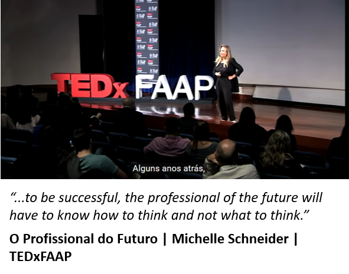 
    <em><a href="https://youtu.be/9G5mS_OKT0A" target="_blank">Evento TED</a> sobre profissionais do futuro.</em>

  

  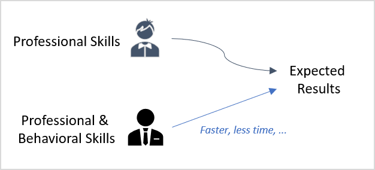 
  <em>Efeito de certas competências comportamentais.</em>

  

**Competências que aumentam a eficiência**  

O desempenho de um indivíduo na **execução de uma tarefa** é resultado da combinação dos mais variados recursos cognitivos e emocionais acumulados por esse indivíduo ao longo de sua vida pregressa. Entre esses recursos pessoais, estão os conhecimentos técnicos aprendidos, as habilidades desenvolvidas por experiências, toda a carga cultural dos ambientes em que viveu, seus traços de personalidade, comportamento social, valores, atitudes, enfim, tudo mais que pode contribuir para o desempenho da tarefa. Quando esse desempenho é **validado positivamente** por um outro indivíduo ou grupo social, estes entendem que o indivíduo é **competente** para executar aquela tarefa e que todos os recursos que contribuiram para isso formam as suas **competências** para executá-la.

Apesar de útil, a definição de competência nesses termos não capta os efeitos do tempo e dos demais recursos não pessoais empregados pelo indivíduo para execução da tarefa. Uma forma de pensar esses efeitos é considerar uma restrição de utilização máxima destes recursos para efeito de validação. Assim, a **eficácia** na execução da tarefa só seria obtida se o indivíduo a executasse nestas condições, ou seja, num prazo ou utilização de recursos abaixo do limite estabelecido.   

Incluir os recursos não pessoais no conceito da eficácia de execução de uma tarefa ajuda a torná-lo mais realista, mas, ainda assim, não fornece elementos para explicar porque uns indivíduos são **mais eficientes** que outros, apesar de igualmente eficazes na execução da mesma tarefa. Todavia, a considerar a opinião dos gestores de RH tabulada no relatório do Fórum Econômico Mundial, esta é uma explicação cada vez mais necessária.    

Uma forma (não a única) de ajustar o conceito de competência à eficiência no uso de recursos não pessoais é destacar o grupo de competências responsáveis pela execução da tarefa "num mundo ideal", teórico, do grupo de competências responsáveis para que essa execução seja mais eficiente, isto é, num menor tempo ou utilizando menos recursos. No caso de tarefas profissionais, as competências que garantiriam a eficácia são as conhecidas como **competências técnicas**, enquanto as que melhorariam a eficiência seriam as competências não técnicas, ou **comportamentais**. 

  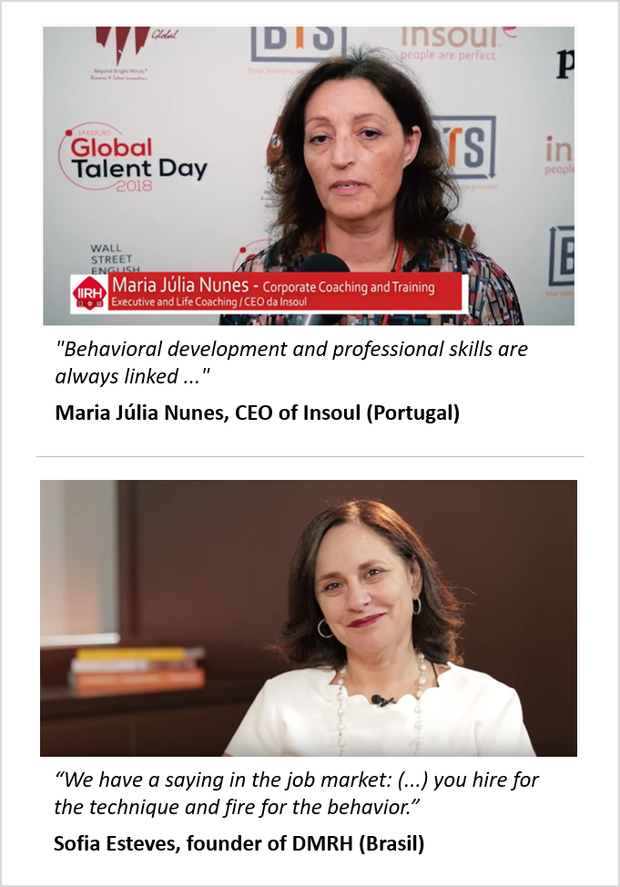 
  <em><a href="https://youtu.be/1HEymYOkz44" target="_blank">Vídeo 1</a> e <a href="https://youtu.be/WyKZC7nhQZw" target="_blank">vídeo 2</a> com consultores de RH sobre competências comportamentais.</em>

  

**Competências comportamentais profissionais**  

Uma parcela relevante das competências técnicas profissionais é adquirida por ocasião da formação profissional. Entretanto, embora seja possível desenvolver **competências comportamentais profissionais** já a partir do terço final da formação técnica, na grande maioria das vezes este desenvolvimento só ocorre de fato ao longo da carreira, com a experiência profissional.

Por razões diversas que envolvem custos, prazos e competitividade, a grande maioria das escolas de formação se limita a desenvolver as **competências técnicas** em nível suficiente para garantir a **empregabilidade de entrada** de seus alunos no mercado de trabalho. Raramente, as escolas de formação profissional avaliam o desempenho de seus alunos em questões técnicas que não sejam apresentadas sob **condições ideais** e isentas de fatores inerentes do dia a dia profissional. Isso implica em garantir aos profissionais em formação apenas a **execução eficaz** das tarefas profissionais em ambientes ideais. 

Contudo, ao empregar suas competências técnicas nas demandas e tarefas diárias da carreira que escolheram, estes profissionais se deparam com aspectos práticos relevantes, tais como **assimetrias de informação**, **restrições de recursos** e **pressões de ordem diversa**, que alteram (por vezes, substancialmente) as condições ideais das tarefas para as quais seus conhecimento e habilidades técnicas se aplicam sob medida. Por esta razão, embora os profissionais entrantes no mercado de trabalho tenham recursos técnicos para garantir a eficácia na execução de suas tarefas, a sua **eficiência**, isto é, a conta que considera o tempo e os demais recursos que são empregados para a execução, só é incrementada ao longo da **experiência** na função. 

Assim, por essa visão, todas as competências adicionais que não se enquadram nos conhecimentos e habilidades técnicas para execução das tarefas profissionais em condições ideais são consideradas como **potenciais capacitadoras** dos indivíduos à execução de tarefas profissionais em **ambientes reais**.  

**Desenvolvendo competências comportamentais da forma natural**  

As competências comportamentais que interessam às empresas, como liderança, por exemplo, podem ser desenvolvidas segundo diversas estratégias de aprendizagem, seja diretamente através da transmissão de conhecimentos teóricos, seja indiretamente através de atividades de aprendizagem práticas. Contudo, quanto mais estas atividades se aproximam da forma **natural**, representada pela forma como os profissionais adquirem competências não comportamentais pela experiência profissional do dia-a-dia, mais relevante o desenvolvimento tende a ser. 

Sempre que os profissionais se deparam com situações de "imperfeição" da vida real, tais como **riscos**, **incertezas** e **preferências**, eles precisam buscar **novas formas** de atingir os mesmos resultados que atingiriam nas condições ideais.   

  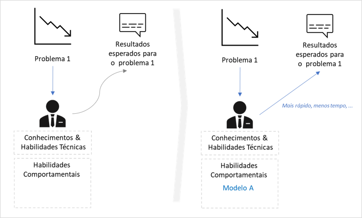 
  <em>Exemplo de uma técnica que ajuda a ser mais eficiente para atingir os resultados.</em>

  

Esse processo de **tentativa e erro** envolve a busca de novas técnicas e, via de regra, a **incorporação** das técnicas **mais adequadas** às suas habilidades pessoais. Como consequência deste processo contínuo de teste e adequação, cada indivíduo acaba por reunir e **incorporar à sua atuação profissional** um **repertório único** de técnicas, modelos e estratégias empíricas com os quais ele irá contar, juntamente com suas competências técnicas, para superar os desafios a que é submetido ao longo da carreira.  

  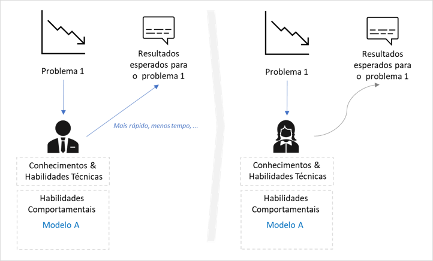 
  <em>Uma mesma técnica pode não ter o mesmo efeito para outro indivíduo.</em>

  

Embora algumas empresas avaliem as **habilidades pessoais** e **perfis da personalidade** de seus colaboradores (modelos DISC, MBTI e Big Five) como forma de orientá-los no desenvolvimento das atitudes frente aos problemas e convívio corporativo, na grande maioria dos casos, o desenvolvimento das competências comportamentais é um processo **não supervisionado**, **auto patrocinado** e executado de forma **natural** e **inconsciente** ao longo da carreira profissional. 

Apesar de relevante do ponto de vista de **recall** do aprendizado, a forma natural do desenvolvimento de competências comportamentais tem uma importante limitação. Por sua característica não supervisionada, dependendo dos diferentes estímulos a que são submetidos os profissionais, este processo de desenvolvimento pode durar **muito tempo** para ocorrer ou, até mesmo, não acontecer.   

  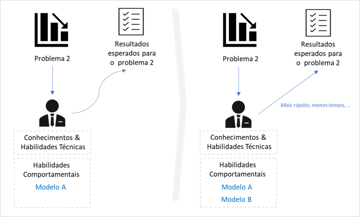 
  <em>Um novo problema pode requerer novas técnicas.</em>

  

**Acelerando o desenvolvimento de competências comportamentais**  

Para **acelerar** e tornar mais **assertivo** este processo, alguns **programas educacionais** se propõem a **simular** situações reais do dia-a-dia em atividades de aprendizagem para, desta forma, estimular o desenvolvimento **natural** e **personalizado** de competências comportamentais. 

É o caso, por exemplo, das escolas que ofertam programas educacionais utilizando predominantemente a *Problem Based Learning* (ou, de forma abreviada, a **PBL**), uma **estratégia de aprendizagem** na qual os alunos aprendem **resolvendo problemas** e **refletindo** sobre suas experiências (<a href="https://en.wikipedia.org/wiki/Problem-based_learning" target="_blank">Ver definição na Wikipedia</a>).  

  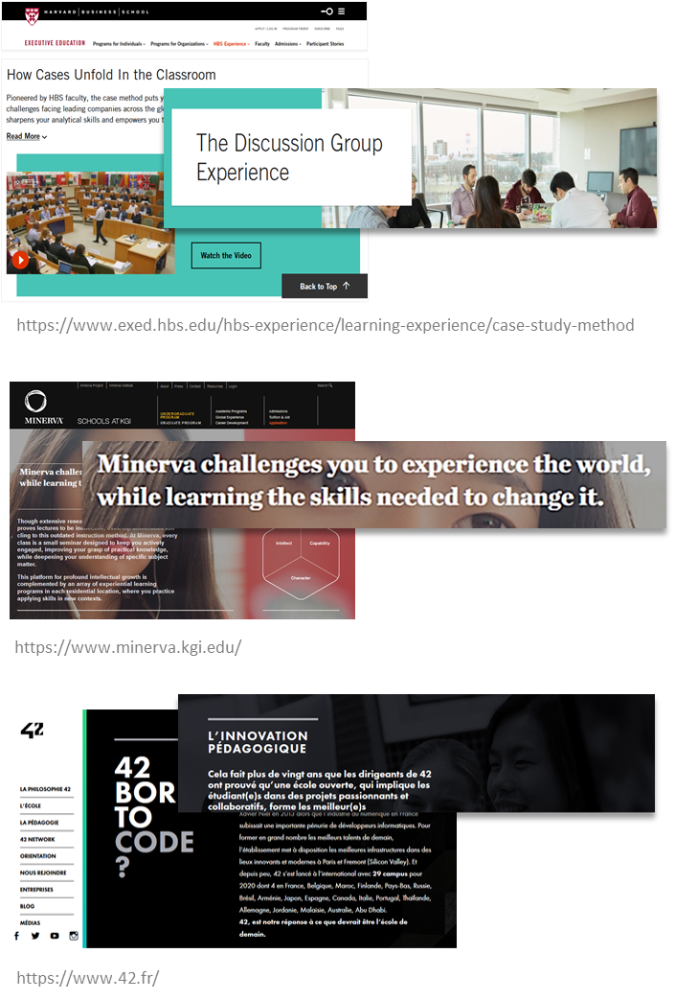 
  <em>Harvard, Minerva e a escola de tecnologia #42 são exemplos bem sucedidos de aplicação da PBL.</em>

  

O que torna a *Problem Based Learning* relevante é a replicação do processo natural do desenvolvimento de competências comportamentais. De fato, sempre que os profissionais se deparam com situações de "imperfeição" da vida real, tais como **riscos**, **incertezas** e **preferências**, eles estão diante de um **problema** a ser resolvido. Um problema causado pela incapacidade de prevermos todas situações possíveis por conta das "imperfeições" da vida real. 

Não por acaso, oito das dez competências profissionais mais desejadas para os trabalhadores do futuro na opinião de gestores de RH de todo o mundo, segundo o Fórum Econômico Mundial, são competências comportamentais que aumentam a eficiência da execução das tarefas profissionais.  

**Desequilíbrio de mercado** 

Se por um lado, conforme observado pelo Fórum Econômico Mundial, as empresas demandam cada vez mais profissionais com competências comportamentais, por outro lado, estes mesmos profissionais encontram muitas dificuldades para desenvolvê-las num prazo razoável, uma vez que **a oferta de cursos e programas educacionais** específicos para esse fim **não é suficiente** para atender os requisitos de **preço** e **disponibilidade** do mercado.

Grande parte deste desequilíbrio ocorre porque as escolas que atuam tradicionalmente neste segmento não geram **economias de escala suficientes** para **popularizarem seus cursos**. Nem mesmo a recente introdução de tecnologias digitais nas práticas educacionais foi capaz de estimular a universalização deste tipo de programa.  

Diante deste cenário, de desequilíbrio entre a oferta e a demanda de cursos e programas educacionais para desenvolvimento competências comportamentais, experientes executivos do setor educacional identificaram uma excelente **janela de oportunidades** a ser explorada.

  

    <a href="#pitchdeck"> [Pitchdeck] </a> .
    <a href="#problema"> O Problema </a> ·
    <a href="#proposta"> A Proposta </a> .
    <a href="#negocio"> O Negócio </a> .
    <a href="#execucao"> Execução </a> .
    <a href="#expansao"> Expansão </a> .
    <a href="#financiamento"> Financiamento </a>

    
##  

   

 

## PROPOSTA PARA EXPLORAR A OPORTUNIDADE DE MERCADO

A PBL é comprovadamente **eficaz** no desenvolvimento de competências comportamentais e, portanto, uma **candidata natural** para suprir a atual demanda do mercado educacional. Entretanto, isso não ocorre porque existem alguns **obstáculos** para sua **execução em larga escala**. Por esta razão, os idealizadores desenvolveram uma estratégia com ações para contornar estes obstáculos.  

### Escalando a PBL

A **Aprendizagem Baseada em Problemas** é uma estratégia de aprendizagem **ativa**, ou seja, o aluno é co-responsável por seu aprendizado. Além disso, a PBL é **centrada no aluno**, ou seja, onde cada aluno aprende de forma individualizada. 

Tradicionalmente, a PBL é executada em **duas etapas**. Na **etapa de preparação**, os alunos trabalham individualmente ou em pequenos grupos colaborativos onde aprendem o que precisam para resolver um problema apresentado a eles. Na **etapa de discussão** das soluções para o problema, o professor atua mais como um facilitador para orientar a aprendizagem do aluno do que como um detentor de conhecimento como nas abordagens tradicionais. 

A força da adoção da PBL na **educação profissional** está no **pragmatismo das experiências de aprendizagem**, o que ajuda a acelerar o ganho de empregabilidade dos alunos no mercado de trabalho.  

  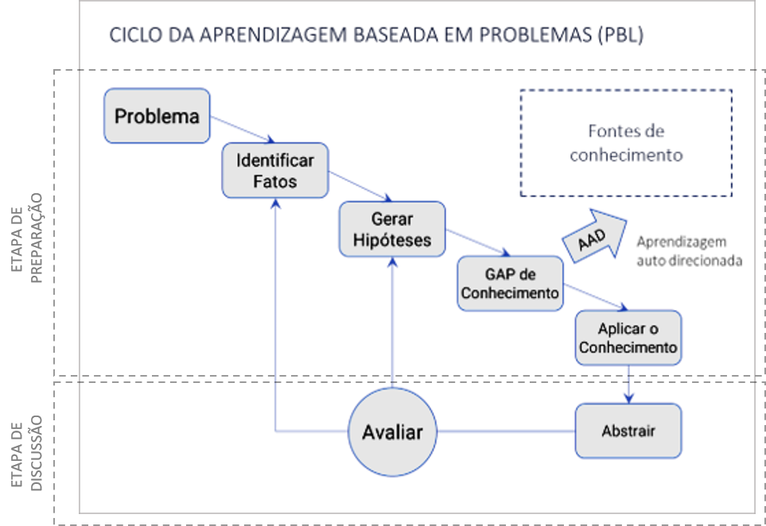 
  <em>Pela PBL, os alunos aprendem resolvendo problemas e refletindo sobre suas experiências.  Fonte:<a href="https://docs.lib.purdue.edu/ijpbl/" target="_blank"> The Interdisciplinary Journal of Problem-based Learning</a>.</em>

  

Os dois principais **obstáculos** para execução da PBL **em larga escala** são: 
- A PBL requer que dois dos mais relevantes **recursos educacionais** em termos de custo -**docentes** e **infraestrutura física**- sejam **desenvolvidos sob medida** para cada instituição de ensino.
- A **interação síncrona** na etapa de discussão da PBL é considerada uma atividade crítica para a qualidade do método e a **execução 100% digital** ainda não é capaz de substituir as sessões presenciais tutoradas. 

**Modelo inovador**  
Para contornar os obstáculos para execução da PBL em larga escala, os idealizadores desenvolveram um **modelo inovador** baseado na utilização de **ativos de terceiros** e no uso intensivo de **inteligência artificial**. 

Diferentemente do "paradigma 100% digital" adotado por Edtechs para gerar economias de escala, a **essência** do novo modelo propõe escalar **cada etapa** do processo de execução da PBL de forma **única**. O resultado é um modelo **híbrido** (ou semi-presencial), porém com grande capacidade de gerar economias de escala.   

  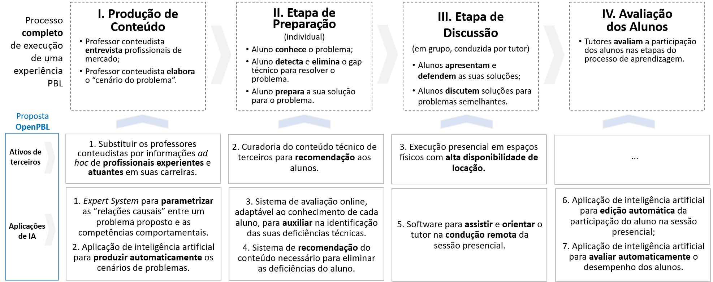 
  <em>Intervenção em cada uma das etapas clássicas do processo de execução.</em>

  

A seguir, a justificativa de cada intervenção proposta no modelo para escalar o processo de execução da PBL: 

1. Utilização de **ativos de terceiros**: 
 - A utilização de **espaços físicos** de terceiros garante o nível de disponibilidade de salas, mesmo com o aumento das atividades da empresa;
 - A adoção de espaços físicos, cuja oferta já consideram as facilities atendimento, limpeza, segurança, agendamento, etc, permite que a gestão seja tratada como a gestão de um custo direto e não como um custo fixo apropriável por chave de rateio;
 - A substituição de docentes por profissionais de mercado sem qualquer skill acadêmico viabiliza a produção escalável de conteúdo.  

2. Uso intensivo de **inteligência artificial**: 
 - A IA viabiliza a “extração” (e a codificação) da experiência dos profissionais de mercado;
 - A IA automatiza algumas tarefas docentes e reduz substancialmente o custo da operação;   

3. Integração estratégica  
Além de contribuir individualmente para escalar a PBL via custos, a "**atomização**" da sessão presencial também proporciona um **ambiente viável** para a aplicação de modelos de *machine learning* com o emprego de equipamentos simples.  

### Método de ensino profissionalizante

Baseado no modelo proposto, os idealizadores desenvolveram um **método de ensino profissionalizante** que permite a **criação** e a **gestão sistemática** de **cursos de especialização profissional** baseados em problemas. Cada curso embute um **ciclo PBL completo** baseado na discussão de um problema real e típico de sua carreira profissional.

Os **três processos-chave** do método são: 
1. Extração automatizada de cenários reais;
2. Eliminação individualizada das deficiências técnicas;
3. Atomização e automatização das discussões;  

**Extração Automatizada de Cenários Reais**  

Na PBL tradicional, a produção de conteúdo consiste na *"elaboração pedagogicamente estruturada de cenários descritivos de problemas”*. Tradicionalmemte esta elaboração de cenários é executada por docentes "criadores de conteúdo", cuja tarefa é entrevistar **profissionais experientes de mercado** para buscar insights em relatos de **cenários reais** do dia-a-dia profissional, bem como os possíveis **problemas associados** à eles. 

Ao contrário do processo tradicional, a **Extração Automatizada de Cenários Reais** consiste na **interação direta e amigável** destes profissionais experientes com um software do tipo *"expert system"*. Os “títulos” e cenários são sugeridos pelos profissionais, mas o texto final é estruturado por um *software de IA*, treinado pela técnica de *"machine learning"*.   

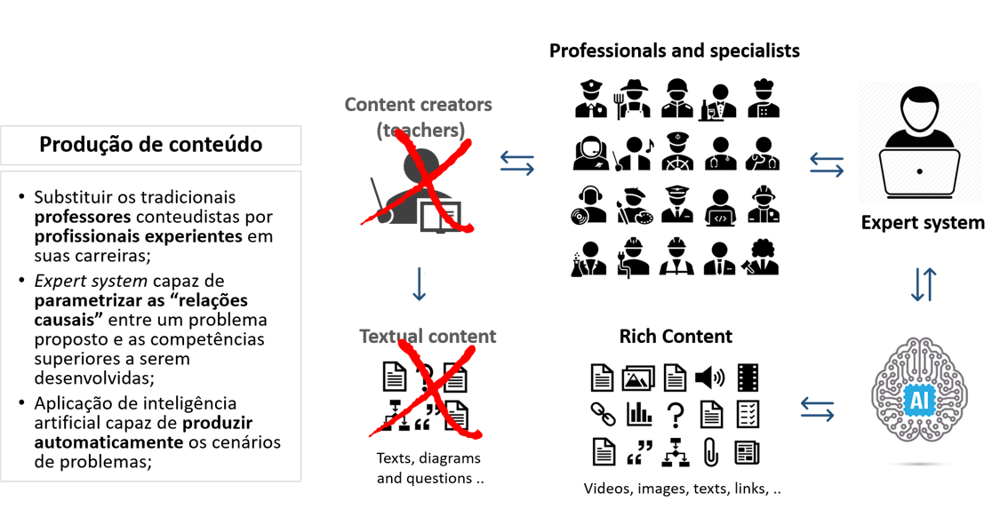 
<em>Sistema para extração de conhecimento dos profissionais especialistas.</em>

  

**Eliminação Individualizada das Deficiências Técnicas**   

Na etapa de *“self-directed learning” (SDL)* do processo de execução da PBL, os alunos *"identificam e buscam os conhecimentos necessários para resolver o problema a que foram submetidos"*. Tradicionalmente, cada aluno é responsável por identificar suas deficiências e buscar as fontes de conhecimento para corrigi-las. 

No processo proposto de **Eliminação Individualizada das Deficiências Técnicas**, a SDL é acelerada. Um *"assessment online"* testa de forma personalizada os conhecimentos dos alunos e um software do tipo *recommender system* aponta as fontes de conteúdo e as opções de capacitação. O processo utiliza ainda o conceito de **nano certificação** (proprietária ou de terceiros) para habilitar os alunos à etapa seguinte do processo da PBL.  

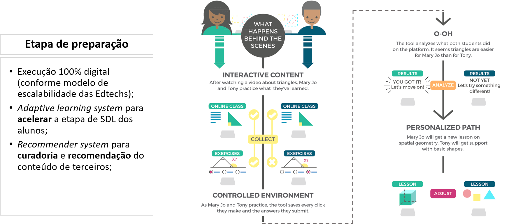 
<em>Adaptive learning para acelerar a fase de "self-directed learning" dos alunos.</em>

  

**Atomização e Automatização das Discussões**  

Na PBL tradicional, as sessões presenciais de discussão de problemas são reuniões com 40 alunos ou mais, uma vez que, quanto maior o número de alunos, menor é o impacto do valor da apropriação do custo da infraestrutura física no preço unitário dos cursos. Por esse motivo, as escolas tradicionais investem em **salas** e **equipamentos sofisticados** como forma de garantir a qualidade das interações entre os alunos, mesmo com discussões em grandes grupos.  

 
<em>Harvard Classroom: a escola investe em infraestrutura e equipamentos para manter a qualidade das discussões em grupos grandes de alunos.</em>

 

No processo proposto de **Atomização e Automatização das Discussões**, as sessões presenciais de discussão são reuniões de 10 alunos no máximo, agendadas conforme demanda em *espaços compartilhados de trabalho (coworking)*. 

A dinâmica da sessão é conduzida por um tutor, via *videoconference*, com o auxílio de um *Process management software* que, entre outras coisas, propõe e controla o tempo das atividades, orienta a elaboração das perguntas, define os grupos para exercícios e exibe o material multimidia auxiliar. 

A avaliação do desempenho individual dos alunos nas discussões é executada por *software de IA*, treinado por um conjunto de técnicas de *"machine learning"* (reconhecimento facial, transcrição, Processamento de linguagem Natural - NLP e algoritmos de clusterização)., que também edita automaticamente o vídeo com a gravação da sessão.  

 
<em>Sessão presencial atomizada e assistida por software.</em>

  

## Trilha de especialização baseada em problemas 

A **Trilha de Especialização Baseada em Problemas** é um conjunto sequencial de cursos, **complementares à formação profissional técnica** do aluno, com o objetivo de desenvolver competências comportamentais pelo **método ativo** da PBL. Cada curso da trilha proporciona ao aluno uma de experiência de aprendizagem completa baseada na discussão de um problema real e típico de sua função.  

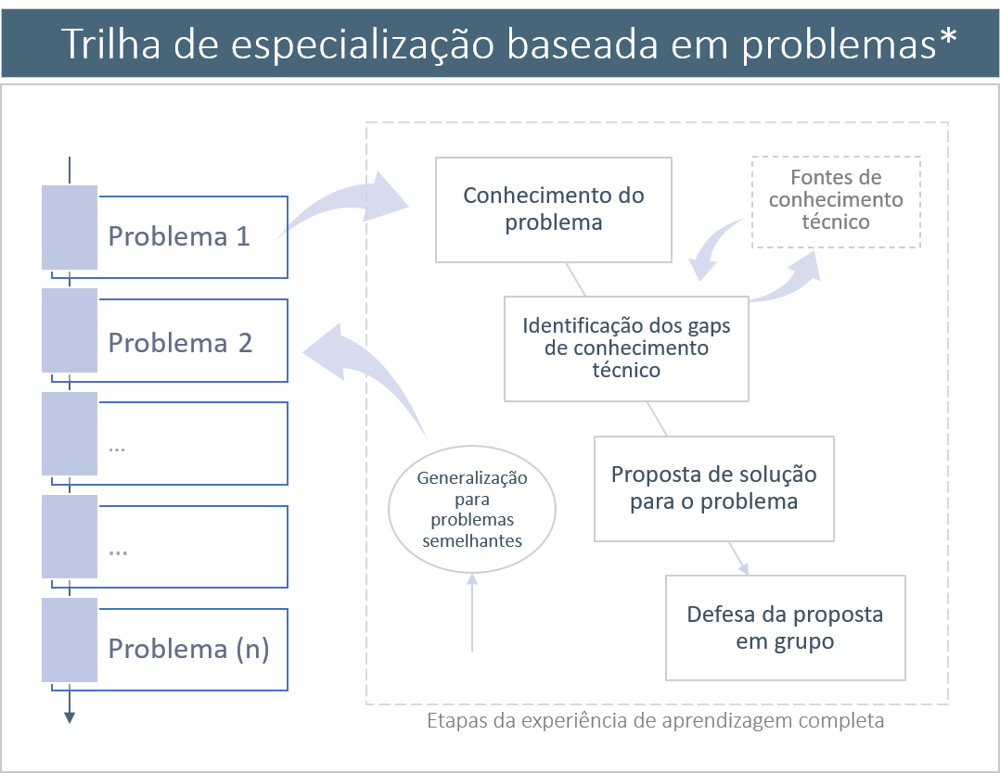 
<em>Trilha de especialização baseada em problemas.</em>

  

**Composição dos cursos**   

Os cursos têm **formato padronizado** na modalidade **híbrida** (ou semi-presencial) e são executados sempre em duas etapas:
1. Uma etapa preliminar de **preparação**, com atividades **online** que correspondem a 95% da carga horária total do curso e; 
2. Uma etapa final de **discussão**, composta de uma sessão **presencial** de três horas, conduzida por um **tutor**, onde **dez alunos** se reunem por **três horas** para **analisar** as possíveis soluções para o problema proposto no curso.   

Na etapa de **preparação** de **cada curso** da trilha, o aluno: 
1. Recebe o **conteúdo descritivo** do problema abordado no curso, bem como todo o material de apoio para o seu entendimento;
2. É **avaliado** de forma adaptativa, através de testes *online*, quanto ao seu nível de proficiência nos **conhecimentos técnicos** necessários para a análise e solução do problema; 
3. Recebe **recomendações personalizadas** de fontes de conteúdo para eliminar possíveis deficiências de conhecimento técnico;
4. Ao final da etapa, **propõe a sua solução** (ou soluções) para o problema objeto do curso.  

Na etapa de **discussão**, o aluno: 
1. Participa de uma **sessão presencial** de **três horas**, em **turmas com dez alunos**, para discussões em torno do problema proposto no curso; 

A sessão é conduzida por um tutor especialista, via webconference, e realizada em ambiente que dispõe dos recursos tecnológicos necessários para o desenvolvimento de competências comportamentais conforme a metodologia proposta.  

Como **feedback** da sua atuação em cada curso da trilha de especialização, o aluno recebe:
1. Os resultados dos testes de conhecimento técnico que fez ao longo do curso;
2. O **registro audiovisual** da sua participação na sessão presencial de discussões;
3. A **avaliação comentada** do seu desempenho na solução do problema proposto no curso.   
 
<!--
1. Recebe uma lista com opções de **locais** e **horários** disponíveis para a sessão presencial, contendo detalhes da **infraestrutura**, **facilidades** e perfil do **tutor** responsável; 
2. Agenda a data e o local mais adequados para participar da sessão;
3. Participa da **dinâmica de discussões** em torno do problema proposto no curso, conduzidas pelo **tutor** da sessão. 
-->

**Objetivos de aprendizagem dos cursos**  

Cada curso da trilha pode ser configurado para **acelerar o desenvolvimento** de uma ou mais das seguintes competências comportamentais:
- Estruturação de **problemas mal definidos**; 
- Tomada de decisão envolvendo **incertezas** e objetivos conflitantes; 
- Tomada de decisão envolvendo **restrições** orçamentárias de recursos, restrições éticas e sujeitas à regras de compliance; 
- Atuação sob **pressão** de prazo, desempenho e opiniões diversas; 
- Atuação em **equipe** sujeita às dinâmicas de cooperação, competição, liderança e negociação; 
- Visão orçamentária e atitude empreendedora.  

## Sistema de ensino profissionalizante baseado em problemas

Os idealizadores propõem que os sete **componentes de software** que **automatizam** os três processos do método de ensino proposto sejam **integrados** por um **sistema de software**, cujo objetivo é garantir a **eficácia** e **escalabilidade** da execução conjunta. São estes componentes:
 - **"*Expert system*"** capaz de parametrizar as relações causais entre o problema proposto por um especialista e as competências comportamentais que se propõe desenvolver nos alunos.
 - **"*Machine learning model*"** capaz de produzir automaticamente os "cenários de problemas" com títulos em **português**, **inglês** e **espanhol**.
 - **"*Adaptive learning system*"** para acelerar a etapa de SDL (self-directed learning) dos alunos.
 - **"*Recommender system*"** para recomendação do conteúdo de apoio na etapa de SDL do método. 
 - **"*Process management system*"** para assistir e orientar os tutores na condução das sessões presenciais de discussão.
 - **"*Machine learning model*"** capaz de editar e avaliar automaticamente o desempenho filmado dos alunos nas sessões de discussão.
 - **API** para integração com bases de dados de redes sociais de cunho profissional.  
 
**Tecnologia educacional**  

Um sistema de software capaz de automatizar a **criação** e a **gestão** de **trilhas de especialização baseadas em problemas** torna-se uma tecnologia extremamente útil para players dos segmentos de **formação profissionalizante** e **educação corporativa**. Entretanto, mais do que um sistema de software, os idealizadores propõem uma nova **tecnologia educacional** que garante a execução **contínua** e **escalável** de **cursos profissionalizantes** ancorados na poderosa *problem-based learning*.

O draft da arquitetura do sistema pode ser acessado em <a href="https://openpbl.github.io/app-docs/" target="_blank">Arquitetura OpenPBL</a>.  

  

    <a href="#pitchdeck"> [Pitchdeck] </a> .
    <a href="#problema"> O Problema </a> ·
    <a href="#proposta"> A Proposta </a> .
    <a href="#negocio"> O Negócio </a> .
    <a href="#execucao"> Execução </a> .
    <a href="#expansao"> Expansão </a> .
    <a href="#financiamento"> Financiamento </a>

    
##  

   

 

## O NEGÓCIO 

Para monetizar o **sistema de ensino baseado em problemas**, os idealizadores decidiram criar a empresa educacional **OpenPBL**.   

### Posicionamento

A OpenPBL é uma **Edtech** detentora de uma **tecnologia educacional própria** que **reduz substancialmente os custos** de desenvolvimento de competências comportamentais profissionais pelo método **ativo**. A tecnologia desenvolvida pela empresa garante a execução **contínua** e **escalável** de **cursos profissionalizantes** baseados na *problem-based learning*.  

### Proposta de valor 

**Democratizar** o acesso à **educação profissional baseada em problemas** para desenvolver as **competências do futuro** em um número cada vez maior de profissionais.”  

### Receitas 

As receitas da empresa são provenientes da exploração de todas as **formas de distribuição** do seu **sistema de ensino baseado em problemas**. O sistema de ensino é distribuido via: (1) licenciamento do software para empresas **B2B2C**; (2) soluções para educação corporativa **B2B** e; (3) Programas educacionais **B2C**.   

### Produtos

O principal produto gerador de receitas recorrentes da empresa é o seu **sistema de ensino baseado em problemas**.   

**Sistema de Ensino baseado em problemas (B2B2C)**  

O sistema de software automatiza a **criação** e a **execução** de **trilhas de especialização baseadas em problemas** para acelerar o desenvolvimento de competências comportamentais profissionais. O valor mensal por usuário não deve ser superior à **US $ 5,00** `(R$ 25,00)`.

**Clientes-alvo**. Os clientes-alvo do **Sistema de Ensino baseado em problemas (B2B2C)** são empresas que o utilizam para capacitar seus **alunos** e **colaboradores** com custos menores que as demais metodologias **ativas** disponíveis. 

No **segmento das escolas profissionalizantes** os clientes-alvo são as instituições de ensino superior e as escolas de ensino técnico de nível médio. No **segmento da educação corporativa** os clientes-alvo são **grandes e médias empresas ou organizações** que viabilizem relacionamento de parceria e recorrência comercial de longo prazo.

**Benefícios para os clientes**. A redução do custo de desenvolvimento de competências comportamentais profissionais com a utilização do **sistema de ensino baseado em problemas**:  
- Permite que **escolas profissionalizantes** ampliem suas receitas pela oferta adicional de novos produtos para desenvolvimento de competências comportamentais; 
- Ajuda **empresas** a promover o desenvolvimento de competências comportamentais para um número maior de colaboradores.

**Customização**. O **sistema de ensino baseado em problemas** orienta a empresa no desenvolvimento de **cursos** totalmente **customizados**. Neste caso, os problemas abordados nos cursos das **trilhas de especialização baseadas em problemas** podem ser propostos por funcionários e colaboradores da própria empresa cliente. 

**Serviços envolvidos**. As ofertas comerciais para licenciamento do **sistema de ensino baseado em problemas** envolvem:
- O valor dos serviços de **implantação** do sistema;
- Um prazo de vigência do contrato de licenciamento não inferior a **24 meses**;
- O **valor mensal por usuário** para cada faixa de **número de usuários** para a utilização ilimitada do sistema;  
 
<!--
O público-alvo das **trilhas de especialização baseadas em problemas** são os **entrantes no mercado de trabalho** e os **profissionais de todos os níveis hierárquicos** com o objetivo comum de se tornarem mais eficientes na execução de suas tarefas.
-->

**Projeto e execução de trilhas de especialização baseadas em problemas para empresas (B2B)**  
 
O mercado B2B surge com a possibilidade de abordar empresas de **forma consultiva** para a ofertar **soluções completas de educação corporativa** que utilizem as **trilhas de especialização baseadas em problemas**. Neste sentido, o **projeto e execução de trilhas de especialização baseadas em problemas para empresas** deve ser visto como uma nova forma de distribuição do **sistema de ensino baseado em problemas**.
 
**Clientes-alvo e benefícios**. Os clientes-alvo e benefícios deste produto são essencialmente os mesmos que a oferta do **sistema de ensino baseado em problemas**. Contudo, neste caso, o sistema de ensino não é licenciado, mas utilizado para o **desenvolvimento** e **operação** de cursos customizados para empresas e escolas de formação. O modelo de receitas passa a ser de um Preço por curso por funcionário.    

**Customização**. As possíveis soluções de educação corporativa englobam desde o **planejamento** até a **gestão da execução** de um **projeto de educação corporativa baseado em problemas**. Estas soluções são: 
- **Soluções de Planejamento Educacional.** As soluções para essa etapa têm caráter de consultoria educacional para os profissionais de T&D, responsáveis por desenvolver e gerenciar projetos de educação corporativa. 
- **Soluções de Aprendizagem.** São os objetos de aprendizagem propriamente ditos. Esses objetos podem estar no acervo da OpenPBL ou requerer a produção de conteúdos customizados.
- **Soluções de Engajamento.** São soluções utilizadas nos projetos onde a adesão do colaborador é facultativa.
- **Soluções de Execução.** São soluções para a execução da capacitação propriamente ditas. Essas soluções disponibilizam a infraestrutura presencial ou online necessárias.
- **Soluções de Gestão da Execução.** É o conjunto de soluções para acompanhamento e controle dos projetos de capacitação pelo profissional de T&D.  

**Trilhas de especialização baseadas em problemas para profissionais e alunos de escolas de formação (B2C)** 

O mercado B2C surge diante da possibilidade de ofertar trilhas e cursos baseados em problemas **diretamente** para profissionais e alunos de escolas de formação. Neste sentido, a oferta direta de **trilhas de especialização baseadas em problemas** também deve ser vista como mais uma forma de distribuição do **sistema de ensino baseado em problemas**. 

A exploração desta classe de produtos é detalhada na próxima seção sobre as **escolas profissionalizantes baseadas em problemas**   

### Escolas profissionalizantes baseadas em problemas

Além das receitas oriundas da venda de cursos profissionalizantes como canal de distribuição do **sistema de ensino baseado em problemas**, a criação de **escolas profissionalizantes baseadas em problemas** tem a função estratégica de **tangibilizar** os benefícios do sistema de ensino à medida que a OpenPBL pode promover ações para comunicar o sucesso dos seus alunos no mercado de trabalho.  

**Público-alvo da escola**  

Os cursos e programas da **escola profissionalizante OpenPBL** são destinados à **profissionais** (e aspirantes) com o **objetivo comum** de se diferenciarem no mercado de trabalho pelo domínio de competências comportamentais, cada vez mais demandadas por empresas e organizações.   

  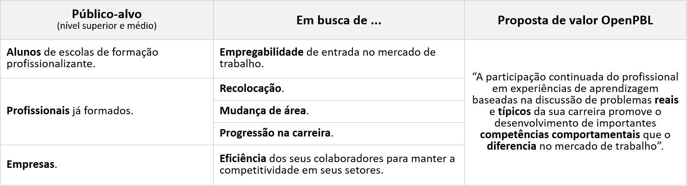 

<em>Usuários-alvo com necessidades diversas e em fases distintas da carreira.</em>

  

**Mercado da escola**  

A combinação das **três classes** de público-alvo da escola com os dois **dois níveis** de progressão de ensino regular definem os **seis segmentos** de mercado, elegíveis para a atuação da escola. Alguns destes segmentos são tradicionais no setor educacional, tais como **educação executiva** e **educação corporativa**. Assim, o cálculo do tamanho do **mercado potencial da escola**, deve considerar as variáveis demográficas e cada **localidade geográfica** onde é cogitada a atuação da escola.   

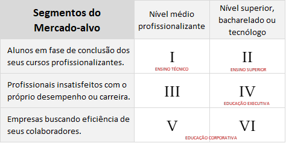

<em>Segmentos-alvo da OpenPBL e os segmentos tradicionais do mercado educacional.</em>

  

**Comunicação dos diferenciais da escola**  

Quando comparados com **programas tradicionais** do mercado educacional desenhados para o desenvolvimento de competências comportamentais, os cursos de uma **Escola profissionalizante baseadas em problemas** se diferenciam pelos seguintes fatores:
- **Custo baixo** das experiências completas de aprendizagem PBL **para** caber em orçamentos de vários tamanhos.
- Programas híbridos com grande parte do tempo dedicado à etapa online assíncrona **para** adequar-se à disponibilidade de tempo dos alunos.
- Etapa presencial com várias opções de disponibilidade geográfica **para** adequar-se às restrições de deslocamento do alunos.
- Cursos segmentados por trilhas funcionais **para** concentrar o ganho de empregabilidade do aluno em uma carreira específica. 

Estes atributos norteiam a estratégia de comunicação para venda B2C das escolas. As ações para atração e conversão de novos alunos está descrita com detalhes em <a href="https://openpbl-school.github.io/CustomerAcquisition/" target="_blank">Estratégia de Comunicação</a>.

*Para mais detalhes sobre a escola profissionalizante OpenPBL, veja um <a href="https://openpbl-school.github.io/Storytelling/#portuguese" target="_blank">storytelling</a> do seu produto-tipo.*   

**Catálogo de cursos da escola**   

Os problemas abordados nos cursos das **escolas profissionalizantes baseadas em problemas** são propostos por **profissionais experientes** do mercado e cada problema específico origina a oferta de um **título no catálogo** da OpenPBL. 

Cada título pode ser adquirido de forma **avulsa** por um preço não superior a **US $ 60,00** `(R$ 320,00)` ou adquiridos em conjunto, com os títulos agrupados em **trilhas funcionais**, planejadas para promover a capacitação do aluno nas diversas **"funções"** da carreira profissional escolhida.

A oferta dos títulos sob a forma de "trilhas funcionais" (ao invés de "trilhas de disciplinas") é a principal ação estratégica com vistas a posicionar a **Escola Profissionalizante OpenPBL** como uma **instituição de ensino segmentada por perfis funcionais"** e não por áreas do conhecimento como é usual no mercado de educação profissionalizante.    

    <a href="#pitchdeck"> [Pitchdeck] </a> .
    <a href="#problema"> O Problema </a> ·
    <a href="#proposta"> A Proposta </a> .
    <a href="#negocio"> O Negócio </a> .
    <a href="#execucao"> Execução </a> .
    <a href="#expansao"> Expansão </a> .
    <a href="#financiamento"> Financiamento </a>

##  

   

 
 

## EXECUÇÃO DO PLANO DE NEGÓCIOS

Os empreendedores que conceberam o projeto e desenvolveram o plano de negócios são profissionais com 20 anos de experiência na condução de **unidades de negócios** de instituições de ensino superior de **grande porte**. 

Em especial, os empreendedores têm experiências complementares na execução de **projetos complexos de educação corporativa**, isto é, projetos que apresentam:
1. Grande abrangência territorial e diversidade de infraestrutura presencial;
2. Grande quantidade e dispersão dos colaboradores envolvidos; 
3. Integração de diversas estratégias instrucionais (EAD, Presencial,...) num mesmo projeto;  
4. Complexidade técnica e inovação das ferramentas tecnológicas envolvidas;
5. Grande necessidade de engajamento e fidelização dos colaboradores.  

Acesse <a href="https://github.com/openpbl-school/InvestorRelations/edit/master/docs/roadshow/BusinessPlan5801.md"> Portfolio de Projetos Complexos</a> para uma lista completa.  

### Time executivo

O time executivo montado para a fase inicial da empresa é composto por profissionais com experiência nos setores de **educação** e **finanças**.   

 

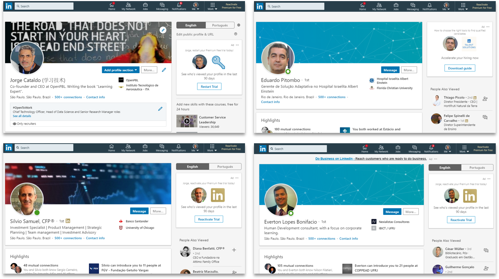 
<em>Time executivo.</em>

 

- Perfil executivo (<a href="https://www.linkedin.com/in/jorgecataldo/">Jorge Cataldo</a>).
- Perfil executivo (<a href="https://www.linkedin.com/in/eduardo-pitombo-62b76ab/">Eduardo Pitombo</a>). 
- Perfil executivo (<a href="https://www.linkedin.com/in/silvio-samuel-cfp/">Sílvio Samuel</a>). 
- Perfil executivo (<a href="https://www.linkedin.com/in/tonlobo/">Everton Bonifácio</a>).  

### Start-up 

Neste plano de negócios, o período de **start-up da empresa** é definido entre a **data do primeiro aporte de capital** e o **final do segundo ano de operação**. Esta seção detalha o período de aproximadamente dois anos que vai preparar a empresa para a atuação escalável B2B2C a partir do terceiro ano. 

Entre outras atividades, no período de start-up a empresa vai executar ações cruciais para definir o seu futuro, tais como:
- Elaborar testes com um **MVP** para validar as premissas de **custos de execução**.
- Estudos de mercado e **escolha das trilhas funcionais** para ofertas B2C.
- Abertura formal e pré-operação da empresa. 
- Produção de um estoque inicial de títulos (CAPEX).
- Desenvolvimento dos componentes de software do **sistema de ensino** da empresa (CAPEX). 

**Roadmap**  

As etapas previstas para este período de startup são:
1. Preparação para a operação manual B2B. 
2. Operação manual B2B. 
3. Testes de conceito e estudos de viabilidade. 
4. Desenvolvimento do software.
5. Preparação para a operação B2C. 
6. Operação B2C (São Paulo). 
7. Preparação para a operação B2B2C. 
8. Preparação para a profissionalização da empresa.    

Abaixo o planejamento e o status atual da execução das etapas.  

  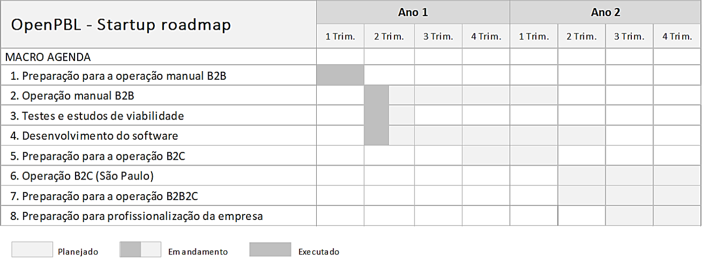 
  <im>Roadmap para o período de lançamento da empresa</im>

  

O detalhamento da etapa de *startup* pode ser acessado pelo link:<a href="https://openpbl-school.github.io/InvestorRelations/roadshow/Startup#portuguese" target="_blank_"> OpenPBL - Startup</a>  

### Operações

O planejamento das operações da empresas está dividido segundo as áreas de execução:
- Operações comerciais - Atração
- Operações comerciais – Conversão
- Conversão online
- Produção de conteúdo
- Execução online
- Execução presencial
- Suporte à carreira  

**Plano Operacional**  

O Plano Operacional detalhado com o detalhamento das funções relevantes pode ser acessado pelo link:<a href="https://openpbl-school.github.io/InvestorRelations/roadshow/OperationsPlan#portuguese" target="_blank_"> OpenPBL - Plano Operacional</a>  

### Simulações de desempenho

Simulações financeiras do modelo de negócios mostram que, com um **investimento inicial** mínimo de **US $ 60.000** `(R$ 327.000)` para a **produção de conteúdo** e **capital de giro**, é possível atingir uma base de **760 alunos** (0,6% do mercado alvo) na escola profissionalizante e **7.500 alunos** licenciados no Sistema de Ensino (1,7% do mercado alvo) e **receitas líquidas** de **US $ 1,94 milhão** `(R$ 10,7 milhões)` (EBITDA 42% RL) no **quinto ano** de operação da empresa. 

As simulações utilizaram **premissas de marketing e custos** para modelar o **ano 2** (primeiro ano "em regime") e **premissas de crescimento de vendas e de custos** para modelar os demais anos.    

  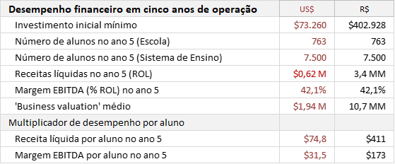

<em>Desempenho da simulação para 5 anos de operação da empresa.</em>

   

**Plano financeiro**  

O Plano financeiro detalhado com todas as planilhas pode ser acessado pelo link:<a href="https://openpbl-school.github.io/InvestorRelations/roadshow/FinancialPlan#portuguese" target="_blank_"> OpenPBL - Plano Financeiro</a>  

### Novas frentes de negócio 
A partir do desenvolvimento do **software do sistema educacional**, será possível a expansão dos negócios da empresa com a replicação do roadmap comercial em outras cidades, inclusive de outros países (*Greenfields*).

Estas novas frentes comerciais têm potencial de **multiplicar o desempenho** da empresa simulado na seção anterior. Para serem exploradas, as novas frentes necessitarão de investimentos adicionais, cuja aplicação deverá nortear as discussões acerca da **estratégia de expansão** da empresa a partir do ano 2 de operação.   

**Greenfield**  

No Brasil, a <a href="http://inep.gov.br/microdados" target="_blank">base de dados do MEC/INEP</a> é considerada uma fonte confiável de dados estratificados do **segmento II**, ou seja, *"alunos em fase de conclusão dos seus cursos profissionalizantes de nível superior"*. Segundo o INEP, o Brasil registrou em 2018, um total de aproximadamente **8.450.000** de alunos universitários matriculados em instituições públicas e privadas, dentre estes, cerca de **1.256.000** (ou 15% dos matriculados) pertencem ao segmento II do público-alvo da escola por estarem concluindo seus programas de capacitação profissionalizante. 

A cidade de São Paulo foi escolhida para o lançamento da empresa por apresentar **grande densidade populacional**, **grande variedade de cursos de graduação**, além de **muitas opções de co-workings**. Segundo o INEP, o tamanho do segmento II na cidade de São Paulo é de **130.000** potenciais alunos.  

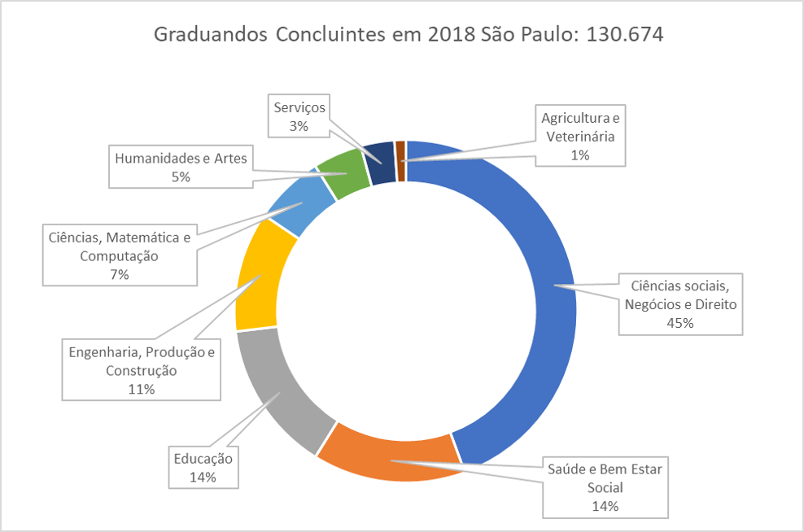 
<em>Alunos concluintes em 2018 na cidade de São Paulo.</em>

 

  

    <a href="#pitchdeck"> [Pitchdeck] </a> .
    <a href="#problema"> O Problema </a> ·
    <a href="#proposta"> A Proposta </a> .
    <a href="#negocio"> O Negócio </a> .
    <a href="#execucao"> Execução </a> .
    <a href="#expansao"> Expansão </a> .
    <a href="#financiamento"> Financiamento </a>

    
##  

   

 

## Sistema de software 

Graças ao modelo escalável utilizado, o **desempenho** da empresa poderá ser replicado para uma rápida **expansão das atividades da empresa**. Para isso, é necessário o desenvolvimento do **sistema de software** para automatizar os processos e etapas do **Sistema de Ensino**.  

**Desenvolvimento de software**  

Para desenho, implantação e testes do **sistema educacional** são necessários investimentos que devem ser contabilizados, em sua maior parte, como despesa de capital" (CAPEX) para **desenvolvimento de software**. 

Os **sete** componentes que compõem o software do **Sistema de Ensino OpenPBL** a ser desenvolvido são: 
- *Expert system* capaz de parametrizar as relações causais entre o problema proposto por um especialista e as competências comportamentais que se propõe desenvolver nos alunos.
- *Machine learning model* capaz de produzir automaticamente os "cenários de problemas" com títulos em **português**, **inglês** e **espanhol**.
- *Adaptive learning system* para acelerar a etapa de SDL (self-directed learning) dos alunos.
- *Recommender system* para recomendação do conteúdo de apoio na etapa de SDL do método.
- *Process management system* para assistir e orientar os tutores na condução das sessões presenciais.
- *Machine learning model* capaz de editar e avaliar automaticamente o desempenho filmado dos alunos.
- *API* para integração com bases de dados de redes sociais de cunho profissional.  

**Estratégia para desenvolvimento**  

OPEN-PBL APP é um software de **código aberto** que gerencia **experiências de aprendizagem baseadas em problemas** tomadas na educação profissional. As escolas podem usar o OPEN-PBL APP **gratuitamente** para garantir que suas experiências de aprendizagem estejam alinhadas com a estrutura teórica e as melhores práticas da aprendizagem baseada em problemas. As pequenas empresas também podem aproveitar os benefícios da abordagem de aprendizagem baseada em problemas usando o OPEN-PBL APP **gratuitamente** no treinamento e desenvolvimento de seus funcionários.  

As funcionalidades do aplicativo de código aberto OpenPBL podem ser acessadas pelo link:<a href="https://openpbl-school.github.io/InvestorRelations/roadshow/SoftwareDevelopment#portuguese" target="_blank_"> OpenPBL - Aplicativo</a>  

A página inicial do projeto *open source* do aplicativo OpenPBL App pode ser acessada (em inglês) pelo link:<a href="https://openpbl.github.io/app-docs/" target="_blank_"> OpenPBL - Free and opensource software</a>  

  

    <a href="#pitchdeck"> [Pitchdeck] </a> .
    <a href="#problema"> O Problema </a> ·
    <a href="#proposta"> A Proposta </a> .
    <a href="#negocio"> O Negócio </a> .
    <a href="#execucao"> Execução </a> .
    <a href="#expansao"> Expansão </a> .
    <a href="#financiamento"> Financiamento </a>

##  

   

 

## FINANCIAMENTO E GOVERNANÇA
Todas as etapas previstas no plano de negócios serão financiadas por **capital de risco** captado através de rodadas públicas. Os roadshows de captação são abertos e publicados em <a href="https://www.crunchbase.com/organization/openpbl#section-overview" target="_blank">CrunchBase.com</a>.   

**Regra de saída**  

A principal regra de saída para atrair investidores é a **venda estratégica** da empresa para um grupo educacional. Entretanto, a  remuneração dos investidores dependerá da **dimensão** conquistada na expansão das atividades de empresa. Pelas características escaláveis do modelo de negócios, a **abertura do capital** é também uma opção viável a ser considerada.   

**Rodadas de captação**  

Até o evento da venda estratégica, estão previstas **quatro** rodadas de captação de investimento com **objetivos** distintos: 
- **Capital semente** - Validações iniciais do modelo; 
- **Series A** - Startup da empresa em uma praça, validações dos atributos comerciais e desenvolvimento do sistema de ensino (software); 
- **Series B** - Atualizações no software, profissionalização da gestão e capital de giro para ampliação das atividades para 100 praças; 
- **Series C** - Internacionalização da empresa, atualizações no software e capital de giro para ampliação para 250 praças; 
- **Series D** - Capital de giro para ampliação da atuação para 500 praças e preparação da empresa para a venda estratégica;   

**Capital Semente**  

Ao todo, já foram captados **US $ 27.000** `(R$ 150.000)` à título de **capital semente** para **validações iniciais** do modelo e desenvolvimento do **plano de negócios**.   

**Series A**  

O objetivo do atual roadshow é a captação de **US $ 132.000** `(R$ 727.000)` divididos em **quatro quotas** de **US $ 33.000** `(R$ 181.000)`. Esse montante deverá ser utilizado durante o *startup* da empresa na cidade de São Paulo para:
- Desenvolver sistemas de software;
- Produzir conteúdo;
- Capital de giro.   

A captação atual considera o *pre money valuation* de **US $ 900.000** `(R$ 4,8 milhões)`.    

**Governança**  

A participação dos investidores nas decisões executivas da empresa é garantida pela adoção das melhores práticas de **governança corporativa** vigentes, tais como *controle orçamentário*, *profissionalização do board*, *conselho fiscal* e *proteção de minoritários*, entre outros.

  

    <a href="#pitchdeck"> [Pitchdeck] </a> .
    <a href="#problema"> O Problema </a> ·
    <a href="#proposta"> A Proposta </a> .
    <a href="#negocio"> O Negócio </a> .
    <a href="#execucao"> Execução </a> .
    <a href="#expansao"> Expansão </a> .
    <a href="#financiamento"> Financiamento </a>

##  

  

    
    <a href="#english">English</a>
    ·
    <a href="#portuguese">Portuguese</a>

                         

 
 

