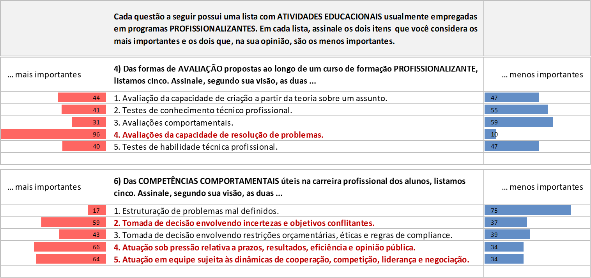
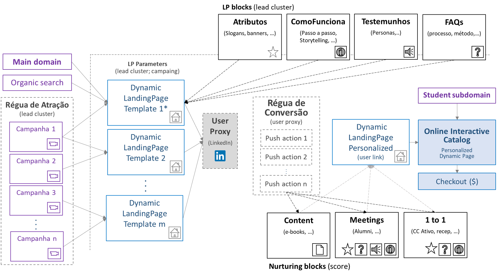
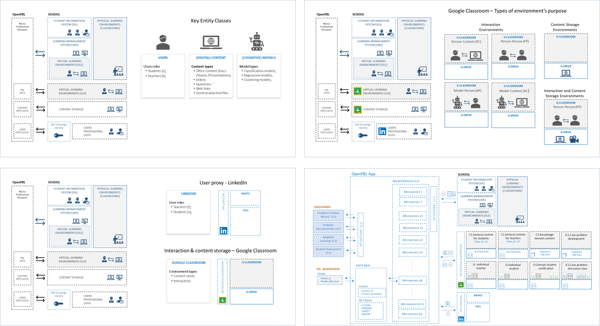

<p align="center">    
    <a href="#english">English</a>
    ·
    <a href="#portuguese">Portuguese</a>
</p>

<!--
<a name="english"></a>
<br>

### BUSINESS PLAN 

<br>

**ABSTRACT**

A group of experienced education sector executives identified a business opportunity in the **imbalance** between the growing demand and stable supply for educational programs designed to develop **professional behavioral skills**.

To take advantage of the opportunity, they designed an ingenious **teaching method** that uses **artificial intelligence** as a technology to **reduce costs** of running a class of courses that has already proven effective to develop **behavioral skills**.

Thus, they launched OpenPBL, a company whose revenues come from the sale of **courses based on typical problems of everyday professional life** and the licensing of its **problem-based learning platform** for **companies** and **vocational schools**.

The company intends to capture 4 shares of **US $ 33,000** that will be used in **software development** and as **working capital** in the **startup** phase of its five-year business plan. To this end, the original partners offer a projected **nominal return** of 36% a.a. interested investors.

`(Full text only available in Portuguese. Soon also available in the English version.)`

...

<br>
<p align="center">    
    <a href="#english">English</a>
    ·
    <a href="#portuguese">Portuguese</a>
</p>

## <br>
<br><br><br><br><br><br><br><br><br><br><br><br><br><br><br><br><br><br><br><br><br><br><br><br><br>
<br><br><br><br><br><br><br><br><br><br><br><br><br><br><br><br><br><br><br><br><br><br><br><br><br>

<a name="spanish"></a> 
<br>

-->

<a name="portuguese"></a> 
<br>

# PLANO DE NEGÓCIOS

<br>

**RESUMO** <br> 
Um grupo de experientes executivos do setor educacional identificou uma oportunidade de negócios no **desequilíbrio** entre a oferta e a demanda de programas educacionais para o desenvolvimento de um importante conjunto de **competências comportamentais profissionais**. 

Para aproveitar a oportunidade, eles projetaram um engenhoso **método de ensino** que utiliza **ativos de terceiros** como estratégia de escalabilidade e **inteligência artificial** como tecnologia para **reduzir substancialmente os custos de execução** de cursos baseados em **problem-based learning (PBL)**, uma tradicional estratégia de aprendizagem que já se demonstrou eficaz para desenvolver **competências comportamentais**.

Assim, lançaram a **OpenPBL**, uma empresa cujas receitas são provenientes do licenciamento de seu **sistema de ensino baseado em problemas** para **empresas** e **escolas profissionalizantes**. O sistema de **baixo custo** permite que os clientes da OpenPBL **democratizem o acesso** e **ampliem a eficácia** de seus programas educacionais com a oferta de **cursos baseados em problemas típicos do dia a dia profissional**.

No presente roadshow (publicado em <a href="https://www.crunchbase.com/organization/openpbl#section-overview" target="_blank">Crunchbase</a>), a empresa pretende captar 4 quotas de **US $ 33.000** `(4 x R$ 182.000)` que serão utilizados no **desenvolvimento de software** e como **capital de giro** na fase de **startup** do seu Plano de Negócios de cinco anos. Para isso, os sócios originais acenam com um **retorno nominal** projetado de 36% a.a. aos investidores interessados. 

**Palavras-chave:** *education; e-learning, problem-based learning;*<br>

## <br>

<p align="center"> 
    
</p><br>

<p align="center">
    PLANO DE NEGÓCIOS |
    <a href="#pitchdeck"> [Pitchdeck] </a> .
    [Seções]
    <a href="#problema"> O Problema </a> ·
    <a href="#proposta"> A Proposta </a> .
    <a href="#negocio"> O Negócio </a> .
    <a href="#execucao"> Execução </a> .
    <a href="#expansao"> Expansão </a> .
    <a href="#financiamento"> Financiamento </a><br><br>

## <br>

<a name="pitchdeck"></a> 
<br>

```html

**PITCHDECK** <br>
Além do texto desta página, são partes integrantes do plano de negócios as seguintes informações disponibilizadas pela área de relacionamento com investidores:<br>

**Publições em listas de startups**  :
<a href="https://www.crunchbase.com/organization/openpbl#section-overview" target="_blank">Crunchbase</a> . 
<a href="https://gust.com/companies/openpbl" target="_blank">Gust</a>
 
**Páginas institucionais**  :
<a href="https://www.linkedin.com/company/openpbl" target="_blank">Website</a> .
<a href="https://openpbl-school.github.io/InvestorRelations/roadshow/About#portuguese" target="_blank">Sobre a OpenPBL</a> .
<a href="" target="_blank">Boiler Plate para imprensa</a> 

**Redes sociais**  :
<a href="https://www.linkedin.com/company/openpbl" target="_blank">LinkedIn</a> .
<a href="" target="_blank">Twitter</a>

**Apresentações**  :
<a href="https://openpbl-school.github.io/InvestorRelations/roadshow/files/openpbl_pitchdeck_07ago20.pdf" target="_blank">Pitchdeck</a>

**Produtos**  :
<a href="https://openpbl-school.github.io/CustomerAcquisition/lp/home#start" target="_blank">Home Page (Ensaio)</a> .
<a href="https://openpbl-school.github.io/Storytelling/#portuguese" target="_blank">Storytelling</a>

**Conversão B2C**  :
<a href="https://openpbl-school.github.io/CustomerAcquisition/shop/cataloge#start" target="_blank">Comércio eletrônico</a> .
<a href="https://openpbl-school.github.io/InvestorRelations/roadshow/FinancialPlan#portuguese" target="_blank">Argumentos B2C</a>

**Conversão B2B**  :
<a href="https://openpbl-school.github.io/InvestorRelations/roadshow/files/proposta_B2B_22ago20.pdf" target="_blank">Proposta comercial</a> . 
<a href="" target="_blank">Argumentos B2B</a> .
<a href="" target="_blank">Conversão B2B (Sistema)</a> .
<a href="" target="_blank">Proposta sistema de ensino</a>

**Outros componentes do plano de negócios**  :
<a href="https://openpbl-school.github.io/InvestorRelations/roadshow/FinancialPlan#portuguese" target="_blank">Plano Financeiro</a> .
<a href="https://openpbl-school.github.io/InvestorRelations/roadshow/Startup#portuguese" target="_blank">Detalhamento do Startup</a>
</p><br>

```

## <br>

<a name="problema"></a> 
<br>

## O PROBLEMA E A OPORTUNIDADE
Uma pesquisa publicada em 2018 pelo **Fórum Econômico Mundial** elencou as dez competências profissionais mais desejadas para os trabalhadores do futuro na opinião de gestores de RH de todo o mundo. Segundo o <a href="https://www.weforum.org/agenda/2020/01/davos-2020-future-work-jobs-skills-what-to-know/">relatório da pesquisa</a>, os conhecimentos e habilidades técnicas são importantes, mas o que **diferencia** os profissionais num mundo cada vez mais globalizado, dinâmico e automatizado é o domínio de algumas importantes **competências comportamentais**. 

Para os especialistas consultados na pesquisa, certas competências, tais como "tomar decisões corretas em ambientes de incerteza", "atuar sob pressão da opinão pública" e "negociar internamente com a equipe" são fundamentais para que colaboradores, não só alcancem os **resultados esperados** por suas empresas, mas que o façam da forma **mais eficiente** possível. <br><br>

<p align="center">
  <br>
</p>

<p align="center">
  <br>
  <em><a href="https://youtu.be/9G5mS_OKT0A" target="_blank">Vídeo TED</a> - Competências comportamentais permitem que profissionais<br> alcançem os resultados esperados com menos recursos.</em>
</p><br><br>

<p align="center">
  <br>
  <em><a href="https://youtu.be/1HEymYOkz44" target="_blank">Vídeo 1</a> e <a href="https://youtu.be/WyKZC7nhQZw" target="_blank">vídeo 2</a> com consultores de RH sobre competências comportamentais.</em>
</p>

<br>


> **Publições em listas de startups**  :
> <a href="https://www.crunchbase.com/organization/openpbl#section-overview" target="_blank">Crunchbase</a> . 
> <a href="https://gust.com/companies/openpbl" target="_blank">Gust</a>
> 
> **Páginas institucionais**  :
> <a href="https://www.linkedin.com/company/openpbl" target="_blank">Website</a> .
> <a href="https://openpbl-school.github.io/InvestorRelations/roadshow/About#portuguese" target="_blank">Sobre a OpenPBL</a> .
> <a href="" target="_blank">Boiler Plate para imprensa</a> 
> 
> **Redes sociais**  :
> <a href="https://www.linkedin.com/company/openpbl" target="_blank">LinkedIn</a> .
> <a href="" target="_blank">Twitter</a>
> 
> **Apresentações**  :
> <a href="https://openpbl-school.github.io/InvestorRelations/roadshow/files/openpbl_pitchdeck_07ago20.pdf" target="_blank">Pitchdeck</a>
> 
> **Produtos**  :
> <a href="https://openpbl-school.github.io/CustomerAcquisition/lp/home#start" target="_blank">Home Page (Ensaio)</a> .
> <a href="https://openpbl-school.github.io/Storytelling/#portuguese" target="_blank">Storytelling</a>
> 
> **Conversão B2C**  :
> <a href="https://openpbl-school.github.io/CustomerAcquisition/shop/cataloge#start" target="_blank">Comércio eletrônico</a> .
> <a href="https://openpbl-school.github.io/InvestorRelations/roadshow/FinancialPlan#portuguese" target="_blank">Argumentos B2C</a>
> 
> **Conversão B2B**  :
> <a href="https://openpbl-school.github.io/InvestorRelations/roadshow/files/proposta_B2B_22ago20.pdf" target="_blank">Proposta comercial</a> . 
> <a href="" target="_blank">Argumentos B2B</a> .
> <a href="" target="_blank">Conversão B2B (Sistema)</a> .
> <a href="" target="_blank">Proposta sistema de ensino</a>
> 
> **Outros componentes do plano de negócios**  :
> <a href="https://openpbl-school.github.io/InvestorRelations/roadshow/FinancialPlan#portuguese" target="_blank">Plano Financeiro</a> .
> <a href="https://openpbl-school.github.io/InvestorRelations/roadshow/Startup#portuguese" target="_blank">Detalhamento do Startup</a></p>


**Desenvolvendo competências comportamentais** <br>
De forma resumida, o desempenho de um indivíduo na **execução de uma tarefa** pode ser vista como resultado direto de um conjunto de recursos de natureza diversa, acumuldos por esse indivíduo até ali. Nesse conjunto de recursos é usual considerarmos os conhecimentos técnicos aprendidos, formalmente ou não, pelo indivíduo, as habilidades desenvolvidas por experiências pregressas, toda a carga cultural dos ambientes em que viveu, seus traços de personalidade, comportamento social, enfim, tudo mais que contribui positivamente ou negativamente para o desempenho da tarefa. Quando esse desempenho é validado positivamente por um grupo social, entendemos que esse indivíduo é competente para executar de forma **eficaz** a tarefa e que todos os recursos que contribuiram para isso formam as suas **competências** para executá-la. 

Ao contrário das **habilidades** pessoais que resultam de características biológicas e socio-emocionais definidas **antes** da vida adulta dos indivíduos, as **competências que interessam às empresas** só podem ser desenvolvidas diretamente após um período mínimo de formação técnica profissional. 

Por razões diversas que envolvem custos, prazos e competitividade, a maior parte das escolas de formação se limita a desenvolver as **competências técnicas** em nível suficiente para garantir a **empregabilidade de entrada** de seus alunos no mercado de trabalho. Isso implica em garantir aos profissionais em formação apenas a **execução eficaz** das tarefas profissionais em ambientes ideais. Contudo, ao empregar suas competências técnicas nas demandas e tarefas diárias da carreira que escolheram, os profissionais se deparam com aspectos práticos relevantes, tais como **assimetrias de informação**, **restrições de recursos** e **pressões de ordem diversa**, que alteram (por vezes, substancialmente) as condições ideais dos problemas para as quais seus conhecimento e habilidades técnicas se aplicam sob medida. Por esta razão, embora os profissionais entrantes no mercado de trabalho tenham recursos técnicos para garantir a eficácia mínima na execução de suas tarefas, a sua **eficiência**, isto é, a conta que considera o tempo e os demais recursos que utilizaram, só é conseguida ao longo da **experiência** na função. 

Os conhecimentos acumulados pelo profissional nesse período que não são enquadráveis nos conhecimento técnicos específicos para execução das tarefas em ambientes ideias, aliados ao seu perfil comportamental pessoal, são vistos como competências, **não técnicas**, sob o ponto de vista específico da profissão, que direcionam o seu comportamento em ambientes reais para a execução mais eficiente das tarefas.   


...
No entanto, as escolas de formação profissionalizante raramente buscam avaliar o desempenho de seus alunos em questões técnicas que não sejam apresentadas sob **condições ideais** e isentas de fatores inerentes do dia a dia profissional. 

O desenvolvimento **desta classe** de competências comportamentais é um processo que se dá quando os profissionais se deparam com situações de "imperfeição" da vida real, tais como **riscos**, **incertezas** e **preferências**. 

Contudo, embora já seja possível desenvolvê-las a partir do terço final da formação técnica, na grande maioria das vezes este desenvolvimento só ocorre de fato ao longo da carreira profissional.

...
O processo pode ser resumido da seguinte forma.

Sempre que os profissionais se deparam com situações de "imperfeição" da vida real, tais como **riscos**, **incertezas** e **preferências**, eles precisam buscar **novas formas** de atingir os mesmos resultados que atingiriam nas condições ideais. Esse processo envolve a busca de novas técnicas e, via de regra, a **incorporação** das técnicas **mais adequadas** às suas habilidades comportamentais pessoais. Como consequência deste processo contínuo de teste e adequação, cada indivíduo acaba por reunir e **incorporar à sua atuação profissional** um **repertório único** de técnicas, modelos e estratégias empíricas com os quais ele irá contar, juntamente com suas competências técnicas, para superar os desafios a que é submetido ao longo da carreira.

Embora algumas empresas avaliem as **habilidades pessoais** e **perfis da personalidade** de seus colaboradores (modelos DISC, MBTI e Big Five) como forma de orientá-los no desenvolvimento das atitudes frente aos problemas e convívio corporativo, na grande maioria dos casos, o desenvolvimento das competências comportamentais é um processo **não supervisionado**, **auto patrocinado** e executado de forma **natural** e **inconsciente** ao longo da carreira profissional. Além disso, dependendo dos diferentes estímulos à que são submetidos os profissionais, este processo de desenvolvimento pode durar **muito tempo** ou, até mesmo, não acontecer. 

<br><br>


<p align="center">
  <br>
  <em>O desenvolvimento das competências técnicas não consideram fatores como riscos, incertezas e preferências.</em>
</p><br><br>
<p align="center">
  <br>
  <em>Cada indivíduo incorpora à sua atuação profissional um repertório próprio.</em>
</p><br><br>
<p align="center">
  <br>
  <em>Um novo problema pode requerer novas ferramentas comportamentais.</em>
</p><br><br>

**Acelerando o desenvolvimento de competências comportamentais** <br>


Para **acelerar** e tornar mais **assertivo** este processo, alguns **programas educacionais** se propõem a **simular** situações reais do dia-a-dia em atividades de aprendizagem para, desta forma, estimular o desenvolvimento personalizado de competências comportamentais. 

É o caso, por exemplo, das escolas que ofertam programas educacionais utilizando predominantemente a *Problem Based Learning* (ou, de forma abreviada, a **PBL**), uma **estratégia de aprendizagem** na qual os alunos aprendem **resolvendo problemas** e **refletindo** sobre suas experiências (<a href="https://en.wikipedia.org/wiki/Problem-based_learning" target="_blank">Ver definição na Wikipedia</a>).<br><br>

<p align="center">
  <br>
  <em>Harvard, Minerva e a escola de tecnologia #42 são exemplos bem sucedidos de aplicação da PBL.</em>
</p><br><br>

**Desequilíbrio de mercado**<br>

Se por um lado, empresas demandam cada vez mais profissionais com competências comportamentais, por outro lado, estes mesmos profissionais encontram muitas dificuldades para desenvolvê-las num prazo razoável, uma vez que **a oferta de cursos e programas educacionais** específicos para esse fim **não é suficiente** para atender os requisitos de **preço** e **disponibilidade** do mercado.

Grande parte deste desequilíbrio ocorre porque as escolas que atuam tradicionalmente neste segmento não geram **economias de escala suficientes** para **popularizarem seus cursos**. Nem mesmo a recente introdução de tecnologias digitais nas práticas educacionais foi capaz de estimular a universalização deste tipo de programa.  

Diante deste cenário, de desequilíbrio entre a oferta e a demanda de cursos e programas educacionais para desenvolvimento competências comportamentais, experientes executivos do setor educacional identificaram uma excelente **janela de oportunidades** a ser explorada.<br><br>


<a name="proposta"></a> 
<br>

## PROPOSTA PARA EXPLORAR A OPORTUNIDADE DE MERCADO

A PBL é comprovadamente **eficaz** no desenvolvimento de competências comportamentais e, portanto, seria **candidata natural** para suprir a atual demanda do mercado educacional. Contudo, a PBL ainda encontra alguns **obstáculos** para **execução em larga escala**.<br><br>

<p align="center">
  <br>
  <em>Pela PBL, os alunos aprendem resolvendo problemas e refletindo sobre suas experiências.<br> Fonte:<a href="https://docs.lib.purdue.edu/ijpbl/" target="_blank"> The Interdisciplinary Journal of Problem-based Learning</a>.</em>
</p><br>

**Escalando a PBL** <br>

O caminho escolhido para aproveitar a atual janela de oportunidades é buscar formas viáveis de contornar os obstáculos para escalar o processo de execução da PBL. Os **obstáculos** para **execução em larga escala** das atividades educacionais típicas da PBL são: 
- Seu processo de execução requer que dois dos mais relevantes **recursos educacionais** em termos de custo -**docentes** e **infraestrutura física**- sejam **desenvolvidos sob medida** para cada instituição de ensino.
- O paradigma da **execução 100% digital** das **Edtechs** ainda não foi capaz de resolver o problema da **qualidade da interação síncrona** entre alunos, fundamental para a execução da PBL.

Para dar **escalabilidade à execução da PBL**, os idealizadores do projeto desenvolveram um modelo **inovador**, baseado na utilização de **ativos de terceiros** e no uso intensivo de **inteligência artificial** no processo de execução de experiências PBL. 

Diferentemente do paradigma de execução 100% digital que se baseia na escala, indiscriminada, todas as atividades educacionais, a **essência inovadora** do modelo proposto consiste em escalar **cada etapa** do processo de execução da PBL de forma **única**, conforme mostra o diagrama a seguir.<br><br>

<p align="center">
  <br>
  <em>Intervenção em cada uma das etapas clássicas do processo de execução da PBL.</em>
</p><br>

A **complementação estratégica** das ações propostas no modelo, podem ser avaliadas:
1. Quanto à utilização de **ativos de terceiros**: 
 - A utilização de **espaços físicos** de terceiros garante o nível de disponibilidade do recurso, mesmo com o aumento das atividades da empresa;
 - A adoção de espaços físicos, cuja oferta já consideram as facilities atendimento, limpeza, segurança, agendamento, etc, permite que a gestão seja tratada como a gestão de um custo direto e não mais como um custo fixo, apropriável por chave de rateio;
 - A substituição de docentes por profissionais experientes de mercado viabiliza a produção de conteúdo que pode, simultaneamente, suportar a capacitação **funcional** e **setorial**.<br>

2. Quanto ao uso intensivo de **inteligência artificial**: 
 - A IA viabiliza a “extração” (e a codificação) da experiência dos profissionais de mercado;
 - A IA automatiza algumas tarefas docentes e reduz drasticamente o custo da operação; 
 - A "**atomização**" da sessão presencial proporciona um ambiente controlado propício para aplicar modelos de reconhecimento facial, transcrição, Processamento de linguagem Natural (NLP) e algoritmos de clusterização obtidos por *machine learning*.<br><br>

**Método de ensino** <br>

Baseado no modelo proposto, os idealizadores desenvolveram um **método** com **três sub-processos**:
1. Extração automatizada de cenários reais;
2. Eliminação individualizada das deficiências técnicas;
3. Atomização e automatização das discussões;

Cada um destes processos responde **de forma integrada** pela intervenção em uma ou mais etapas do processo completo de execução da PBL.<br><br>

**Extração Automatizada de Cenários Reais** <br>

A produção de conteúdo para PBL envolve a *"elaboração pedagogicamente estruturada de cenários descritivos de problemas”*. Tradicionalmemte esta elaboração de "cenários reais" é executada por docentes "criadores de conteúdo" cuja tarefa é entrevistar profissionais e especialistas de mercado para explicitar **cenários do dia-a-dia profissional** e seus possíveis **problemas associados**. 

Ao contrário da elaboração tradicional, a **Extração Automatizada de Cenários Reais** prevê a **interação direta** dos especialistas como um software do tipo *"expert system"*. Os “títulos” e cenários são sugeridos pelos especialistas ao interagirem com o *expert system*, mas o texto final é estruturado por um *software de IA*, treinado pela técnica de *"machine learning"*. <br><br>

<p align="center">
<br>
<em>Sistema para extração de conhecimento dos profissionais especialistas.</em>
</p><br><br>

**Eliminação Individualizada das Deficiências Técnicas** <br> 

Na etapa de *“self-directed learning” (SDL)* do processo de execução da PBL, os alunos *"identificam e buscam os conhecimentos necessários para resolver o problema a que foram submetidos"*. 

Tradicionalmente, cada aluno é responsável por identificar suas deficiências e buscar as fontes de conhecimento para corrigi-las. O principal objetivo do processo de **Eliminação Individualizada das Deficiências Técnicas** é acelerar a fase da SDL. 

Um *"assessment online"* testa de forma personalizada os conhecimentos dos alunos e um software do tipo *recommender system* aponta as fontes de conteúdo e as opções de capacitação. O processo utiliza ainda o conceito de **nano certificação** (proprietária ou de terceiros) para habilitar os alunos à etapa seguinte do processo da PBL.<br><br>

<p align="center">
<br>
<em>Adaptive learning para acelerar a fase de "self-directed learning" dos alunos.</em>
</p><br>

**Atomização e Automatização das Discussões** <br>

Tradicionalmente, as sessões presenciais de discussão de problemas são reuniões com 40 alunos ou mais, uma vez que, quanto maior o número de alunos, menor o impacto do valor da apropriação do custo da infra-estrutura física no preço unitário dos cursos. Para isso, as escolas tradicionais investem em **salas** e **equipamentos sofisticados** para garantir a qualidade das interações entre os alunos, mesmo com discussões em grandes grupos.<br><br>

<p align="center">
<br>
<em>Harvard Classroom: a escola investe em infraestrutura e equipamentos para manter a qualidade das discussões em grupos grandes de alunos.</em>
</p><br>

No processo de **Atomização e Automatização das Discussões**, as sessões presenciais de discussão são reuniões de 10 alunos no máximo, agendadas conforme demanda em *espaços compartilhados de trabalho (coworking)*. 

A dinâmica de uma sessão é conduzida por um tutor via *videoconference* com o auxílio de um *Process management software* que, entre outras coisas, propõe e controla o tempo das atividades, orienta a elaboração das perguntas, define os grupos para exercícios e exibe material multimidia auxiliar. 

A avaliação do desempenho individual dos alunos nas discussões é executada por *software de IA*, treinado pela técnica de *"machine learning"*, que também edita automaticamente o vídeo com a gravação da sessão.<br><br>

<p align="center">
<br>
<em>Sessão presencial atomizada e assistida por software.</em>
</p>

<br>

**Sistema de ensino profissionalizante baseado em problemas** <br>

Os seis **componentes de software** que **automatizam** o método de ensino proposto são **integrados** por um **sistema de software** cujo objetivo é garantir a **eficácia** e **escalabilidade** da execução conjunta. São eles:
 - **"*Expert system*"** capaz de parametrizar as relações causais entre o problema proposto por um especialista e as competências comportamentais que se propõe desenvolver nos alunos.
 - **"*Machine learning model*"** capaz de produzir automaticamente os "cenários de problemas" com títulos em **português**, **inglês** e **espanhol**.
 - **"*Adaptive learning system*"** para acelerar a etapa de SDL (self-directed learning) dos alunos.
 - **"*Recommender system*"** para recomendação do conteúdo de apoio na etapa de SDL do método. 
 - **"*Process management system*"** para assistir e orientar os tutores na condução das sessões presenciais de discussão.
 - **"*Machine learning model*"** capaz de editar e avaliar automaticamente o desempenho filmado dos alunos nas sessões de discussão.<br>
 
O draft da arquitetura do sistema pode ser acessado em <a href="https://openpbl.github.io/app-docs/" target="_blank">Arquitetura OpenPBL</a>.<br>

Um software capaz de automatizar e escalar um **método de ensino baseado em problemas** torna-se uma tecnologia extremamente útil para players do segmento de **educação profissionalizante**. Entretanto, mais do que um sistema de software, os idealizadores propõem uma nova **tecnologia educacional** sob a forma de um **sistema de ensino** que garante a execução **contínua** e **escalável** de **cursos profissionalizantes** com dinâmicas baseadas unicamente na *problem-based learning*. <br><br>

**Dinâmica de aprendizagem do sistema de ensino** <br>

Cada um dos **cursos profissionalizantes** gerenciados pelo sistema de ensino proposto deve proporcionar ao aluno uma **experiência de aprendizagem completa** baseada na discussão de um problema **real** e **típico** de sua carreira profissional. 

Os cursos têm **formato padronizado** na modalidade **híbrida** (ou semi-presencial) e são executados sempre em duas etapas:
1. Uma etapa preliminar de **preparação**, com atividades **online** que correspondem a 95% da carga horária total do curso e; 
2. Uma etapa final de **discussão**, composta de uma sessão **presencial** de três horas, conduzida por um **tutor**, onde **dez alunos** se reunem por **três horas** para **analisar** as possíveis soluções para o problema proposto no curso. 

Na etapa de **preparação**, o aluno: 
1. Recebe o **conteúdo descritivo** do problema abordado no curso, bem como todo o material de apoio para o seu entendimento;
2. Tem os **conhecimentos técnicos** necessários para a análise do problema **aferidos** *online* por **testes adaptados** para a sua proficiência no assunto; 
3. Recebe **recomendações personalizadas** de fontes de conteúdo para eliminar possíveis deficiências de conhecimento técnico;
4. Ao final, **propõe a sua solução** (ou soluções) para o problema objeto do curso.<br>

Na etapa de **discussão**, o aluno: 
1. Recebe uma lista com opções de **locais** e **horários** disponíveis para a sessão presencial, contendo detalhes da **infraestrutura**, **facilidades** e perfil do **tutor** responsável; 
2. Agenda a data e o local mais adequados para participar da sessão;
3. Participa da **dinâmica de discussões** em torno do problema proposto no curso, conduzidas pelo **tutor** da sessão.<br>

Como *feedback* da sua atuação no curso, o aluno recebe: 
1. Os **resultados dos testes** de conhecimento técnico; 
2. O **registro audiovisual** da sua participação na sessão presencial de discussões; 
3. A **avaliação do seu desempenho** na solução do problema proposto no curso.<br><br>

**Objetivos de aprendizagem dos cursos** <br>

A dinâmica proposta pelo sistema de ensino busca desenvolver no alunos as **competências comportamentais** de **um ou mais** grupos a seguir: 
- Estruturação de **problemas mal definidos**; 
- Tomada de decisão envolvendo **incertezas** e objetivos conflitantes; 
- Tomada de decisão envolvendo **restrições** orçamentárias de recursos, restrições éticas e sujeitas à regras de compliance; 
- Atuação sob **pressão** de prazo, desempenho e opiniões diversas; 
- Atuação em **equipe** sujeita às dinâmicas de cooperação, competição, liderança e negociação; 
- Visão orçamentária e atitude empreendedora.<br><br>

**Benefícios para usuários do sistema de ensino profissionalizante**<br>

As competências comportamentais desenvolvidas pelo **sistema de ensino baseado em problemas** proposto melhoram o **desempenho do aluno na resolução de problemas profissionais** e **aumentam a eficiência** da sua atuação no dia-a-dia da carreira. Para avaliar a reação destas hipóteses entre alunos de escolas profissionalizantes, os idealizadores utilizaram os resultados de uma pesquisa quantitativa voluntária realizada recentemente no Brasil. 

A pesquisa entrevistou 120 alunos concluintes de cursos de graduação em economia, engenharia e administração sobre **atividades educacionais** usualmente empregadas em programas **profissionalizantes**. O questionário da pesquisa continha nove questões do tipo múltipla escolha com o objetivo de medir a percepção de valor nas diversas experiências de aprendizagem de programas profissionalizantes online e presencial. 

Duas questões avaliaram diretamente a receptividade dos benefícios da PBL e da importância das competências comportamentais para os alunos entrevistados.<br><br>

<p align="center">

</p>
<p align="center">
<em>Os resultados quantitativos da pesquisa foram validados em entrevistas qualitativas posteriores. A pesquisa completa pode ser acessada em <a href="https://docs.google.com/forms/d/1AtVWKqeECtwsmQpiBUlhZVVezaOU_rUCCRduIeS1CpA/edit#responses" target="_blank">pesquisa</a>.</em>
</p>

<br>

As respostas dos entrevistados para estas duas questões evidenciam fortemente as seguintes hipóteses: 
1. Para os alunos, as **avaliações da capacidade de resolução de problemas** são as **mais importantes** de um curso profissionalizante;
2. O alunos percebem com importância semelhante as **competências comportamentais** que, segundo o Fórum Econômico Mundial, **diferencia** os trabalhadores do futuro no mercado de trabalho. <br><br>


<a name="negocio"></a> 
<br>

## O NEGÓCIO 
Para monetizar o **sistema de ensino** desenvolvido, os idealizadores do projeto criaram a **OpenPBL**, uma edtech cuja missão é *"**popularizar** e **democratizar** o **ensino profissionalizante baseado em problemas**".*

As receitas da OpenPBL são provenientes de duas fontes: 
- do **licenciamento** do **Sistema de Ensino OpenPBL** para escolas profissionalizantes e;
- da **venda de cursos profissionalizantes** para **profissionais** e **entrantes no mercado de trabalho**.<br><br>

**Escola profissionalizante OpenPBL** <br>

Além das receitas oriundas da venda de cursos profissionalizantes, a **Escola profissionalizante OpenPBL** tem a função estratégica de **tangibilizar** os benefícios do **Sistema de Ensino OpenPBL**, à medida que promove ações para comunicar o sucesso dos seus alunos no mercado de trabalho.

Os problemas abordados nos cursos da Escola profissionalizante OpenPBL são propostos por **profissionais experientes** do mercado e cada problema específico origina a oferta de um **título no catálogo** da OpenPBL. Cada título pode ser adquirido de forma **avulsa** pelo preço-alvo de **US $ 60,00** `(R$ 320,00)` ou adquiridos em conjunto, com os títulos agrupados em **trilhas funcionais**, planejadas para promover a capacitação do aluno nas diversas **"funções"** da carreira profissional escolhida.

A oferta dos títulos sob a forma de "trilhas funcionais" (ao invés de "trilhas de disciplinas") é a principal ação estratégica com vistas a posicionar a **Escola Profissionalizante OpenPBL** como uma **instituição de ensino segmentada por perfis funcionais"** e não por áreas do conhecimento como é usual no mercado de educação profissionalizante. <br><br> 

**Público-alvo da escola** <br>

Os cursos e programas da **Escola OpenPBL** são destinados à **profissionais** (e aspirantes) com o **objetivo comum** de se diferenciarem no mercado de trabalho pelo domínio de competências comportamentais, cada vez mais demandadas por empresas e organizações. <br><br>

<p align="center">
  <br>
</p>
<p align="center"><em>Usuários-alvo com necessidades diversas e em fases distintas da carreira.</em>
</p>

<br>

**Mercado da escola** <br>

A combinação das **três classes** de público-alvo da escola com os dois **dois níveis** de progressão de ensino regular definem os **seis segmentos** de mercado, elegíveis para a atuação da escola. Alguns destes segmentos são tradicionais no setor educacional, tais como **educação executiva** e **educação corporativa**. Assim, o cálculo do tamanho do **mercado potencial da escola**, deve considerar as variáveis demográficas e cada **localidade geográfica** onde é cogitada a atuação da escola. <br><br>

<p align="center">

</p>
<p align="center">
<em>Segmentos-alvo da OpenPBL e os segmentos tradicionais do mercado educacional.</em>
</p>

<br>

**Comunicação dos diferenciais da escola** <br>

Quando comparados com **programas tradicionais** do mercado educacional desenhados para o desenvolvimento de competências comportamentais, os cursos profissionalizantes da **Escola OpenPBL** se diferenciam pelos seguintes fatores:
- **Custo baixo** das experiências completas de aprendizagem PBL **para** caber em orçamentos de vários tamanhos.
- Programas híbridos com grande parte do tempo dedicado à etapa online assíncrona **para** adequar-se à disponibilidade de tempo dos alunos.
- Etapa presencial com várias opções de disponibilidade geográfica **para** adequar-se às restrições de deslocamento do alunos.
- Cursos segmentados por trilhas funcionais **para** concentrar o ganho de empregabilidade do aluno em uma carreira específica. 

Estes atributos norteiam a estratégia de comunicação para venda B2C da escola. As ações para atração e conversão de novos alunos está descrita com detalhes em <a href="https://openpbl-school.github.io/CustomerAcquisition/" target="_blank">Estratégia de Comunicação</a>.

*Para mais detalhes sobre a escola profissionalizante OpenPBL, veja um <a href="https://openpbl-school.github.io/Storytelling/#portuguese" target="_blank">storytelling</a> do seu produto-tipo.* <br><br>

**Sistema de Ensino OpenPBL** <br>

O **Sistema de Ensino OpenPBL** viabiliza o desenvolvimento sistemático de **cursos** baseados em PBL totalmente **customizados** para terceiros. Os problemas abordados nos cursos são propostos pelos próprios clientes e cada problema específico origina a oferta de um **título no catálogo** do cliente. 

Os usuários do **Sistema de Ensino OpenPBL** acessam os títulos pelo preço-alvo mensal de **US $ 5,37** `(R$ 25,00)`. As ofertas comerciais para licenciamento do **Sistema de Ensino OpenPBL** envolvem ainda:
- O valor dos serviços de **implantação** do sistema;
- O prazo de vigência do contrato de licenciamento, não inferior a **24 meses**;
- As faixas de franquia divididas por **quantidade de usuários** para a utilização ilimitada do sistema;
- O **valor mensal por usuário** para cada faixa de franquia.<br><br>

**Clientes-alvo do sistema de ensino** <br>

A utilização do **Sistema de Ensino OpenPBL** pode ajudar: 
1. **Escolas profissionalizantes** a ampliarem suas receitas e; 
2. **Empresas** a promover o **desenvolvimento de competências comportamentais** em seus funcionários e colaboradores.

No **segmento das escolas profissionalizantes** os clientes-alvo são as instituições de ensino superior e as escolas de ensino técnico de nível médio. Para estas escolas, a utilização do **Sistema de Ensino OpenPBL** promove a **participação continuada** dos alunos em "experiências PBL" que os **diferenciam** no mercado de trabalho. 

No **segmento da educação corporativa** os clientes-alvo são **grandes e médias empresas ou organizações** que viabilizem relacionamento de parceria e recorrência comercial de longo prazo. 

Os profissionais de Treinamento e Desenvolvimento (T&D) destas empresas são os responsáveis por desenvolver e gerenciar projetos de educação corporativa. Assim, as soluções são organizadas em 5 grupos para que os profissionais de T&D tenham suporte em todas as suas demandas, desde o planejamento até a gestão da execução de um **projeto de educação corporativa baseado em *Problem-based Learning*.** Estas soluções são: 
- **Soluções de Planejamento Educacional.** As soluções para essa etapa têm caráter de consultoria educacional para os profissionais de T&D. 
- **Soluções de Aprendizagem.** São os objetos de aprendizagem propriamente ditos. Esses objetos podem estar no acervo da OpenPBL ou requerer a produção de conteúdos customizados.
- **Soluções de Engajamento.** São soluções utilizadas nos projetos onde a adesão do colaborador é facultativa.
- **Soluções de Execução.** São soluções para a execução da capacitação propriamente ditas. Essas soluções disponibilizam a infraestrutura presencial ou online necessárias.
- **Soluções de Gestão da Execução.** É o conjunto de soluções para acompanhamento e controle dos projetos de capacitação pelo profissional de T&D.<br><br>


<a name="execucao"></a> 
<br>

## EXECUÇÃO DO PLANO DE NEGÓCIOS
Os empreendedores que conceberam o projeto e desenvolveram o plano de negócios são profissionais com 20 anos de experiência na condução de **unidades de negócios** de instituições de ensino superior de **grande porte**.<br><br>

 <p align="center">
<br>
<em>Time executivo.</em>
</p><br>

Os perfis profissionais complementares credenciam os idealizadores a liderarem a fase de *startup* do plano de negócios.  
- Perfil executivo (<a href="https://www.linkedin.com/in/jorgecataldo/">Jorge Cataldo</a>).
- Perfil executivo (<a href="https://www.linkedin.com/in/eduardo-pitombo-62b76ab/">Eduardo Pitombo</a>). 
- Perfil executivo (<a href="https://www.linkedin.com/in/silvio-samuel-cfp/">Sílvio Samuel</a>). 
- Perfil executivo (<a href="https://www.linkedin.com/in/tonlobo/">Everton Bonifácio</a>).<br> 
 
Em especial, os empreendedores têm experiências complementares na execução de *projetos complexos de educação corporativa*, isto é, projetos que apresentam:
1. Grande abrangência territorial e diversidade de infraestrutura presencial;
2. Grande quantidade e dispersão dos colaboradores envolvidos; 
3. Integração de diversas estratégias instrucionais (EAD, Presencial,...) num mesmo projeto;  
4. Complexidade técnica e inovação das ferramentas tecnológicas envolvidas;
5. Grande necessidade de engajamento e fidelização dos colaboradores.<br>


<br><br>


**Roadmap** <br>

Do lançamento da empresa até o **final do segundo ano de operação**, os objetivos do startup são:
1. Estudos de viabilidade, pesquisas de mercado e testes para validar as premissas do plano de negócios;
2. Desenvolver e ofertar cursos PBL para empresas (B2B);
3. Ampliar oferta de cursos e iniciar a automação do processo (IA);
4. Finalizar automação e iniciar oferta no varejo (B2C) para fortalecimento da marca;
5. Lançar o Sistema de Ensino baseado em Problemas (B2B2C);

<br><br> 


**Greenfield** <br>

No Brasil, a <a href="http://inep.gov.br/microdados" target="_blank">base de dados do MEC/INEP</a> é considerada uma fonte confiável de dados estratificados do **segmento II**, ou seja, *"alunos em fase de conclusão dos seus cursos profissionalizantes de nível superior"*. Segundo o INEP, o Brasil registrou em 2018, um total de aproximadamente **8.450.000** de alunos universitários matriculados em instituições públicas e privadas, dentre estes, cerca de **1.256.000** (ou 15% dos matriculados) pertencem ao segmento II do público-alvo da escola por estarem concluindo seus programas de capacitação profissionalizante. 

A cidade de São Paulo foi escolhida para o lançamento da escola profissionalizante por apresentar **grande densidade populacional**, **grande variedade de cursos de graduação**, além de **muitas oções de co-workings**. Segundo o INEP, o tamanho do segmento II na cidade de São Paulo é de **130.000** potenciais alunos.<br><br>

<p align="center">
<br>
<em>Alunos concluintes em 2018 na cidade de São Paulo.</em>
</p><br>

**Startup** <br>

O *startup* da empresa, previsto para o seu **primeiro ano** de operação, tem como objetivos: 
- Elaborar testes com um “**concierge MVP**” para validar as premissas de **custos de execução** das sessões presenciais (utilização do *capital semente*).
- Estudos de mercado e **escolha das trilhas funcionais** para oferta inicial na cidade São Paulo.
- Abertura formal e pré-operação da empresa na **cidade São Paulo**. 
- Produção do estoque inicial de títulos (CAPEX).
- Lançamento das primeiras trilhas, validação das **premissas de mercado** e ajustes na campanha. 
- Desenvolvimento dos componentes de software do **sistema educacional proprietário** da empresa (CAPEX).<br>

O detalhamento da etapa de *startup* pode ser acessado pelo link:<a href="https://openpbl-school.github.io/InvestorRelations/roadshow/Startup#portuguese" target="_blank_"> OpenPBL - Startup</a><br><br>


**Comercialização B2C** <br>

A política de **canais B2C** para os **dois primeiros anos de operação** deve se basear em **parcerias** firmadas com empresas **ativadoras de tráfego** e empresas especializadas na **conversão** do público-alvo. Entre estes:
- Marketplaces digitais com foco educacional (*Udemy, ...*); 
- Instituições de ensino superior (IES) e escolas profissionalizantes do ensino médio;
- Agências intermediadoras de recrutamento e seleção profissional.

A **estratégia de comunicação** para atração e conversão de leads contém elementos para a construção da *home page* da escola. <br><br>

<p align="center">
<br>
<em>Projeto de conversão online.</a>.</em>
</p>

<br><br>

<p align="center">
<br>
<em><a href="https://openpbl-school.github.io/CustomerAcquisition/lp/home" target="_blank">Ensaio da HomePage</a>.</em>
</p>

<br>

**Comercialização B2B** <br>

A Política de **canais B2B** para os **dois primeiros anos de operação** deve se basear em **parcerias** estabelecidas com **associações** profissionais, **cooperativas**, **empresas de representação comercial** e organizações empresariais diversas.

A partir da conclusão do **sistema educacional**, prevista para o início do segundo ano de operação, a atuação B2B deverá incluir também as **instituções de ensino de nível médio e superior** e **empresas de grande e médio porte** como clientes-alvo. <br><br>


### Operações
Blá blá Graças ao modelo escalável utilizado, o desempenho simulado acima poderá ser replicado para garantir uma rápida expansão das atividades da escola. Para is. <br><br> 

**Operações comerciais - Atração**<br>

Estratégia operacional 
- Produção publicitária: (1) peças de comunicação digital (banners, posts, ...) e; (2) peças de comunicação tradicional (apresentações, ...); 
- Portfolio de ações de atração distribuído entre: (1) agências de marketing digital; (2) agências de publicidade tradicional (incluindo OOH); (3) agências de eventos e; (4) ações próprias;<br><br> 

Atividades e responsabilidades da área: **Atração de leads** 
- Gestão da produção publicitária;
- Gestão da comunicação digital (adwords, redes sociais, sites, ...);
- Gestão da comunicação em veículos tradicionais; 
- Gestão dos eventos;
- Gestão do agendamento de visitas às empresas.<br><br> 


**Operações comerciais – Conversão**

Estratégia operacional
- Política de canais B2C baseada em parcerias com empresas ativadoras de tráfego e conversão do público-alvo:
Marketplaces digitais: (1) generalistas (Amazon, ...); (2) foco educacional (Udemy, ...);
- Escolas profissionalizantes: (1) ensino médio; (2) instituições de ensino superior - IES;
- Agências recrutadoras: (1) generalistas; (2) especialistas; 
- Política de canais B2B baseada em parcerias com empresas de representação comercial;
- Modelos de parceria desde a simples geração de leads até o faturamento e repasse (subcontratação);<br><br> 

Atividades e responsabilidades da área: **Conversão de leads**
- Gestão do pipeline B2C (online e offline);
- Gestão do pipeline B2B.<br><br> 


**Conversão online**

Estratégia operacional
- Elementos da conversão online web: (1) landing pages; (2) páginas de nutrição; (3) páginas de catálogo;
- Landing Pages: páginas únicas para cada segmento do PA . Calls to action: (1) ir para o catálogo; (2) saber mais detalhes;
- Páginas de nutrição: Páginas com mais informações sobre o método, processo, etc. Call to action: (1) ir para o catálogo;
- Páginas de catálogo: baseada em parcerias com empresas de representação comercial. Call to action: (1) ir para checkout;<br><br> 

Atividades e responsabilidades da área: **conversão online**
- Gestão do pipeline B2C online;<br><br> 


**Produção de conteúdo**

Estratégia operacional
- Conteúdo PBL: remuneração dos especialistas-autores com royalties pela utilização dos problemas sugeridos, contextualizados e desenvolvidos por eles nas SessõesPBL;
- Programa de treinamento de especialistas-autores e tutores na elaboração e condução de conteúdo PBL;
- Produção de conteúdo de apoio em material rico (vídeo, imagem, texto, links,..);<br><br> 

Atividades e responsabilidades da área: **produção de conteúdo**
- Gestão da captação de autores e tutores;
- Gestão do relacionamento e suporte de atendimento aos autores e tutores; 
- Gestão do treinamento dos autores e tutores;
- Gestão da schedule de produção de conteúdo PBL e conteúdo de apoio.<br><br> 


**Execução presencial**

Estratégia operacional
- Execução das sessões presenciais em salas de reunião para 10 pessoas, agendadas sob demanda em espaços para coworking; 
- Programa de parcerias de permutas com empresas fornecedoras de espaços para coworking;<br><br> 

Atividades e responsabilidades da área: **execução presencial** 
- Gestão de contratos e parcerias com empresas fornecedoras de espaços para coworking;
- Controle da qualidade da infraestrutura e facilities das sessões presenciais. <br><br> 


**Execução online** 

Estratégia operacional
- Utilização do software open-source OpenPBL App como engine para a gestão do processo de aprendizagem; <br><br>  

Atividades e responsabilidades da área: **execução online** 
- Gestão da infraestrutura digital do LMS;
- Gestão dos indicadores de desempenho do LMS (acesso, disponibilidade, segurança, ...);
- Gestão do suporte de atendimento aos alunos.<br><br> 


**Suporte à carreira**

Estratégia operacional
- Acompanhamento dos “indicadores de empregabilidade” dos ex-alunos no mercado de trabalho;  
- Integração dos “indicadores de desempenho” dos alunos às bases comerciais de dados para recrutamento (LinkedIn, ...); 
- Convênios com empresas de intermediação de recrutamento e seleção;<br><br> 

Atividades e responsabilidades da área: **suporte de carreira** 
- Gestão dos “indicadores de empregabilidade”;
- Gestão dos contratos com empresas recrutadoras;
- Gestão do atendimento de suporte à carreira para os alunos.<br><br> 


**Desempenho global** <br>

Simulações financeiras do modelo de negócios mostram que, com um **investimento inicial** mínimo de **US $ 60.000** `(R$ 327.000)` para a **produção de conteúdo** e **capital de giro**, é possível atingir uma base de **760 alunos** (0,6% do mercado alvo) na escola profissionalizante e **7.500 alunos** licenciados no Sistema de Ensino (1,7% do mercado alvo) e **receitas líquidas** de **US $ 1,94 milhão** `(R$ 10,7 milhões)` (EBITDA 42% RL) no **quinto ano** de operação da empresa. 

As simulações utilizaram **premissas de marketing e custos** para modelar o **ano 2** (primeiro ano "em regime") e **premissas de crescimento de vendas e de custos** para modelar os demais anos. <br><br> 

<p align="center">
  
</p>
<p align="center"><em>Desempenho da simulação para 5 anos de operação da empresa.</em>
</p> 

<br>

**Plano financeiro** <br>

O Plano financeiro detalhado com todas as planilhas pode ser acessado pelo link:<a href="https://openpbl-school.github.io/InvestorRelations/roadshow/FinancialPlan#portuguese" target="_blank_"> OpenPBL - Plano Financeiro</a><br><br>


<a name="expansao"></a> 
<br>

## EXPANSÃO
Graças ao modelo escalável utilizado, o **desempenho** simulado acima poderá ser replicado para garantir uma rápida **expansão das atividades da escola**. Para isso, é necessário o desenvolvimento do **Sistema Educacional OpenPBL** para automatizar os processos e etapas do método.<br><br>


**Desenvolvimento de software** <br>

Para desenho, implantação e testes do **sistema educacional** são necessários investimentos que devem ser contabilizados, em sua maior parte, como despesa de capital" (CAPEX) para **desenvolvimento de software**. 

Os **sete** componentes que compõem o software do **Sistema de Ensino OpenPBL** a ser desenvolvido são: 
- *Expert system* capaz de parametrizar as relações causais entre o problema proposto por um especialista e as competências comportamentais que se propõe desenvolver nos alunos.
- *Machine learning model* capaz de produzir automaticamente os "cenários de problemas" com títulos em **português**, **inglês** e **espanhol**.
- *Adaptive learning system* para acelerar a etapa de SDL (self-directed learning) dos alunos.
- *Recommender system* para recomendação do conteúdo de apoio na etapa de SDL do método.
- *Process management system* para assistir e orientar os tutores na condução das sessões presenciais.
- *Machine learning model* capaz de editar e avaliar automaticamente o desempenho filmado dos alunos.
- *API* para integração com bases de dados de redes sociais de cunho profissional.<br><br>


**Estratégia para desenvolvimento** <br>

OPEN-PBL APP é um software de **código aberto** que gerencia **experiências de aprendizagem baseadas em problemas** tomadas na educação profissional. As escolas podem usar o OPEN-PBL APP **gratuitamente** para garantir que suas experiências de aprendizagem estejam alinhadas com a estrutura teórica e as melhores práticas da aprendizagem baseada em problemas. As pequenas empresas também podem aproveitar os benefícios da abordagem de aprendizagem baseada em problemas usando o OPEN-PBL APP **gratuitamente** no treinamento e desenvolvimento de seus funcionários. <br>

**O que é PBL** <br>
A Aprendizagem Baseada em Problemas (PBL) é uma estratégia de aprendizagem adotada - total ou parcialmente - por algumas escolas em sua arquitetura educacional. No PBL, os alunos aprendem **resolvendo problemas** e **refletindo sobre suas experiências**. Eles trabalham em pequenos grupos colaborativos onde aprendem o que precisam para resolver um problema apresentado a eles. Nesse contexto, o professor atua mais como um facilitador para orientar a aprendizagem do aluno do que como um detentor de conhecimento, como nas abordagens tradicionais de aprendizagem. <br>

Harvard, Minerva e a escola de tecnologia '42' são alguns exemplos de iniciativas bem-sucedidas de uso do PBL para desenvolver ** habilidades profissionais superiores **. A força da adoção da estratégia PBL na educação profissional está no **pragmatismo** de suas experiências de aprendizagem, o que ajuda a **acelerar o ganho de empregabilidade** dos alunos no mercado de trabalho. <br> <br>

**Por que usar o OPEN-PBL APP** <br>
Apesar das vantagens de adotar arquiteturas educacionais baseadas em PBL, apenas algumas escolas adotam totalmente a abordagem PBL porque ela requer recursos acadêmicos mais caros, pois são geralmente escassos e pouco escaláveis. O OPEN-PBL APP ajuda escolas e empresas a lidar com essas restrições, fornecendo um conjunto de recursos para gerenciar a execução de **trilhas de aula para discutir a resolução de casos de problemas**, como aulas de estudo de caso médico e empresarial, sessões para discussão de tecnologia soluções de projetos e muito mais. Para garantir a integridade do processo de aplicação do tutorial PBL, OPENPBL APP:
- Interage com os professores para ajudá-los a criar e disseminar problemas de caso (CP), e avaliar o desempenho dos alunos nas aulas de discussão do CP.
- Interage com os alunos para ajudá-los a pesquisar e aprender as habilidades acadêmicas necessárias para a análise do PC e preparar os argumentos individuais para a discussão do PC. <br> <br>

O conjunto de recursos do OPEN-PBL APP permite que escolas e empresas adotem a estratégia PBL em sua arquitetura e sistemas educacionais sem a necessidade de adquirir recursos acadêmicos caros e não escaláveis. Assim, eles podem garantir a aplicação adequada e medição da eficácia das arquiteturas educacionais para:
- Implantar **sitemas educacionais totalmente centrados no aluno** adotando o uso de PBL; ou
- Basta **adicionar algumas experiências PBL** aos sistemas de ensino que usam atualmente. <br><br>


**CONCEPTUALIZAÇÃO E DESENVOLVIMENTO DE OPEN-PBL**

O processo de conceituação e delineamento da arquitetura do OPEN-PBL APP originou-se da pesquisa de doutorado do Departamento de Informática da PUC-Rio. Atualmente, o desenvolvimento do código é coordenado por OPEN-PBL.ORG, que é responsável por aplicar as melhores práticas internacionais para a criação, versionamento e licenciamento de **código livre**. <br>

**Universalização do PBL** <br>
A missão principal do OPEN-PBL.ORG é promover o uso do PBL por organizações sociais, governos e pequenas empresas que, de outra forma, não teriam acesso aos recursos necessários para sua adoção. <br>

**Licenciamento** <br>
A licença para usar o OPEN-PBL APP é BSD. O código, bem como todas as instruções para sua implantação segura, podem ser acessados ​​em github.com/openpbl. <br>

**Monitorar as práticas PBL** <br>
O OPEN-PBL.ORG mantém, em parceria com *”The Interdisciplinary Journal of Problem-Based Learning”*, a publicação de um monitor de novos **estudos acadêmicos e casos de aplicação PBL**. O conteúdo do **PBL Monitor** é direcionado a professores, educadores, profissionais de T&D e executivos de educação interessados em acompanhar os desenvolvimentos e discussões sobre a estratégia de aprendizagem do PBL. <br>

**Suporte para ações sociais** <br>
OPEN-PBL.ORG mantém programa de consultoria voluntária para a implementação gratuita da aplicação OPEN-PBL em iniciativas educacionais promovidas por prefeituras e entidades sem fins lucrativos. <br><br>

<p align="center">
  
</p>
<p align="center"><em>Diagramas de entidade-relacionamento.</em>
</p> 

<br>

**AMBIENTES OPEN-PBL COM O GOOGLE CLASSROOM APP**

**Ambientes Virtuais de Aprendizagem**<br>
O OPEN-PBL usa o ambiente virtual do aplicativo gratuito Google Classroom (GC) como interface padrão para interagir com (e entre) os atores envolvidos no processo de aprendizagem. A interação é feita nos seguintes ambientes:
- Ambiente de CG de interação individual com cada aluno;
- Ambiente de CG de interação individual com cada professor;
- Ambiente de CG compartilhado por grupos de professores, dedicado ao desenvolvimento estruturado de cada “caso-problema” (CP);
- Ambiente de CG de interação individual com cada aluno, dedicado à pesquisa e avaliação de proficiência em cada disciplina pré-requisito para análise de PC;
- Ambiente de CG compartilhado por grupos de alunos, dedicado ao estudo preliminar e à elaboração dos argumentos de análise do CP;
- Ambiente GC compartilhado por alunos e professores, destinado à preparação preliminar para as aulas de discussão em PC;<br><br>

**RECURSOS PRINCIPAIS DO OPEN-PBL**

**Planejamento instrucional e design**
As principais funcionalidades para o planejamento e execução instrucional fornecidas pelo OPEN-PBL APP nos ambientes de GC de interação do professor e aluno são:
- Auxiliar professores na criação estruturada de CP;
- Divulgar o CP e todo o material complementar associado aos alunos interessados;
- Avaliar a proficiência dos alunos em tópicos acadêmicos, pré-requisitos para análise de CP;
- Auxiliar o professor na preparação e execução das aulas de discussão do CP;
- Registrar a participação dos alunos nas aulas de discussão do CP;
- Auxiliar na avaliação e classificação da participação dos alunos nas aulas de discussão do CP;<br><br>

**Experiências de aprendizagem**
Os principais recursos para o gerenciamento de experiências de aprendizagem fornecidos pelo OPEN-PBL APP em ambientes de interação de professores e alunos do GC são:
- Crie um ambiente propício para a pesquisa em cada assunto de pré-requisito para a análise de CP;
- Criar um ambiente de discussão entre os alunos para elaboração dos argumentos de análise do CP;
- Criar um ambiente de explicação consolidada da aprendizagem coletiva gerada em cada sessão de discussão de um PC;<br><br>


A página inicial do projeto do aplicativo OpenPBL App pode ser acessada (em inglês) pelo link:<a href="https://openpbl.github.io/app-docs/" target="_blank_"> OpenPBL - Free and opensource software</a><br><br>


**Novas frentes de negócios** <br>

A partir do desenvolvimento do sistema educacional será possível a expansão dos negócios da empresa em **três novas frentes**:
- Implantação da *Escola Profissionalizante OpenPBL* em outras cidades, inclusive de outros países (*Greenfield*);
- Venda do *Sistema Educacional OpenPBL* para instituições de ensino utilizarem como complemento de suas atividades educacionais;
- Venda de projetos capacitação baseados em PBL para empresas utilizarem como complemento de suas atividades de educação corporativa;<br><br>

Estas três novas frentes de negócios têm potencial de **multiplicar o desempenho** simulado da empresa na seção anterior. Para serem exploradas, as novas frentes necessitarão de investimentos adicionais, cuja aplicação deverá nortear as discussões acerca da **estratégia de expansão** da empresa a partir do ano 2 de operação.<br><br>


<a name="financiamento"></a> 
<br>

## FINANCIAMENTO E GOVERNANÇA
Todas as etapas previstas no plano de negócios serão financiadas por **capital de risco** captado através de rodadas públicas. Os roadshows de captação são abertos e publicados em <a href="https://www.crunchbase.com/organization/openpbl#section-overview" target="_blank">CrunchBase.com</a>. <br><br>

**Regra de saída** <br>

A principal regra de saída para atrair investidores é a **venda estratégica** da empresa para um grupo educacional. Entretanto, a  remuneração dos investidores dependerá da **dimensão** conquistada na expansão das atividades de empresa. Pelas características escaláveis do modelo de negócios, a **abertura do capital** é também uma opção viável a ser considerada.<br><br> 

**Rodadas de captação** <br>

Até o evento da venda estratégica, estão previstas **quatro** rodadas de captação de investimento com **objetivos** distintos:<br>
- **Capital semente** - Validações iniciais do modelo;<br>
- **Series A** - Startup da empresa em uma praça, validações dos atributos comerciais e desenvolvimento do sistema de ensino (software);<br>
- **Series B** - Atualizações no software, profissionalização da gestão e capital de giro para ampliação das atividades para 100 praças;<br>
- **Series C** - Internacionalização da empresa, atualizações no software e capital de giro para ampliação para 250 praças;<br>
- **Series D** - Capital de giro para ampliação da atuação para 500 praças e preparação da empresa para a venda estratégica;<br><br> 

**Capital Semente** <br>

Ao todo, já foram captados **US $ 27.000** `(R$ 150.000)` à título de **capital semente** para **validações iniciais** do modelo e desenvolvimento do **plano de negócios**.<br><br> 

**Series A** <br>

O objetivo do atual roadshow é a captação de **US $ 132.000** `(R$ 727.000)` divididos em **quatro quotas** de **US $ 33.000** `(R$ 181.000)`. Esse montante deverá ser utilizado durante o *startup* da empresa na cidade de São Paulo para:
- Desenvolver sistemas de software;
- Produzir conteúdo;
- Capital de giro.<br><br> 

A captação atual considera o *pre money valuation* de **US $ 900.000** `(R$ 4,8 milhões)`. <br><br> 

**Governança** <br>

A participação dos investidores nas decisões executivas da empresa é garantida pela adoção das melhores práticas de **governança corporativa** vigentes, tais como *controle orçamentário*, *profissionalização do board*, *conselho fiscal* e *proteção de minoritários*, entre outros <br><br>

... 

<br>
<p align="center">    
    <a href="#english">English</a>
    ·
    <a href="#portuguese">Portuguese</a>
</p>

## <br>
<br><br><br><br><br><br><br><br><br><br><br><br><br><br><br><br><br><br><br><br><br><br><br><br><br>

<a name="chinese"></a> 
<br>

