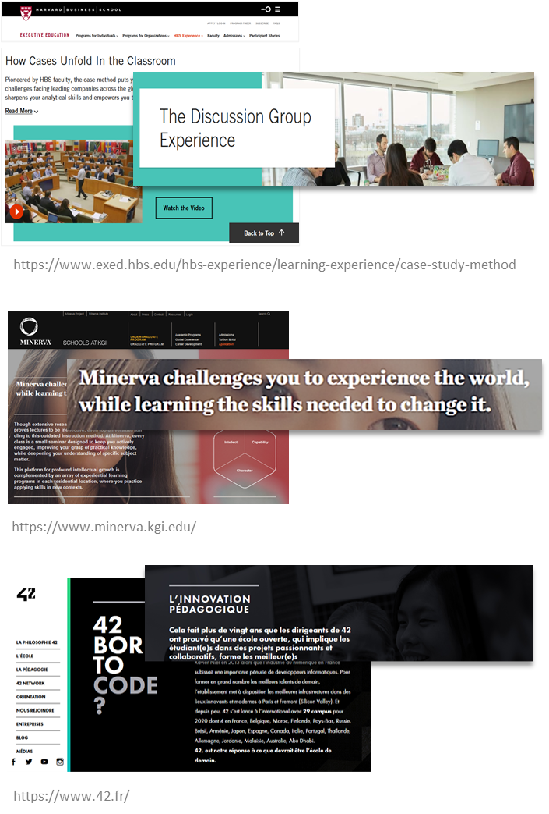
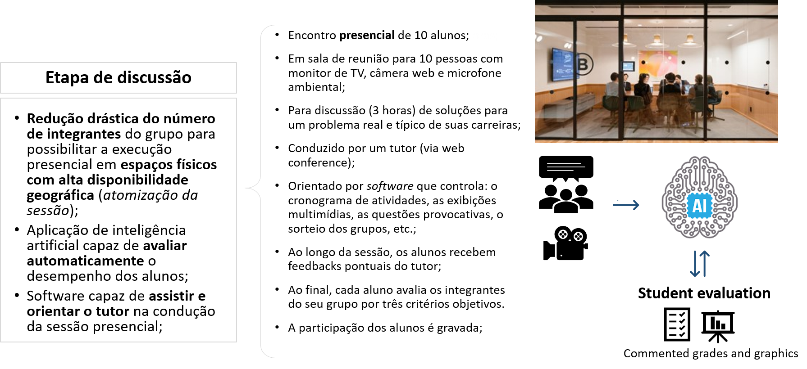
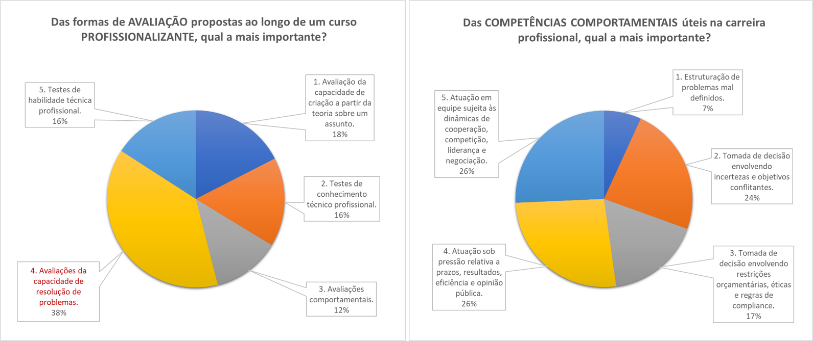
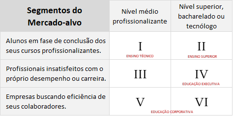
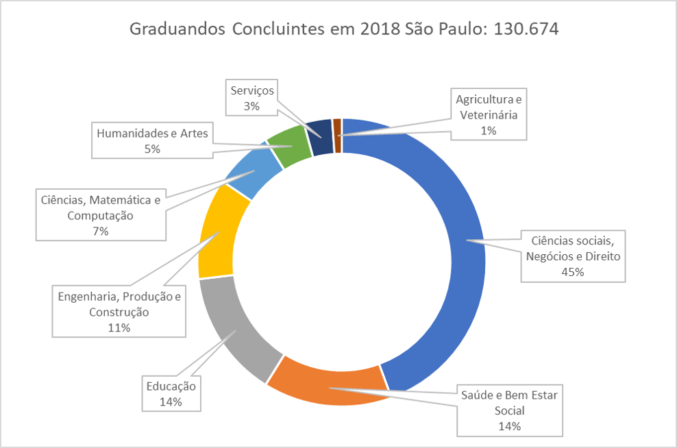

    
    <a href="#english">English</a>
    ·
    <a href="#spanish">Spanish</a>
    ·
    <a href="#portuguese">Portuguese</a>
    ·
    <a href="#chinese">Chinese</a>

 

### OPEN-PBL EXECUTIVE SUMMARY 
Executive summary of the 2020 fundraising Business Plan.  

(Soon also available in the English version)

...

*1. The "Non Disclousure Agreement" for access to the business plan's **executive summary** is available to investors interested in <a href="https://openpbl-school.github.io/InvestorRelations/NDA(en)-OpenPBL-GaveaPar.pdf" target="_blank">OpenPBL NDA</a>.*

*2. For more details of OpenPBL professional school, see a <a href="https://openpbl-school.github.io/Storytelling/#english" target="_blank">storytelling</a> of its standard product (only the portuguese version available).*

 

    
    <a href="#english">English</a>
    ·
    <a href="#spanish">Spanish</a>
    ·
    <a href="#portuguese">Portuguese</a>
    ·
    <a href="#chinese">Chinese</a>

##  
                         
                         

 
 

### RESUMEN EJECUTIVO OPEN-PBL
Resumen ejecutivo del Plan de negocios de recaudación de fondos 2020. 

**...**

(Pronto también disponible en la versión en español)

...

*1. El "Acuerdo de no divulgación" para el acceso al **resumen ejecutivo** del plan de negocios está disponible para inversores interesados en <a href="https://openpbl-school.github.io/InvestorRelations/NDA(en)-OpenPBL-GaveaPar.pdf" target="_blank">OpenPBL NDA</a>.*

*2. Para obtener más detalles sobre la escuela profesional OpenPBL, consulte una <a href="https://openpbl-school.github.io/Storytelling/#spanish" target="_blank">storytelling</a> de su producto estándar (solo está disponible la versión en portugués).*

 

    
    <a href="#english">English</a>
    ·
    <a href="#spanish">Spanish</a>
    ·
    <a href="#portuguese">Portuguese</a>
    ·
    <a href="#chinese">Chinese</a>

##  
                         
                         

 
 

# OPEN-PBL - SUMÁRIO EXECUTIVO
Resumo da execução do plano de negócios proposto no *road show* 2020.1 para captação de recursos.    

    
    <a href="#problema">O Problema</a>
    ·
    <a href="#proposta">A Proposta</a>
    ·
    <a href="#negocio">O Negócio</a>
    ·
    <a href="#execucao">Execução</a>
    ·
    <a href="#expansao">Expansão</a>
    ·
    <a href="#financiamento">Financiamento</a>

 
 

## O PROBLEMA E A OPORTUNIDADE
Uma pesquisa publicada em 2018 pelo **Fórum Econômico Mundial** elencou as dez competências profissionais mais desejadas para os trabalhadores do futuro, segundo gestores de RH de todo o mundo. Segundo o <a href="https://www.weforum.org/agenda/2020/01/davos-2020-future-work-jobs-skills-what-to-know/">relatório da pesquisa</a>, o que **diferencia** os profissionais num mundo cada vez mais globalizado, dinâmico e automatizado não são seus conhecimentos e habilidade técnicas, mas o domínio de algumas importantes **competências comportamentais**. 

Para os especialistas consultados na pesquisa, certas competências como "tomar decisões em ambientes de incerteza", "atuar sob pressão da opinão pública" e "negociar internamente com a equipe" são fundamentais para que colaboradores, não só alcancem os **resultados esperados** por suas empresas, mas que o façam da forma **mais eficiente** possível.   

   
  <em><a href="https://youtu.be/1HEymYOkz44" target="_blank">Vídeo 1</a> | <a href="https://youtu.be/WyKZC7nhQZw" target="_blank">Vídeo 2</a> com consultores de RH sobre competências comportamentais.</em>

 

**Desenvolvendo competências comportamentais**  

Ao contrário das **habilidades** comportamentais, que resultam de características biológicas, cognitivas e socio-emocionais moldadas **antes da vida adulta**, as **competências** comportamentais profissionais só podem ser desenvolvidas ao término da formação profissionalizante de um indivíduo. Apesar de já estar preparado para desenvolvê-las no terço final da sua formação, em grande parte dos casos, este desenvolvimento só acontece ao longo da carreira. 

Por razões diversas, as escolas de formação profissionalizante se concentram em desenvolver apenas as **competências técnicas** em nível suficiente para garantir a **empregabilidade de entrada** de seus alunos no mercado de trabalho. Raramente, elas se empenham em avaliar as respostas de seus alunos para questões técnicas que não sejam apresentadas sob **condições ideais** e isentas de fatores inerentes da vida real, tais como riscos, incertezas e preferências. 

Somente quando o profissional emprega os conhecimentos e habilidades técnicas nas situações do dia-a-dia da carreira, ele se depara com aspectos práticos importantes, como assimetrias de informação, restrições de recursos e pressões diversas.

À medida que o profissional experimenta situações reais, ele inicia uma fase de **testes** e **descobertas** na busca pelas ferramentas **mais adequadas** às suas **próprias** habilidades comportamentais para atingir os resultados esperados. Com consequencia, cada indivíduo reúne e **incorpora à sua atuação profissional** um **repertório único** de conhecimentos, técnicas, estratégias e modelos com os quais ele irá contar, juntamente com suas competências técnicas, para desempenhar as diversas funções e desafios a que é submetido.  

   
  <em>Cada indivíduo incorpora à sua atuação profissional um repertório próprio.</em>

 

Embora algumas empresas avaliem e informem as **habilidades** comportamentais de seus colaboradores com os diversos modelos disponíveis no mercado (DISC, MBTI, Big Five), na maioria das vezes, o desenvolvimento das competências comportamentais é **auto patrocinado** e executado de forma **natural** e **inconsciente**. 

Além disso, dependendo dos estímulos à que são submetidos diferentes profissionais, este processo de desenvolvimento pode durar **muito tempo** até se concluir ou, até mesmo, não se concluir. 

Para **acelerar** e tornar mais **assertivo** este processo, alguns **programas educacionais** se propõem a utilizar as situações reais do dia-a-dia em atividades de aprendizagem. Desta forma, estimulam o desenvolvimento personalizado das competências comportamentais. 

É o caso, por exemplo, das escolas que ofertam programas educacionais utilizando predominantemente a *Problem Based Learning* (ou, de forma abreviada, a **PBL**), uma **estratégia de aprendizagem** na qual os alunos aprendem **resolvendo problemas** e **refletindo** sobre suas experiências (<a href="https://en.wikipedia.org/wiki/Problem-based_learning" target="_blank">Ver definição na Wikipedia</a>).  

   
  <em>Harvard, Minerva e a escola de tecnologia #42 são exemplos bem sucedidos de aplicação da PBL.</em>

 

**Desequilíbrio de mercado** 

Se por um lado, empresas demandam cada vez mais profissionais com competências comportamentais, por outro lado, estes mesmos profissionais encontram muitas dificuldades para desenvolvê-las num prazo razoável, uma vez que **a oferta de cursos e programas educacionais** específicos para esse fim **não é suficiente** para atender os requisitos de **preço** e **disponibilidade** do mercado.

Grande parte deste desequilíbrio ocorre porque as escolas que atuam tradicionalmente neste segmento não geram **economias de escala suficientes** para **popularizarem seus cursos**. Nem mesmo a recente introdução de tecnologias digitais nas práticas educacionais foi capaz de estimular a universalização deste tipo de programa.  

Diante deste cenário, de desequilíbrio entre a oferta e a demanda de cursos e programas educacionais para desenvolvimento competências comportamentais, experientes executivos do setor educacional identificaram uma excelente **janela de oportunidades** a ser explorada.  

 
 

## PROPOSTA PARA EXPLORAR A OPORTUNIDADE DE MERCADO

A PBL é comprovadamente **eficaz** no desenvolvimento de competências comportamentais e, portanto, seria **candidata natural** para suprir a atual demanda do mercado educacional. Contudo, a PBL ainda encontra alguns **obstáculos** para **execução em larga escala**.  

   
  <em>Pela PBL os alunos aprendem resolvendo problemas e refletindo sobre suas experiências.  Fonte<a href="https://docs.lib.purdue.edu/ijpbl/" target="_blank"> The Interdisciplinary Journal of Problem-based Learning</a>.</em>

  

**Escalando a PBL**  

O caminho escolhido para aproveitar a atual janela de oportunidades é buscar formas viáveis de contornar os obstáculos para escalar o processo de execução da PBL. Os **obstáculos** para **execução em larga escala** das atividades típicas da PBL são: 
- Seu processo de execução requer que dois dos mais relevantes **recursos educacionais** em termos de custo -**docentes** e **infraestrutura física**- sejam **desenvolvidos sob medida** para cada instituição de ensino.
- O paradigma da **execução 100% digital** das **Edtechs** ainda não foi capaz de resolver o problema da **qualidade da interação síncrona** entre alunos, fundamental para a execução da PBL.

Para dar **escalabilidade à execução da PBL**, os idealizadores do projeto desenvolveram um modelo **inovador**, baseado na utilização de **ativos de terceiros** e no uso intensivo de **inteligência artificial** no processo de execução de experiências PBL. Diferentemente do paradigma de execução 100% digital que se baseia na escala, indiscriminada, todas as atividades educacionais, a **essência inovadora** do modelo proposto consiste em escalar **cada etapa** do processo de execução da PBL de forma **única**, conforme mostra o diagrama a seguir.  

   
  <em>Intervenção em cada uma das etapas clássicas do processo de execução da PBL.</em>

 

A **complementação estratégica** das ações propostas no modelo, podem ser avaliadas:
1. Quanto à utilização de **ativos de terceiros**: 
 - A utilização de **espaços físicos** de terceiros garante o nível de disponibilidade do recurso, mesmo com o aumento das atividades da empresa;
 - A adoção de espaços físicos, cuja oferta já consideram as facilities atendimento, limpeza, segurança, agendamento, etc, permite que a gestão seja tratada como a gestão de um custo direto e não mais como um custo fixo, apropriável por chave de rateio;
 - A substituição de docentes por profissionais experientes de mercado viabiliza a produção de conteúdo que pode, simultaneamente, suportar a capacitação **funcional** e **setorial**. 

2. Quanto ao uso intensivo de **inteligência artificial**: 
 - A IA viabiliza a “extração” (e a codificação) da experiência dos profissionais de mercado;
 - A IA automatiza algumas tarefas docentes e reduz drasticamente o custo da operação; 
 - A "**atomização**" da sessão presencial proporciona um ambiente controlado propício para aplicar modelos de reconhecimento facial, transcrição, Processamento de linguagem Natural (NLP) e algoritmos de clusterização obtidos por *machine learning*.  

**Método de Ensino**  

Baseado no modelo proposto, os idealizadores desenvolveram um **método** com **três processos**:
1. Extração automatizada de cenários reais;
2. Eliminação individualizada das deficiências técnicas;
3. Atomização e automatização das discussões;

Cada um destes processos responde **de forma integrada** pela intervenção em uma ou mais etapas do processo completo de execução da PBL.  

**Extração Automatizada de Cenários Reais**  

A produção de conteúdo para PBL envolve a *"elaboração pedagogicamente estruturada de cenários descritivos de problemas”*. Tradicionalmemte esta elaboração de "cenários reais" é executada por docentes "criadores de conteúdo" cuja tarefa é entrevistar profissionais e especialistas de mercado para explicitar **cenários do dia-a-dia profissional** e seus possíveis **problemas associados**. 

No entanto, a **Extração Automatizada de Cenários Reais** prevê a interação direta dos especialistas como um software do tipo *"expert system"*. Os “títulos”, cenários e as competências comportamentais alvo do processo de aprendizagem são decididos pelos especialistas (diagrama causal), mas o texto final é pedagogicamente estruturado por software baseado em *"machine learning"*.   

 
<em>Sistema para extração de conhecimento dos profissionais especialistas.</em>

  

**Eliminação Individualizada das Deficiências Técnicas**   

Na etapa de *“self-directed learning” (SDL)*, os alunos *"buscam os conhecimentos para resolver o problema a foram submetidos"*. Tradicionalmente, cada aluno é responsável por identificar suas deficiências e buscar as fontes de conhecimento para corrigi-las. 

O principal objetivo da **Eliminação Individualizada das Deficiências Técnicas** é acelerar a fase da SDL. Um *"assessment online"* testa de forma individualizada os conhecimentos dos alunos e um software do tipo *recommender system* aponta as fontes de conteúdo e as opções de capacitação. O processo utiliza ainda o conceito de **nano certificação** (proprietária ou de terceiros) para habilitar os alunos à etapa seguinte de discussão.  

 
<em>Adaptive learning para acelerar a fase de "self-directed learning" dos alunos.</em>

 

**Atomização e Automatização das Discussões**  

Tradicionalmente, as sessões presenciais de discussão são reuniões com 40 alunos ou mais. Pelo modelo tradicional, quanto maior o número de alunos, sem que haja comprometimento da qualidade das discussões, menor o impacto do valor da apropriação do custo da infra-estrutura física no preço dos cursos. De fato, as escolas tradicionais investem em equipamentos sofisticados para garantir a qualidade das interações entre os alunos em grandes grupos.  

 
<em>Investimento em infraestrutura para manter a qualidade das discussões em grupos grandes de alunos.</em>

 

Na **Atomização e Automatização das Discussões**, as sessões presenciais de discussão são agendadas, conforme demanda, em *organizações gestoras de espaços compartilhados de trabalho (coworking)*. As dinâmicas da sessão são orientadas por tutores via video conferência e assistidas por software. A avaliação do desempenho individual dos alunos nas discussões é executada por software que também edita automaticamente o vídeo da gravação da sessão.  

 
<em>Sessão presencial atomizada e assistida por software.</em>

 

**Integração via software**  

Os três sub-processos são **integrados** por um sistema de software capaz de garantir a **automatização**, **eficácia** e **escalabilidade** na execução conjunta de **seis** componentes fundamentais:
 - *Expert system* capaz de parametrizar as relações causais entre o problema proposto por um especialista e as competências comportamentais que se propõe desenvolver nos alunos.
 - *Machine learning model* capaz de produzir automaticamente os "cenários de problemas" com títulos em **português**, **inglês** e **espanhol**.
 - *Adaptive learning system* para acelerar a etapa de SDL (self-directed learning) dos alunos.
 - *Recommender system* para recomendação do conteúdo de apoio na etapa de SDL do método. 
 - *Process management system* para assistir e orientar os tutores na condução das sessões presenciais de discussão.
 - *Machine learning model* capaz de editar e avaliar automaticamente o desempenho filmado dos alunos nas sessões de discussão.

Um software com estes componentes viabiliza a execução **sistemática** e **contínua** de atividades educacionais baseadas em PBL por players do segmento de **educação profissionalizante**. O sistema de software que automatiza o método proposto para escalar a PBL pode ainda ser "produtizado" sob a forma de um "**Sistema de Ensino**" com caracerísticas únicas no mercado educacional.   

**"Sistema de ensino baseado em problemas**  

O **"Sistema de Ensino"** desenvolvido pelos idealizadores garante a execução **contínua** e **escalável** de programas educacionais **profissionalizantes** compostos por **cursos** cujas dinâmicas são baseadas unicamente na *problem-based learning*.

Cada um dos **cursos profissionalizantes** gerenciados pelo sistema de ensino deve proporcionar ao aluno uma **experiência de aprendizagem completa** baseada na discussão de um problema **real** e **típico** de sua carreira profissional. 

Os cursos têm **formato padronizado** na modalidade **híbrida** (ou semi-presencial) e são executados sempre em duas etapas:
1. Uma etapa preliminar de **preparação**, com atividades **online** que correspondem a 95% da carga horária total do curso e; 
2. Uma etapa final de **discussão**, composta de uma sessão **presencial** de três horas, conduzida por um **tutor**, onde **dez alunos** se reunem por **três horas** para **analisar** as possíveis soluções para o problema proposto no curso. 

Na etapa de **preparação**, o aluno: 
1. Recebe o **conteúdo descritivo** do problema abordado no curso, bem como todo o material de apoio para o seu entendimento;
2. Tem os **conhecimentos técnicos** necessários para a análise do problema **aferidos** por testes *online*, personalizados para a sua proficiência no assunto; 
3. Recebe **recomendações personalizadas** de fontes de conteúdo para eliminar possíveis deficiências;
4. Ao final, **propõe a sua solução** (ou soluções) para o problema objeto do curso. 

Na etapa de **discussão**, o aluno: 
1. Recebe uma lista com opções de **locais** e **horários** disponíveis para a sessão presencial, contendo detalhes da **infraestrutura**, **facilidades** e perfil do **tutor** responsável; 
2. Agenda a data e o local mais adequados;
3. Participa da **dinâmica de discussões** em torno do problema proposto no curso, conduzidas pelo **tutor** da sessão. 

Como *feedback* da sua atuação no curso, o aluno recebe: 
1. Os **resultados dos testes** de conhecimento técnico; 
2. O **registro audiovisual** da sua participação na sessão presencial de discussões; 
3. A **avaliação do seu desempenho** na solução do problema proposto no curso.  

**Benefícios para usuários do Sistema de Ensino** 

Para avaliar a reação da aprendizagem baseada em problemas entre alunos de escolas profissionalizantes, os idealizadors utilizaram os resultados de uma pesquisa quantitativa voluntária realizada recentemente no Brasil com 120 profissionais e entrantes no mercado de trabalho sobre **atividades educacionais** usualmente empregadas em programas **profissionalizantes**. 

O questionário da pesquisa continha nove questões do tipo múltipla escolha com o objetivo de medir a percepção de valor nas diversas experiências de aprendizagem de programas profissionalizantes online e presencial. Duas questões avaliaram diretamente a receptividade dos benefícios da PBL e da importância das competências comportamentais para os alunos.  

<em>Os resultados quantitativos da pesquisa, foram validados em entrevistas qualitativas posteriores. A pesquisa completa pode ser acessada em <a href="https://docs.google.com/forms/d/1AtVWKqeECtwsmQpiBUlhZVVezaOU_rUCCRduIeS1CpA/edit#responses" target="_blank">pesquisa</a>.</em>

 

A consolidação das respostas à pesquisa evidenciam as hipóteses de que:
1. Os alunos percebem como as **avaliações mais importante** de um curso profissionalizante aquelas que medem a **capacidade de resolução de problemas** dos alunos;
2. O alunos percebem igual valor entre as **competências comportamentais** que, segundo o Fórum Econômico Mundial, os **diferencia** no mercado de trabalho.   

 
 

## O NEGÓCIO 
Para monetizar o **sistema de ensino** desenvolvido, os idealizadores do projeto criaram a **OpenPBL**, uma edtech cuja missão é *"**popularizar** e **democratizar** o **ensino profissionalizante baseado em problemas**".*

As receitas da OpenPBL são provenientes de duas fontes: do **licenciamento** do **Sistema de Ensino OpenPBL** para escolas profissionalizantes e da **venda de cursos profissionalizantes** para **profissionais** e **entrantes no mercado de trabalho**.  

**Escola profissionalizante OpenPBL**  

A parcela das receitas da empresa oriunda da venda de cursos para profissionais e entrantes no mercado de trabalho é viabilizada com a criação da **Escola Profissionalizante OpenPBL**. 

Além das receitas, a **Escola OpenPBL** tem a função estratégica de **tangibilizar** os benefícios do **Sistema de Ensino OpenPBL** aos seus usuários, à medida que promove ações para comunicar o sucesso dos alunos da escola no mercado de trabalho.

Os problemas abordados nos cursos são propostos por **profissionais experientes** do mercado e cada problema específico origina a oferta de um **título no catálogo** da OpenPBL. Cada título pode ser adquirido de forma **avulsa** pelo preço-alvo de **US $ 60,00** (R$ 320,00) ou adquirido em conjunto, com os títulos agrupados em **trilhas funcionais**, planejadas para promover a capacitação do aluno nas diversas **"funções"** da carreira profissional escolhida.

A oferta dos títulos sob a forma de "trilhas funcionais" (ao invés de "trilhas de disciplinas") é a principal ação estratégica com vistas a posicionar a **Escola OpenPBL** como uma **instituição de ensino segmentada por perfis funcionais"** e não por áreas do conhecimento como é usual no mercado de educação profissionalizante.    

**Objetivos de aprendizagem da escola**  

A dinâmica dos cursos e programas da **Escola OpenPBL** têm o objetivo de desenvolver no aluno **seis** grupos de **competências comportamentais**: 
- Estruturação de **problemas mal definidos**; 
- Tomada de decisão envolvendo **incertezas** e objetivos conflitantes; 
- Tomada de decisão envolvendo **restrições** orçamentárias de recursos, restrições éticas e sujeitas à regras de compliance; 
- Atuação sob **pressão** de prazo, desempenho e opiniões diversas; 
- Atuação em **equipe** sujeita às dinâmicas de cooperação, competição, liderança e negociação; 
- Visão orçamentária e atitude empreendedora.

Em conjunto, essas competências melhoram o **desempenho do aluno na resolução de problemas profissionais** e **aumentam a eficiência** da sua atuação no dia-a-dia da carreira.  

**Público-alvo da escola**  

Os cursos e programas da **Escola OpenPBL** são destinados à **profissionais** (e aspirantes) com o **objetivo comum** de se diferenciarem no mercado de trabalho pelo domínio de competências comportamentais, cada vez mais demandadas por empresas e organizações.   

   

<em>Usuários-alvo com necessidades diversas e em fases distintas da carreira.</em>

 

**Mercado da escola**  

A combinação das **três classes** de público-alvo da escola com os dois **dois níveis** de progressão de ensino regular definem os **seis segmentos** de mercado, elegíveis para a atuação da escola. Alguns destes segmentos são tradicionais no setor educacional, tais como **educação executiva** e **educação corporativa**. Assim, o cálculo do tamanho do **mercado potencial da escola**, deve considerar as variáveis demográficas e cada **localidade geográfica** onde é cogitada a atuação da escola.   

<em>Segmentos-alvo da OpenPBL e os segmentos tradicionais do mercado educacional.</em>

 

**Comunicação dos diferenciais da escola**  

Quando comparados com **programas tradicionais** do mercado educacional desenhados para o desenvolvimento de competências comportamentais, os cursos profissionalizantes da **Escola OpenPBL** se diferenciam pelos seguintes fatores:
- **Custo baixo** das experiências completas de aprendizagem PBL **para** caber em orçamentos de vários tamanhos.
- Programas híbridos com grande parte do tempo dedicado à etapa online assíncrona **para** adequar-se à disponibilidade de tempo dos alunos.
- Etapa presencial com várias opções de disponibilidade geográfica **para** adequar-se às restrições de deslocamento do alunos.
- Cursos segmentados por trilhas funcionais **para** concentrar o ganho de empregabilidade do aluno em uma carreira específica. 

Estes atributos norteiam a estratégia de comunicação para venda B2C da escola. As ações para atração e conversão de novos alunos está descrita com detalhes em <a href="https://openpbl-school.github.io/CustomerAcquisition/" target="_blank">Estratégia de Comunicação</a>.  

**Sistema de Ensino OpenPBL**  

Conforme sugerido pelo Fórum Econômico Mundial, a **participação continuada** do aluno em "experiências PBL" promove um **ganho** no seu patamar de empregabilidade que o **diferencia** no mercado de trabalho. O sucesso na tarefa de diferenciar os alunos da **Escola OpenPBL** no mercado de trabalho, habilita a empresa a comercializar o **Sistema de Ensino OpenPBL** para terceiros. 

Cada um dos **cursos profissionalizantes** oferecidos pela escola deve proporcionar ao aluno uma **experiência de aprendizagem completa** baseada na discussão de um problema **real** e **típico** de sua carreira profissional. 

A produtização e comercialização do **Sistema de Ensino OpenPBL** viabiliza o desenvolvimento sistemático de **trilhas funcionais** baseadas em PBL totalmente **customizadas** para terceiros. 

Os profissionais de Treinamento e Desenvolvimento (T&D) destas empresas são os responsáveis por desenvolver e gerenciar projetos de educação corporativa. Assim, as soluções são organizadas em 5 grupos para que os profissionais de T&D tenham suporte em todas as suas demandas, desde o planejamento até a gestão da execução de um **projeto de educação corporativa baseado em *Problem-based Learning*.** 
- **Soluções de Planejamento Educacional.** As soluções para essa etapa têm caráter de consultoria educacional para os profissionais de T&D. 
- **Soluções de Aprendizagem.** São os objetos de aprendizagem propriamente ditos. Esses objetos podem estar no acervo da OpenPBL ou requerer a produção de conteúdos customizados.
- **Soluções de Engajamento.** São soluções utilizadas nos projetos onde a adesão do colaborador é facultativa.
- **Soluções de Execução.** São soluções para a execução da capacitação propriamente ditas. Essas soluções disponibilizam a infraestrutura presencial ou online necessárias.
- **Soluções de Gestão da Execução.** É o conjunto de soluções para acompanhamento e controle dos projetos de capacitação pelo profissional de T&D.

As ofertas comerciais para licenciamento do **Sistema de Ensino OpenPBL** envolvem:
- O valor dos serviços de **implantação** do sistema;
- O prazo de vigência do contrato de licenciamento, não inferior a **24 meses**;
- As faixas de franquia divididas por **quantidade de usuários** para a utilização ilimitada do sistema;
- O **valor mensal por usuário** para cada faixa de franquia.

  

**Clientes-alvo do sistema de ensino**  

O **Sistema de Ensino OpenPBL** viabiliza o desenvolvimento sistemático de **cursos** baseados em PBL totalmente **customizados** para terceiros. Assim, a utilização do sistema de ensino pode ajudar: 
1. **Escolas profissionalizantes** a ampliarem suas receitas e; 
2. **Empresas** a promover o **desenvolvimento de competências comportamentais** em seus funcionários e colaboradores.

Os clientes-alvo da OpenPBL no segmento da educação corporativa são **grandes e médias empresas ou organizações** que viabilizem relacionamento de parceria e recorrência comercial de longo prazo. 

  

==================

====================

**Mercado da escola**  

 
 

## EXECUÇÃO DO PLANO DE NEGÓCIOS
Os empreendedores que conceberam o projeto e desenvolveram o plano de negócios são profissionais com 20 anos de experiência na condução de **unidades de negócios** de instituições de ensino superior de **grande porte**. Em especial, os empreendedores têm experiências complementares (comercial e operações) na execução de *projetos complexos de educação corporativa*, isto é, projetos que apresentam:
1. Grande abrangência territorial e diversidade de infraestrutura presencial;
2. Grande quantidade e dispersão dos colaboradores envolvidos; 
3. Integração de diversas estratégias instrucionais (EAD, Presencial,...) num mesmo projeto;  
4. Complexidade técnica e inovação das ferramentas tecnológicas envolvidas;
5. Grande necessidade de engajamento e fidelização dos colaboradores. 

Os perfis profissionais complementares credenciam os idealizadores a liderarem a fase de *startup* do plano de negócios.  
- Perfil executivo TechnicalPillar (<a href="https://www.linkedin.com/in/jorgecataldo/">Linkedin</a>).
- Perfil executivo RainMaker (<a href="https://www.linkedin.com/in/eduardo-pitombo-62b76ab/">Linkedin</a>).   

**Greenfield**  

No Brasil, a <a href="http://inep.gov.br/microdados" target="_blank">base de dados do MEC/INEP</a> é considerada uma fonte confiável de dados estratificados do **segmento II**, ou seja, *"alunos em fase de conclusão dos seus cursos profissionalizantes de nível superior"*. Segundo o INEP, o Brasil registrou em 2018, um total de aproximadamente **8.450.000** de alunos universitários matriculados em instituições públicas e privadas, dentre estes, cerca de **1.256.000** (ou 15% dos matriculados) pertencem ao segmento II do público-alvo da escola por estarem concluindo seus programas de capacitação profissionalizante. 

A cidade de São Paulo foi escolhida para o lançamento da escola profissionalizante por apresentar **grande densidade populacional**, **grande variedade de cursos de graduação**, além de **muitas oções de co-workings**. Segundo o INEP, o tamanho do segmento II na cidade de São Paulo é de **130.000** potenciais alunos.  

 
<em>Alunos concluintes em 2018 na cidade de São Paulo.</em>

 

**Startup**  

O *startup* da empresa, previsto para o seu **primeiro ano** de operação, tem como objetivos: 
- Abertura formal e pré-operação da empresa na **cidade São Paulo**. 
- Elaborar testes com um “**concierge MVP**” para validar as premissas de **custos de execução** das sessões presenciais (utilização do *capital semente*).
- Estudos de mercado e **escolha das trilhas funcionais** para oferta inicial na cidade São Paulo.
- Produção do estoque inicial de títulos (CAPEX).
- Lançamento das primeiras trilhas, validação das **premissas de mercado** e ajustes na campanha. 
- Desenvolvimento dos componentes de software do **sistema educacional proprietário** da empresa (CAPEX).  

**Comercialização B2C**  

A política de **canais B2C** para os **dois primeiros anos de operação** deve se basear em **parcerias** firmadas com empresas **ativadoras de tráfego** e empresas especializadas na **conversão** do público-alvo. Entre estes:
- Marketplaces digitais com foco educacional (*Udemy, ...*); 
- Instituições de ensino superior (IES) e escolas profissionalizantes do ensino médio;
- Agências intermediadoras de recrutamento e seleção profissional.

A **estratégia de comunicação** para atração e conversão de leads contém elementos para a construção da *home page* da escola <a href="https://openpbl-school.github.io/CustomerAcquisition/lp/home" target="_blank">Ensaio da HomePage</a>.  

**Comercialização B2B**  

A Política de **canais B2B** para os **dois primeiros anos de operação** deve se basear em **parcerias** estabelecidas com **associações** profissionais, **cooperativas**, **empresas de representação comercial** e organizações empresariais diversas.

A partir da conclusão do **sistema educacional**, prevista para o início do segundo ano de operação, a atuação B2B deverá incluir também as **instituções de ensino de nível médio e superior** e **empresas de grande e médio porte** como clientes-alvo.   

**Desempenho global**  

Simulações financeiras do modelo de negócios mostram que, com um **investimento inicial** mínimo de **US $ 47.000** para a **produção de conteúdo** e **capital de giro**, é possível atingir uma base de **760 alunos** (0,6% do mercado alvo) na escola profissionalizante e **7.500 alunos** licenciados no Sistema de Ensino (1,7% do mercado alvo) e **receitas líquidas** de **US $ 1,94 milhão** (EBITDA 42% RL) no **quinto ano** de operação da empresa. 

As simulações utilizaram **premissas de marketing e custos** para modelar o **ano 2** (primeiro ano "em regime") e **premissas de crescimento de vendas e de custos** para modelar os demais anos.    

  

<em>Desempenho da simulação para 5 anos de operação da empresa.</em>

 

 

**Plano financeiro**  

O Plano financeiro detalhado com todas as planilhas pode ser acessado pelo link:<a href="https://openpbl-school.github.io/InvestorRelations/roadshow/FinancialPlan#portuguese" target="_blank_"> OpenPBL - Plano Financeiro</a>  

 
 

## EXPANSÃO
Graças ao modelo escalável utilizado, o **desempenho** simulado acima poderá ser replicado para garantir uma rápida **expansão das atividades da escola**. Para isso, é necessário o desenvolvimento do **Sistema Educacional OpenPBL** para automatizar os processos e etapas do método.  

**Desenvolvimento de software**  

Para desenho, implantação e testes do **sistema educacional** são necessários investimentos que devem ser contabilizados, em sua maior parte, como despesa de capital" (CAPEX) para **desenvolvimento de software**. 

Os **sete** componentes que compõem o software do **Sistema Educacional OpenPBL** a ser desenvolvido são: 
- *Expert system* capaz de parametrizar as relações causais entre o problema proposto por um especialista e as competências comportamentais que se propõe desenvolver nos alunos.
- *Machine learning model* capaz de produzir automaticamente os "cenários de problemas" com títulos em **português**, **inglês** e **espanhol**.
- *Adaptive learning system* para acelerar a etapa de SDL (self-directed learning) dos alunos.
- *Recommender system* para recomendação do conteúdo de apoio na etapa de SDL do método.
- *Process management system* para assistir e orientar os tutores na condução das sessões presenciais.
- *Machine learning model* capaz de editar e avaliar automaticamente o desempenho filmado dos alunos.
- *API* para integração com bases de dados de redes sociais de cunho profissional.  

**Novas frentes de negócios**  

A partir do desenvolvimento do sistema educacional será possível a expansão dos negócios da empresa em **três novas frentes**:
- Implantação da *Escola Profissionalizante OpenPBL* em outras cidades, inclusive de outros países (*Green field*);
- Venda do *Sistema Educacional OpenPBL* para instituições de ensino utilizarem como complemento de suas atividades educacionais;
- Venda de projetos capacitação baseados em PBL para empresas utilizarem como complemento de suas atividades de educação corporativa;  

Estas três novas frentes de negócios têm potencial de **multiplicar o desempenho** simulado da empresa na seção anterior. Para serem exploradas, as novas frentes necessitarão de investimentos adicionais, cuja aplicação deverá nortear as discussões acerca da **estratégia de expansão** da empresa a partir do ano 2 de operação.  

 
 

## FINANCIAMENTO E GOVERNANÇA
Todas as etapas previstas no plano de negócios serão financiadas por **capital de risco** captado através de rodadas públicas. Os roadshows de captação são abertos e publicados em <a href="https://www.crunchbase.com/organization/openpbl#section-overview" target="_blank">CrunchBase.com</a>.   

**Regra de saída**  

A principal regra de saída para atrair investidores é a **venda estratégica** da empresa para um grupo educacional. Entretanto, a  remuneração dos investidores dependerá da **dimensão** conquistada na expansão das atividades de empresa. Pelas características escaláveis do modelo de negócios, a **abertura do capital** é também uma opção viável a ser considerada.   

**Rodadas de captação**  

Até o evento da venda estratégica, estão previstas **quatro** rodadas de captação de investimento com **objetivos** distintos: 
- **Capital semente** - Validações iniciais do modelo; 
- **Series A** - Startup da empresa em uma praça, validações dos atributos comerciais e desenvolvimento do sistema de ensino (software); 
- **Series B** - Atualizações no software, profissionalização da gestão e capital de giro para ampliação das atividades para 100 praças; 
- **Series C** - Internacionalização da empresa, atualizações no software e capital de giro para ampliação para 250 praças; 
- **Series D** - Capital de giro para ampliação da atuação para 500 praças e preparação da empresa para a venda estratégica;   

**Capital Semente**  

Ao todo, já foram captados **US $ 27.000** (R$ 150.000) à título de **capital semente** para **validações iniciais** do modelo e desenvolvimento do **plano de negócios**.   

**Series A**  

O objetivo do atual roadshow é a captação de **US $ 132.000** (R$ 727.000) divididos em **quatro quotas** de **US $ 33.000** (R$ 181.000). Esse montante deverá ser utilizado durante o *startup* da empresa na cidade de São Paulo para:
- Desenvolver sistemas de software;
- Produzir conteúdo;
- Capital de giro.   

A captação atual considera o *pre money valuation* de **US $ 900.000** (R$ 4,8 milhões).    

**Governança**  

A participação dos investidores nas decisões executivas da empresa é garantida pela adoção das melhores práticas de **governança corporativa** vigentes, tais como *controle orçamentário*, *profissionalização do board*, *conselho fiscal* e *proteção de minoritários*, entre outros   

... 

*1. O Non Disclousure Agreement para acesso ao **sumário executivo** do plano de negócios está disponível para investidores interessados em <a href="https://openpbl-school.github.io/InvestorRelations/NDA(en)-OpenPBL-GaveaPar.pdf" target="_blank">OpenPBL NDA</a>.*

*2. Para mais detalhes sobre a escola profissionalizante OpenPBL, veja um <a href="https://openpbl-school.github.io/Storytelling/#portuguese" target="_blank">storytelling</a> do seu produto-tipo.* 

 

    
    <a href="#english">English</a>
    ·
    <a href="#spanish">Spanish</a>
    ·
    <a href="#portuguese">Portuguese</a>
    ·
    <a href="#chinese">Chinese</a>

##  
                         
                         

 
 

### OPEN-PBL执行摘要
2020年筹款业务计划的执行摘要。 

（很快也有中文版本）

...

*1。 对<a href="https://openpbl-school.github.io/InvestorRelations/NDA(en)-OpenPBL-GaveaPar.pdf" target="_blank"> OpenPBL NDA </a>感兴趣的投资者可以使用“非公开协议”来访问业务计划的“执行摘要”*

*2。 有关OpenPBL专业学校的更多详细信息，请参见其标准产品的<a href="https://openpbl-school.github.io/Storytelling/#chinese" target="_blank">讲故事</a>（仅提供葡萄牙语版本）*

 

    
    <a href="#english">English</a>
    ·
    <a href="#spanish">Spanish</a>
    ·
    <a href="#portuguese">Portuguese</a>
    ·
    <a href="#chinese">Chinese</a>

##  
                         
