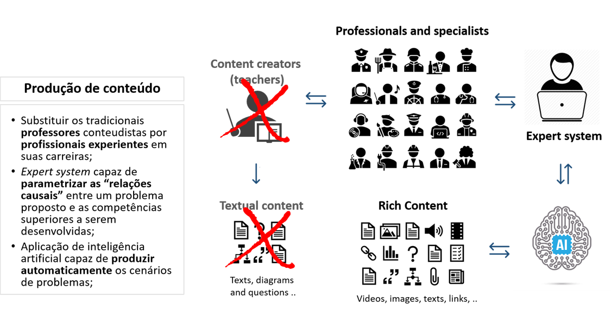

    
    <a href="#english">English</a>
    ·
    <a href="#spanish">Spanish</a>
    ·
    <a href="#portuguese">Portuguese</a>
    ·
    <a href="#chinese">Chinese</a>

 

### OPEN-PBL EXECUTIVE SUMMARY 
Executive summary of the 2020 fundraising Business Plan.  

**THE OPPORTUNITY AND THE PROPOSAL**  
Companies are increasingly demanding professionals from **all hierarchical levels** to develop the **behavioral skills** that allow them, not only to achieve the **expected results** but to achieve them in the **most efficient** way possible.However, despite this growing market opportunity, the offer of educational programs that aim to develop this type of skill does not keep up with the increase in demand.

...

*1. The "Non Disclousure Agreement" for access to the **business plan** is available to investors interested in <a href="http://bit.ly/NDA-OpenPBL" target="_blank">OpenPBL NDA</a>.*

*2. For more details of OpenPBL professional school, see a <a href="https://welearnpbl.github.io/openpbl-ir/roadshow/Storytelling#portuguese" target="_blank">storytelling</a> of its standard product (only the portuguese version available).*

 

    
    <a href="#english">English</a>
    ·
    <a href="#spanish">Spanish</a>
    ·
    <a href="#portuguese">Portuguese</a>
    ·
    <a href="#chinese">Chinese</a>

##  
                         
                         

 
 

### RESUMEN EJECUTIVO OPEN-PBL
Resumen ejecutivo del Plan de negocios de recaudación de fondos 2020. 

**...**

(Pronto también disponible en la versión en español)
...

*1. El "Acuerdo de no divulgación" para el acceso al **plan de negocios** está disponible para inversores interesados en <a href="http://bit.ly/NDA-OpenPBL" target="_blank">OpenPBL NDA</a>.*

*2. Para obtener más detalles sobre la escuela profesional OpenPBL, consulte una <a href="https://jorgecataldo.github.io/OpenPBL-Storytelling/#spanish" target="_blank">storytelling</a> de su producto estándar (solo está disponible la versión en portugués).*

 

    
    <a href="#english">English</a>
    ·
    <a href="#spanish">Spanish</a>
    ·
    <a href="#portuguese">Portuguese</a>
    ·
    <a href="#chinese">Chinese</a>

##  
                         
                         

 
 

## OPEN-PBL - SUMÁRIO EXECUTIVO
Resumo da execução do plano de negócios proposto no *road show* para captação de recursos 2020.1.   

### O PROBLEMA E A OPORTUNIDADE
Um relatório publicado em 2018 pelo Fórum Econômico Mundial elencou as dez competências profissionais mais desejadas para os trabalhadores do futuro. Segundo o <a href="https://www.weforum.org/agenda/2020/01/davos-2020-future-work-jobs-skills-what-to-know/">relatório</a>, o que diferencia os profissionais num mundo cada vez mais **globalizado**, **dinâmico** e **automatizado** não é o domínio de competências técnicas, mas de algumas importantes **competências comportamentais**. A justificativa é que este conjunto de competências é fundamental para que profissionais de todas as áreas, não só alcancem os **resultados esperados** por suas empresas, mas que o façam da forma **mais eficiente** possível.   

<table style="width:100%">
  <tr>
    <th></th> 
    <th></th>
  </tr>
</table>

<em><a href="https://youtu.be/WyKZC7nhQZw">Vídeo</a> da entrevista com a consultora de RH, Sofia Esteves, sobre competências comportamentais.</em>

  

**Desenvolvendo competências**  
Sabe-se que o emprego **contínuo** dos conhecimentos e habilidades **técnicas** de um profissional nas **situações reais** do dia-a-dia ao longo da carreira promove naturalmente o desenvolvimento de importantes competências comportamentais, mas que demanda tempo. Para acelerar este processo, alguns **programas educacionais** se propõem a simular estas situações reais em atividades de treinamemto para, assim, estimular o desenvolvimento destas competências. 

É o caso, por exemplo, das escolas que ofertam programas educacionais utilizando predominantemente a *Problem Based Learning* (**PBL**), uma **estratégia de aprendizagem** na qual os alunos aprendem **resolvendo problemas** e **refletindo** sobre suas experiências.   

<table style="width:100%">
  <tr>
    <th></th>
    <th></th> 
  </tr>
</table>

<em>Harvard, Minerva e a escola de tecnologia #42 são exemplos bem sucedidos de aplicação da PBL.</em>

 

**Desequilíbrio** 
Se por um lado, empresas (e organizações) vêm demandando cada vez mais que profissionais de **todos os níveis hierárquicos** detenham competências complexas, tais como "pensamento crítico", "julgamento e tomada de decisão" e "inteligência emocional", por outro lado, estes mesmos profissionais encontram muitas dificuldades para desenvolvê-las num prazo razoável, uma vez que a oferta de programas educacionais específicos para esse fim **não é suficiente**.

Grande parte deste **desequilíbrio** entre oferta e demanda ocorre porque as escolas que tradicionalmente desenvolvem competências comportamentais em seus alunos utilizam modelos de negócios que não geram **economias de escala** suficientes para popularizar seus cursos. Nem mesmo a recente introdução de tecnologias digitais foi capaz de criar (ainda) as bases para a universalização deste tipo de programa educacional.

Diante deste cenário, experientes executivos do setor educacional entenderam que o atual desequilibrio do mercado educacional configura uma excelente **janela de oportunidades** a ser explorada e, assim, idealizaram um projeto para explorá-la.  

### PROPOSTA PARA EXPLORAR A OPORTUNIDADE 
A PBL é comprovadamente **eficaz** no desenvolvimento de competências comportamentais e, portanto, candidata natural para suprir a atual demanda do mercado educacional. Contudo, a PBL encontra os seguintes **obstáculos** para **execução em larga escala**:
- Seu processo de execução requer que "docentes" e "infraestrutura física" (dois dos mais relevantes **recursos educacionais** em termos de custo) sejam **desenvolvidos sob medida** para cada instituição de ensino.
- O paradigma da **execução 100% digital** das **Edtechs** ainda não foi capaz de resolver o problema da **qualidade da interação síncrona** entre alunos, fundamental para a execução da PBL.  

**Escalando a PBL**  
Para dar **escalabilidade à execução da PBL** e aproveitar a atual janela de oportunidades, os idealizadores do projeto desenvolveram um método **inovador**, baseado na utilização de **ativos de terceiros** e no uso intensivo de **inteligência artificial** no processo de execução de experiências PBL.  

  
  <em>Intervenção em cada uma das etapas do processo de execução da PBL.</em>

 

**Integração estratégica do método**  
Diferentemente do paradigma de execução 100% digital para escalar, indiscriminadamente, todas as atividades educacionais, a essência inovadora do método proposto consiste em escalar **cada etapa** do processo de execução da PBL de forma **única**. Contudo, essa diferenciação é planejada para que se dê de forma integrada, de forma a garantir a escalabilidade da execução das atividades. 

Sob esse aspecto, os pilares do novo método, (1) "*utilização de ativos de terceiros*" e (2)"*uso intensivo de inteligência artificial*" se complementam:

1. Quanto à utilização de **ativos de terceiros**: 
- O modelo garante o nível de disponibilidade de dois importantes recursos educacionais (espaço físico e docentes), mesmo com o aumento das atividades da empresa;
- Espaços físicos, cuja oferta já consideram as facilities (atendimento, limpeza, segurança, agendamento, etc), permitem que o custo do recurso seja tratado como direto e não mais fixo;
- Profissionais experientes viabilizam a produção de conteúdo funcional e setorial ao mesmo tempo (“hiper funcionalização”). 

2. Quanto ao uso intensivo de **inteligência artificial**: 
- O modelo viabiliza a “extração” (e a codificação) da experiência de profissionais especialistas;
- O modelo automatiza algumas tarefas docentes e reduz drasticamente o custo da operação; 
- A atomização da sessão presencial proporciona um ambiente controlado propício para aplicar modelos de reconhecimento facial, transcrição, NLP e algoritmos de clusterização.  

**Sistema de Ensino**  
A execução de experiências PBL pelo método proposto é operacionalizada com **três** processos chave, com cada um deles responsável pela intervenção em uma as etapas do processo de execução da estratégia de aprendizagem baseada em problemas.
- Produção de conteúdo automatizada
- Aprendizagem adaptativa
- Atomização da execução presencial  

<b>PRODUÇÃO DE CONTEÚDO AUTOMATIZADA.</b>
  

<em>Sistema especialista para extração de conhecimento dos profissionais experientes.</em>

  

<b>APRENDIZAGEM ADAPTATIVA</b>
  

  
<em>Adaptive learning para acelerar a fase de "self-directed learning".</em>

  

<b>ATOMIZAÇÃO DA EXECUÇÃO PRESENCIAL</b>
  

<em>Sessão presencial atomizada e assistida por software.</em>

 

O desenvolvimento de um **sistema de software** para automatizar e coordenar a execução destes processos, bem como para garantir suas **integridades**, **eficácias** e **escalabilidade** é a base para construção de um **Sistema de Ensino** baseado em PBL, **único** no setor educacional.   

### O NEGÓCIO 
Como forma de por em prática a proposta para escalar a PBL, os idealizadores do projeto elaboraram um **plano de negócios de cinco anos** para a criação e a expansão da Edtech **OpenPBL**, uma **escola profissionalizante** com um **Sistema de Ensino** inovador que permite a oferta sistemática e contínua de programas educacionais baseados unicamente em *Problem-based Learning*.

O público-alvo dos alunos da escola são os **profissionais** (e **aspirantes a profissional**) com necessidades diversas e em fases distintas da carreira, mas com o **objetivo comum** de se diferenciarem no mercado de trabalho pelo domínio, cada vez mais importante, das competências comportamentais demandadas por empresas e organizações.   

  

<em>Detalhamento do público-alvo da OpenPBL em função das suas necessidades.</em>

 

**Cursos e programas OpenPBL** 
 
Cada um dos **cursos profissionalizantes** oferecidos pela escola deve proporcionar ao aluno uma **experiência de aprendizagem completa** baseada na discussão de um problema **real** e **típico** de sua carreira profissional. 

Os problemas abordados nos cursos são propostos por **profissionais experientes** do mercado e cada problema específico origina  a oferta de um **título no catálogo** da OpenPBL. 

Cada título pode ser adquirido de forma **avulsa** pelo preço-alvo de R$ 320,00 ou em conjunto, com os títulos agrupados em **trilhas funcionais**, planejadas para promover a capacitação do aluno nas diversas **"funções"** da carreira profissional escolhida.

A oferta dos títulos sob a forma de "trilhas funcionais" (ao invés de "trilhas de disciplinas") é a principal ação estratégica com vistas a posicionar a OpenPBL como uma **instituição de ensino segmentada por "escolas funcionais"** e não por áreas do conhecimento como é usual no mercado de educação profissionalizante.   

**Dinâmica dos cursos**  
Todos os cursos têm formato padronizado. São oferecidos na modalidade **híbrido** (ou semi-presencial) e são executados em duas etapas:
1. Uma etapa preliminar de preparação, com atividades **online**, que correspondem a 95% da carga horária total do curso; 
2. Uma etapa final de discussão, com uma sessão **presencial** de três horas, conduzida por um tutor, onde dez alunos se reunem para **analisar** as possíveis soluções para o problema proposto no curso. 

Na etapa de **preparação**, o aluno: 
1. Recebe o **conteúdo descritivo** do problema, bem como todo o material de apoio para o seu entendimento;
2. Afere os **conhecimentos necessários** para a análise do problema; 
3. Recebe **recomendações personalizadas** de fontes de conteúdo para eliminar possíveis deficiências;
4. Ao final, **propõe a sua solução** ou soluções para o problema. 

Na etapa de **discussão**, o aluno: 
1. Recebe uma lista de locais com infraestrutura e facilidades para abrigar uma sessão presencial com 10 alunos; 
2. Agenda a data e o local mais adequados;
3. Participa da **dinâmica de discussões** em torno do problema proposto, conduzidas pelo **tutor** da sessão. 

Após a etapa de discussão, o aluno recebe: 
1. O **registro audiovisual** da sua participação na sessão presencial de discussões; 
2. O *feedback* com a **avaliação do seu desempenho** na solução do problema proposto no curso.   

**Benefícios ao público alvo** 
Conforme defendido pelo Fórum Econômico Mundial, a **participação continuada** do aluno em "experiências PBL" promove um **ganho** no seu patamar de empregabilidade que o **diferencia** no mercado de trabalho. Na escola profissionalizante OpenPBL, este ganho é alcançado com atividades educacionais como o objetivo de desenvolver **seis** grupos de **competências comportamentais**: 
- Estruturação de **problemas mal definidos**; 
- Tomada de decisão envolvendo **incertezas** e objetivos conflitantes; 
- Tomada de decisão envolvendo **restrições** orçamentárias de recursos, restrições éticas e sujeitas à regras de compliance; 
- Atuação sob **pressão** de prazo, desempenho e opiniões diversas; 
- Atuação em **equipe** sujeita às dinâmicas de cooperação, competição, liderança e negociação; 
- Visão orçamentária e atitude empreendedora.

Em conjunto, essas características melhoram o **desempenho do aluno na resolução de problemas** do dia-a-dia profissional.  

**Diferenciais**  
Os cursos profissionalizantes OpenPBL, quando comparados com **programas tradicionais** desenhados para o desenvolvimento de competências comportamentais, se diferenciam pelos seguintes fatores:
- **Custo baixo** das experiências completas de aprendizagem PBL **para** caber em orçamentos de vários tamanhos.
- Programas híbridos com grande parte do tempo dedicado à etapa online assíncrona **para** adequar-se à disponibilidade de tempo dos alunos.
- Etapa presencial com várias opções de disponibilidade geográfica **para** adequar-se às restrições de deslocamento do alunos.
- Cursos segmentados em trilhas funcionais **para** concentrar a capacitação na diferenciação (e empregabilidade) em uma carreira específica.   

**Sistema de Ensino OpenPBL**  
O sucesso no objetivo de diferenciar seus alunos no mercado de trabalho pelo método inovador empregado, habilita a OpenPBL a comercializar o seu **Sistema de Ensino** para **instituições de ensino diversas**. Inicialmente, para escolas profissionalizantes, mas, num segundo momento, para ser aplicado em um espectro mais abrangente de escolas do setor educacional.   

### EXECUÇÃO 

**Time executivo**  
Os empreendedores que conceberam o projeto e desenvolveram o plano de negócios são profissionais com 20 anos de experiência na condução de unidades de negócios de instituições de ensino superior de **grande porte**, tais como Ibmec, Estácio e outras. Essa experiência acumulada credencia esses executivos para liderarem o *startup* do plano de negócios.  
- <a href="https://www.linkedin.com/in/jorgecataldo/">Linkedin</a>   

**Startup**  
O *startup* da escola, previsto para o seu **primeiro ano** de operação, tem como objetivos: 
- Testes com um “**concierge MVP**” para validar as premissas iniciais de eficácia e custos da execução das sessões presenciais (capital semente).
- Abertura formal e pré-operação da empresa na cidade São Paulo. 
- Estudos de mercado e **escolha das trilhas funcionais** para oferta inicial na cidade São Paulo.
- Produção do estoque inicial de títulos (CAPEX).
- Lançamento das primeiras trilhas, validação das premissas de mercado e ajustes na campanha. 
- Desenvolvimento dos sistemas de software proprietários (CAPEX).  

**Canais de comercialização B2C e B2B**  
A política de **canais B2C** da escola é baseada em **parcerias** firmadas com empresas **ativadoras de tráfego** e empresas especializadas na **conversão** do público-alvo. Entre elas:
- Marketplaces digitais: (1) generalistas (*Amazon, ...*); (2) foco educacional (*Udemy, ...*);
- Escolas profissionalizantes: (1) ensino médio; (2) instituições de ensino superior - IES;
- Agências recrutadoras: (1) generalistas; (2) especialistas; 

A Política de **canais B2B** é baseada em **parcerias** estabelecidas com **associações** profissionais, **cooperativas**, **empresas de representação comercial** e **organizações diversas**.  

**Desempenho**  
Simulações financeiras do modelo de negócios mostram que, com um **investimento inicial** mínimo de R$ 160.000 para a **produção de conteúdo**, é possível atingir uma base de 2.500 alunos e **receitas líquidas** de R$ 5 milhões (EBITDA 55% RL) no **quinto ano** de operação da escola.   

  

<em>Demostrativo de resultados, geração de caixa livre e balanço patrimonial resultantes da simulação do modelo de negócios.</em>

  

As simulações financeiras do plano de negócios utilizaram as seguintes premissas de **atração** e **conversão**: 

1. **Premissas de captação no ano 2**  
- Preço da oferta de trilha com **8 Títulos** - R$ 2.560 por aluno;
- % da ROB destinada à captação (atração e conversão) - 15% ROB
- % da captação alocado para atração - 70% 
- Leads (tipo "SAL") gerados no ano - 3.466 
- Taxa de conversão (VENDAS/SAL) - 10,0% 
- Produtos vendidos no ano – 347 trilhas 
- Custo de atração (por SAL) - R$ 27,15
- Custo de conversão (por venda) - R$ 116,37
- Nr de alunos capacitados ao longo do ano 2 – 347 (sem recorrência); 
- Sessões presenciais executadas no ano 2 – 35 sessões (2,9 por mês).

*SAL -> Sales accepted leads*   

2. **Premissas de crescimento das vendas** 
- Crescimento das vendas (ano 2-1) - 80,0%
- Crescimento das vendas (ano 3-2) - 100,0%
- Crescimento das vendas (ano 4-3) - 100,0%
- Crescimento das vendas (ano 5-4) - 80,0%   

  

<em>Panorama das vendas de acordo com as premissas de captação e crescimento.</em>

  

As simulações do DRE consideraram ainda as seguintes premissas: 

3. **Premissas de custos e preços no ano 2**
- Custo direto total para execução de um título - R$ 701
- Custo com conteúdo (amortização) - R$ 60 
- Custo com locação da sala - R$ 458 (3 horas x R$ 152)
- Custo com o tutor - R$ 183 (4 horas x R$ 45)
- Custo do serviço de vídeo – residual 
- Impostos sobre serviços educacionais – 8,65%
- Taxa de "*no show*" esperada - 10%
- Preço sugerido para a oferta avulsa do título - R$ 323 por aluno.  

### EXPANSÃO
Graças ao modelo escalável, o **desempenho** simulado acima poderá ser replicado para garantir uma rápida **expansão das atividades da escola**. Para isso, é necessário o desenvolvimento prévio de um sistema de software para automatizar seus processos e etapas.

Para desenho, implantação e testes do **sistema educacional** são necessários investimentos de R$ 492.000, contabilizados, em grande parte, como "despesa de capital" (CAPEX) em **desenvolvimento de software**. 

Os **sete** componentes que compõem o software do sistema educacional são: 
- *Expert system* para parametrizar as relações causais entre um problema proposto pelo especialista e as competências superiores que propõe desenvolver.
- *Machine learning model* capaz de produzir automaticamente os cenários de problemas com títulos em **português**, **inglês** e **espanhol**.
- *Adaptive learning system* para acelerar a etapa de SDL dos alunos.
- *Recommender system* para recomendação do conteúdo de apoio na etapa de SDL dos alunos.
- *Software system* para assistir e orientar o tutor da sessão presencial.
- *Machine learning model* capaz de avaliar automaticamente o desempenho dos alunos.
- *API* para integração com bases de dados de recrutamento profissional.  

### FINANCIAMENTO DO PROJETO
Todas as etapas de expansão previstas no plano serão financiadas por **capital de risco** e a principal regra de saída para atrair investidores é a **venda estratégica** da empresa para um grupo educacional.

Ao todo, já foram captados R$ 150.000 à título de **capital semente** para **validações iniciais** do modelo. 

O objetivo do atual roadshow - publicado em <a href="https://www.crunchbase.com/organization/openpbl#section-overview" target="_blank">CrunchBase.com</a> - é a captação de R$ 652.000 (divididas em **quatro quotas** de R$ 163.000) para **desenvolver sistemas de software**, **produzir conteúdo** e para **capital de giro** durante o *startup* da empresa na cidade de São Paulo.

A captação atual considera o *valuation* atual de R$ 5,4 milhões. 

... 

*1. O "Non Disclousure Agreement" para acesso ao **plano de negócios** está disponível para investidores interessados em <a href="http://bit.ly/NDA-OpenPBL" target="_blank">OpenPBL NDA</a>.*

*2. Para mais detalhes sobre a escola profissionalizante OpenPBL, veja um <a href="https://welearnpbl.github.io/openpbl-ir/roadshow/Storytelling#portuguese" target="_blank">storytelling</a> do seu produto-tipo.* 

 

    
    <a href="#english">English</a>
    ·
    <a href="#spanish">Spanish</a>
    ·
    <a href="#portuguese">Portuguese</a>
    ·
    <a href="#chinese">Chinese</a>

##  
                         
                         

 
 

### OPEN-PBL执行摘要
2020年筹款业务计划的执行摘要。 

（很快也有中文版本）

...

*1。 对<a href="http://bit.ly/NDA-OpenPBL" target="_blank"> OpenPBL NDA </a>感兴趣的投资者可以使用“非公开协议”来访问业务计划的“执行摘要”*

*2。 有关OpenPBL专业学校的更多详细信息，请参见其标准产品的<a href="https://jorgecataldo.github.io/OpenPBL-Storytelling/#chinese" target="_blank">讲故事</a>（仅提供葡萄牙语版本）*

 

    
    <a href="#english">English</a>
    ·
    <a href="#spanish">Spanish</a>
    ·
    <a href="#portuguese">Portuguese</a>
    ·
    <a href="#chinese">Chinese</a>

##  
                         
