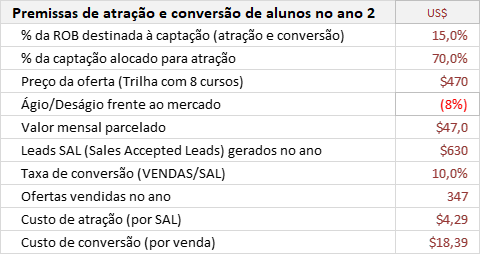
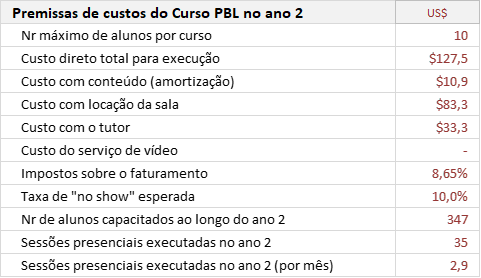
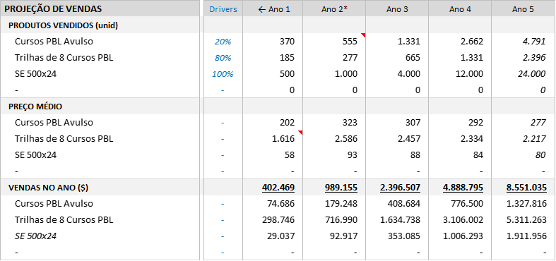

    
    <a href="#english">English</a>
    ·
    <a href="#spanish">Spanish</a>
    ·
    <a href="#portuguese">Portuguese</a>
    ·
    <a href="#chinese">Chinese</a>

 

## OPEN-PBL FINANCIAL PLAN
Financial plan of the 2020 fundraising Business Plan.  

...

*1. The "Non Disclousure Agreement" for access to the **business plan** is available to investors interested in <a href="http://bit.ly/NDA-OpenPBL" target="_blank">OpenPBL NDA</a>.*

*2. For more details of OpenPBL professional school, see a <a href="https://welearnpbl.github.io/openpbl-ir/roadshow/Storytelling#portuguese" target="_blank">storytelling</a> of its standard product (only the portuguese version available).*

 

    
    <a href="#english">English</a>
    ·
    <a href="#spanish">Spanish</a>
    ·
    <a href="#portuguese">Portuguese</a>
    ·
    <a href="#chinese">Chinese</a>

##  
                         
                         

 
 

## OPEN-PBL FINANCIAL PLAN
Financial plan of the 2020 fundraising Business Plan.  

**...**

(Pronto también disponible en la versión en español)
...

*1. El "Acuerdo de no divulgación" para el acceso al **plan de negocios** está disponible para inversores interesados en <a href="http://bit.ly/NDA-OpenPBL" target="_blank">OpenPBL NDA</a>.*

*2. Para obtener más detalles sobre la escuela profesional OpenPBL, consulte una <a href="https://jorgecataldo.github.io/OpenPBL-Storytelling/#spanish" target="_blank">storytelling</a> de su producto estándar (solo está disponible la versión en portugués).*

 

    
    <a href="#english">English</a>
    ·
    <a href="#spanish">Spanish</a>
    ·
    <a href="#portuguese">Portuguese</a>
    ·
    <a href="#chinese">Chinese</a>

##  
                         
                         

 
 

# OPEN-PBL - PLANO FINANCEIRO
Plano financeiro proposto no *road show* 2020.1 para captação de recursos.   

## O PROBLEMA E A OPORTUNIDADE
O relatório de uma pesquisa publicada em 2018 pelo **Fórum Econômico Mundial** elencou as dez competências profissionais mais desejadas para os trabalhadores do futuro. Segundo o <a href="https://www.weforum.org/agenda/2020/01/davos-2020-future-work-jobs-skills-what-to-know/">relatório</a>, o que **diferencia** os profissionais num mundo cada vez mais globalizado, dinâmico e automatizado não são seus conhecimentos e habilidade técnicas, mas o domínio de algumas importantes **competências comportamentais**. 

**Desempenho**  
Simulações financeiras do modelo de negócios mostram que, com um **investimento inicial** mínimo de **US $ 47.000** (R$ 0.000) para a **produção de conteúdo** e **capital de giro**, é possível atingir uma base de 2.300 alunos e **receitas líquidas** de **US $ 1 milhão** (R$ 0,0 milhões) (EBITDA 14% RL) no **quinto ano** de operação da escola. As simulações utilizaram **premissas de marketing e custos** para modelar o **ano 2** (primeiro ano "em regime") e **premissas de crescimento de vendas e de custos** para modelar os demais anos.    

  

<em>Demostração de resultados, geração de caixa livre e balanço patrimonial resultantes da simulação do modelo de negócios.</em>

 

 

**Premissas de marketing e custo**  
Premissas de **atração** e **conversão** utilizadas para modelar o **ano 2**: 

  

<em>Panorama das vendas de acordo com as premissas de captação e crescimento.</em>

 

Premissas de **custos** e **preços** utilizadas para modelar o **ano 2**: 

  

<em>Panorama das vendas de acordo com as premissas de captação e crescimento.</em>

 

**Premissas de crescimento**  
Premissas de **crescimento de vendas e de custos** utilizadas para modelar os anos 1, 3, 4 e 5 de operação da empresa.

  

<em>Panorama das vendas de acordo com as premissas de captação e crescimento.</em>

 

**Business Valuation**  
A avaliação do valor da empresa para a simulação acima utilizou a média entre os valores obtidos pelos métodos do *fluxo de caixa descontado* e dos *multiplicadores de receita*, conforme quadro a seguir:

  

<em>Business Valuation da simulação de operação da empresa.</em>

  

## EXPANSÃO
Graças ao modelo escalável utilizado, o **desempenho** simulado acima poderá ser replicado para garantir uma rápida **expansão das    

## FINANCIAMENTO DO PROJETO

... 

*1. O "Non Disclousure Agreement" para acesso ao **plano de negócios** detalhado está disponível para investidores interessados em <a href="http://bit.ly/NDA-OpenPBL" target="_blank">OpenPBL NDA</a>.*

*2. Para mais detalhes sobre a escola profissionalizante OpenPBL, veja um exemplo de <a href="https://welearnpbl.github.io/openpbl-ir/roadshow/Storytelling#portuguese" target="_blank">storytelling</a> da execução de um curso típico.* 

 

    
    <a href="#english">English</a>
    ·
    <a href="#spanish">Spanish</a>
    ·
    <a href="#portuguese">Portuguese</a>
    ·
    <a href="#chinese">Chinese</a>

##  
                         
                         

 
 

## OPEN-PBL FINANCIAL PLAN
Financial plan of the 2020 fundraising Business Plan.  

（很快也有中文版本）

...

*1。 对<a href="http://bit.ly/NDA-OpenPBL" target="_blank"> OpenPBL NDA </a>感兴趣的投资者可以使用“非公开协议”来访问业务计划的“执行摘要”*

*2。 有关OpenPBL专业学校的更多详细信息，请参见其标准产品的<a href="https://jorgecataldo.github.io/OpenPBL-Storytelling/#chinese" target="_blank">讲故事</a>（仅提供葡萄牙语版本）*

 

    
    <a href="#english">English</a>
    ·
    <a href="#spanish">Spanish</a>
    ·
    <a href="#portuguese">Portuguese</a>
    ·
    <a href="#chinese">Chinese</a>

##  
                         
