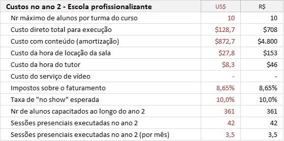

    
    <a href="#english">English</a>
    ·
    <a href="#spanish">Spanish</a>
    ·
    <a href="#portuguese">Portuguese</a>
    ·
    <a href="#chinese">Chinese</a>

 

## OPEN-PBL FINANCIAL PLAN
Financial plan of the 2020 fundraising Business Plan.  

...

*1. The "Non Disclousure Agreement" for access to the business plan's **executive summary** is available to investors interested in <a href="https://openpbl-school.github.io/InvestorRelations/NDA(en)-OpenPBL-GaveaPar.pdf" target="_blank">OpenPBL NDA</a>.*

*2. For more details of OpenPBL professional school, see a <a href="https://openpbl-school.github.io/Storytelling/#english" target="_blank">storytelling</a> of its standard product (only the portuguese version available).*

 

    
    <a href="#english">English</a>
    ·
    <a href="#spanish">Spanish</a>
    ·
    <a href="#portuguese">Portuguese</a>
    ·
    <a href="#chinese">Chinese</a>

##  
                         
                         

 
 

## OPEN-PBL FINANCIAL PLAN
Financial plan of the 2020 fundraising Business Plan.  

**...**

(Pronto también disponible en la versión en español)
...

*1. El "Acuerdo de no divulgación" para el acceso al **resumen ejecutivo** del plan de negocios está disponible para inversores interesados en <a href="https://openpbl-school.github.io/InvestorRelations/NDA(en)-OpenPBL-GaveaPar.pdf" target="_blank">OpenPBL NDA</a>.*

*2. Para obtener más detalles sobre la escuela profesional OpenPBL, consulte una <a href="https://openpbl-school.github.io/Storytelling/#spanish" target="_blank">storytelling</a> de su producto estándar (solo está disponible la versión en portugués).*

 

    
    <a href="#english">English</a>
    ·
    <a href="#spanish">Spanish</a>
    ·
    <a href="#portuguese">Portuguese</a>
    ·
    <a href="#chinese">Chinese</a>

##  
                         
                         

 
 

## OPEN-PBL - PLANO FINANCEIRO
Plano financeiro proposto no *road show* 2020.1 para captação de recursos.   

## Premissas 

As simulações financeiras do modelo de negócios utilizaram **premissas de marketing e custos** para modelar o **ano 2** (primeiro ano "em regime") e **premissas de crescimento de vendas e de custos** para modelar os demais anos.    

## Desempenho global 

**overall-performance**  

  

<em>overall-performance.</em>

 

 

## Ofertas 

**b2c-offerings**  

  

<em>b2c-offerings.</em>

 

 

**b2b-offerings**  

  

<em>b2b-offerings.</em>

 

 

## Custos 

**costs-year2-school**  

  

<em>costs-year2-school.</em>

 

 

**costs-year2-system**  

  

<em>costs-year2-system.</em>

 

 

## Campanha  

**customer-acquisition-year2**  

  

<em>customer-acquisition-year2.</em>

 

 

**5years-sales**  

  

<em>5years-sales.</em>

 

 

## Demosntração dos resultados   

**5years-profit-and-loss**  

  

<em>5years-profit-and-loss.</em>

 

 

**5years-investment-rounds**  

  

<em>5years-investment-rounds.</em>

 

 

**5years-cashflow**  

  

<em>5years-cashflow.</em>

 

 

**5years-balance-sheet**  

  

<em>5years-balance-sheet.</em>

 

 

## Valor do negócio

**enterprise-valuation**  

  

<em>enterprise-valuation.</em>

 

 

**business-shareholders**  

  

<em>business-shareholders.</em>

 

 

... 

*1. O Non Disclousure Agreement para acesso ao **sumário executivo** do plano de negócios está disponível para investidores interessados em <a href="https://openpbl-school.github.io/InvestorRelations/NDA(en)-OpenPBL-GaveaPar.pdf" target="_blank">OpenPBL NDA</a>.*

 

    
    <a href="#english">English</a>
    ·
    <a href="#spanish">Spanish</a>
    ·
    <a href="#portuguese">Portuguese</a>
    ·
    <a href="#chinese">Chinese</a>

##  
                         
                         

 
 

## OPEN-PBL FINANCIAL PLAN
Financial plan of the 2020 fundraising Business Plan.  

（很快也有中文版本）

...

*1。 对<a href="https://openpbl-school.github.io/InvestorRelations/NDA(en)-OpenPBL-GaveaPar.pdf" target="_blank"> OpenPBL NDA </a>感兴趣的投资者可以使用“非公开协议”来访问业务计划的“执行摘要”*

*2。 有关OpenPBL专业学校的更多详细信息，请参见其标准产品的<a href="https://openpbl-school.github.io/Storytelling/#chinese" target="_blank">讲故事</a>（仅提供葡萄牙语版本）*

 

    
    <a href="#english">English</a>
    ·
    <a href="#spanish">Spanish</a>
    ·
    <a href="#portuguese">Portuguese</a>
    ·
    <a href="#chinese">Chinese</a>

##  
                         
