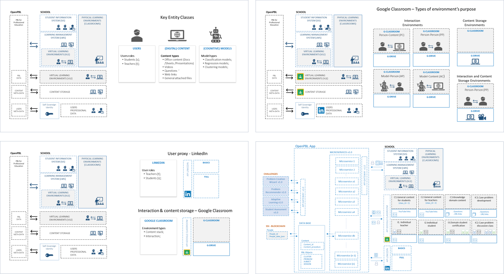

### Sistema de software 

Graças ao modelo escalável utilizado, o **desempenho** simulado acima poderá ser replicado para garantir uma rápida **expansão das atividades da empresa**. Para isso, é necessário o desenvolvimento do **Sistema de Ensino** para automatizar os processos e etapas do método.  

**Desenvolvimento de software**  

Para desenho, implantação e testes do **sistema educacional** são necessários investimentos que devem ser contabilizados, em sua maior parte, como despesa de capital" (CAPEX) para **desenvolvimento de software**. 

Os **sete** componentes que compõem o software do **Sistema de Ensino OpenPBL** a ser desenvolvido são: 
- *Expert system* capaz de parametrizar as relações causais entre o problema proposto por um especialista e as competências comportamentais que se propõe desenvolver nos alunos.
- *Machine learning model* capaz de produzir automaticamente os "cenários de problemas" com títulos em **português**, **inglês** e **espanhol**.
- *Adaptive learning system* para acelerar a etapa de SDL (self-directed learning) dos alunos.
- *Recommender system* para recomendação do conteúdo de apoio na etapa de SDL do método.
- *Process management system* para assistir e orientar os tutores na condução das sessões presenciais.
- *Machine learning model* capaz de editar e avaliar automaticamente o desempenho filmado dos alunos.
- *API* para integração com bases de dados de redes sociais de cunho profissional.  

**Estratégia para desenvolvimento**  

OPEN-PBL APP é um software de **código aberto** que gerencia **experiências de aprendizagem baseadas em problemas** tomadas na educação profissional. As escolas podem usar o OPEN-PBL APP **gratuitamente** para garantir que suas experiências de aprendizagem estejam alinhadas com a estrutura teórica e as melhores práticas da aprendizagem baseada em problemas. As pequenas empresas também podem aproveitar os benefícios da abordagem de aprendizagem baseada em problemas usando o OPEN-PBL APP **gratuitamente** no treinamento e desenvolvimento de seus funcionários.  

**O que é PBL**  
A Aprendizagem Baseada em Problemas (PBL) é uma estratégia de aprendizagem adotada - total ou parcialmente - por algumas escolas em sua arquitetura educacional. No PBL, os alunos aprendem **resolvendo problemas** e **refletindo sobre suas experiências**. Eles trabalham em pequenos grupos colaborativos onde aprendem o que precisam para resolver um problema apresentado a eles. Nesse contexto, o professor atua mais como um facilitador para orientar a aprendizagem do aluno do que como um detentor de conhecimento, como nas abordagens tradicionais de aprendizagem.  

Harvard, Minerva e a escola de tecnologia '42' são alguns exemplos de iniciativas bem-sucedidas de uso do PBL para desenvolver ** habilidades profissionais superiores **. A força da adoção da estratégia PBL na educação profissional está no **pragmatismo** de suas experiências de aprendizagem, o que ajuda a **acelerar o ganho de empregabilidade** dos alunos no mercado de trabalho.    

**Por que usar o OPEN-PBL APP**  
Apesar das vantagens de adotar arquiteturas educacionais baseadas em PBL, apenas algumas escolas adotam totalmente a abordagem PBL porque ela requer recursos acadêmicos mais caros, pois são geralmente escassos e pouco escaláveis. O OPEN-PBL APP ajuda escolas e empresas a lidar com essas restrições, fornecendo um conjunto de recursos para gerenciar a execução de **trilhas de aula para discutir a resolução de casos de problemas**, como aulas de estudo de caso médico e empresarial, sessões para discussão de tecnologia soluções de projetos e muito mais. Para garantir a integridade do processo de aplicação do tutorial PBL, OPENPBL APP:
- Interage com os professores para ajudá-los a criar e disseminar problemas de caso (CP), e avaliar o desempenho dos alunos nas aulas de discussão do CP.
- Interage com os alunos para ajudá-los a pesquisar e aprender as habilidades acadêmicas necessárias para a análise do PC e preparar os argumentos individuais para a discussão do PC.    

O conjunto de recursos do OPEN-PBL APP permite que escolas e empresas adotem a estratégia PBL em sua arquitetura e sistemas educacionais sem a necessidade de adquirir recursos acadêmicos caros e não escaláveis. Assim, eles podem garantir a aplicação adequada e medição da eficácia das arquiteturas educacionais para:
- Implantar **sitemas educacionais totalmente centrados no aluno** adotando o uso de PBL; ou
- Basta **adicionar algumas experiências PBL** aos sistemas de ensino que usam atualmente.   

**CONCEPTUALIZAÇÃO E DESENVOLVIMENTO DE OPEN-PBL**

O processo de conceituação e delineamento da arquitetura do OPEN-PBL APP originou-se da pesquisa de doutorado do Departamento de Informática da PUC-Rio. Atualmente, o desenvolvimento do código é coordenado por OPEN-PBL.ORG, que é responsável por aplicar as melhores práticas internacionais para a criação, versionamento e licenciamento de **código livre**.  

**Universalização do PBL**  
A missão principal do OPEN-PBL.ORG é promover o uso do PBL por organizações sociais, governos e pequenas empresas que, de outra forma, não teriam acesso aos recursos necessários para sua adoção.  

**Licenciamento**  
A licença para usar o OPEN-PBL APP é BSD. O código, bem como todas as instruções para sua implantação segura, podem ser acessados ​​em github.com/openpbl.  

**Monitorar as práticas PBL**  
O OPEN-PBL.ORG mantém, em parceria com *”The Interdisciplinary Journal of Problem-Based Learning”*, a publicação de um monitor de novos **estudos acadêmicos e casos de aplicação PBL**. O conteúdo do **PBL Monitor** é direcionado a professores, educadores, profissionais de T&D e executivos de educação interessados em acompanhar os desenvolvimentos e discussões sobre a estratégia de aprendizagem do PBL.  

**Suporte para ações sociais**  
OPEN-PBL.ORG mantém programa de consultoria voluntária para a implementação gratuita da aplicação OPEN-PBL em iniciativas educacionais promovidas por prefeituras e entidades sem fins lucrativos.   

  

<em>Diagramas de entidade-relacionamento.</em>

 

 

**AMBIENTES OPEN-PBL COM O GOOGLE CLASSROOM APP**

**Ambientes Virtuais de Aprendizagem** 
O OPEN-PBL usa o ambiente virtual do aplicativo gratuito Google Classroom (GC) como interface padrão para interagir com (e entre) os atores envolvidos no processo de aprendizagem. A interação é feita nos seguintes ambientes:
- Ambiente de CG de interação individual com cada aluno;
- Ambiente de CG de interação individual com cada professor;
- Ambiente de CG compartilhado por grupos de professores, dedicado ao desenvolvimento estruturado de cada “caso-problema” (CP);
- Ambiente de CG de interação individual com cada aluno, dedicado à pesquisa e avaliação de proficiência em cada disciplina pré-requisito para análise de PC;
- Ambiente de CG compartilhado por grupos de alunos, dedicado ao estudo preliminar e à elaboração dos argumentos de análise do CP;
- Ambiente GC compartilhado por alunos e professores, destinado à preparação preliminar para as aulas de discussão em PC;  

**RECURSOS PRINCIPAIS DO OPEN-PBL**

**Planejamento instrucional e design**
As principais funcionalidades para o planejamento e execução instrucional fornecidas pelo OPEN-PBL APP nos ambientes de GC de interação do professor e aluno são:
- Auxiliar professores na criação estruturada de CP;
- Divulgar o CP e todo o material complementar associado aos alunos interessados;
- Avaliar a proficiência dos alunos em tópicos acadêmicos, pré-requisitos para análise de CP;
- Auxiliar o professor na preparação e execução das aulas de discussão do CP;
- Registrar a participação dos alunos nas aulas de discussão do CP;
- Auxiliar na avaliação e classificação da participação dos alunos nas aulas de discussão do CP;  

**Experiências de aprendizagem**
Os principais recursos para o gerenciamento de experiências de aprendizagem fornecidos pelo OPEN-PBL APP em ambientes de interação de professores e alunos do GC são:
- Crie um ambiente propício para a pesquisa em cada assunto de pré-requisito para a análise de CP;
- Criar um ambiente de discussão entre os alunos para elaboração dos argumentos de análise do CP;
- Criar um ambiente de explicação consolidada da aprendizagem coletiva gerada em cada sessão de discussão de um PC;  
