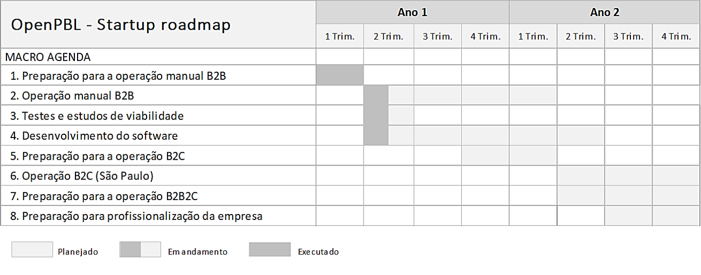
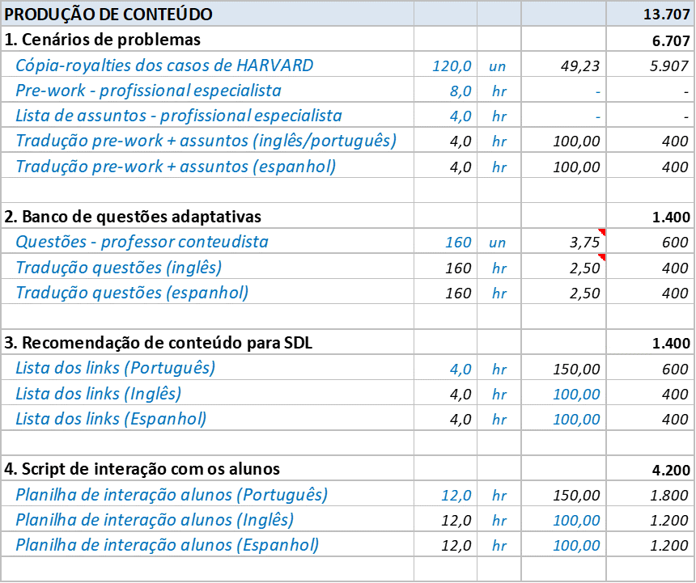

<a href="#portuguese">start</a>

 
 

## START-UP DA EMPRESA

No plano de negócios, o período de **startup** é definido entre a data do primeiro aporte de capital e o final do segundo ano de operação da empresa. Esta seção detalha este período de aproximadamente dois anos que prepara a empresa para a atuação escalável B2B2C. 

### Roadmap

As etapas previstas para este período de startup são:
1. Preparação para a operação manual B2B.
2. Operação manual B2B.
3. Testes de conceito e estudos de viabilidade.
4. Desenvolvimento do software.
5. Preparação para a operação B2C.
6. Operação B2C (São Paulo). 
7. Preparação para a operação B2B2C.  

Abaixo o planejamento e o status atual da execução das etapas.  

   
  <im>Roadmap para o período de lançamento da empresa</im>

  
**Preparação para a operação manual B2B** 

Esta etapa é subdividida em:
- Elaboração dos argumentos de venda.
- Elaboração da planilha de precificação (concluído).
- Definição do preço de lançamento e política de descontos (concluído).
- Definição das comissão de venda (concluído).
- Elaboração da proposta comercial <a href="https://openpbl-school.github.io/InvestorRelations/roadshow/files/proposta_B2B_22ago20.pdf" target="_blank">(concluído)</a>.

  
**Operação manual B2B** 

Esta etapa é subdividida em:
- Fomento de parcerias com consultorias de RH (iniciado).
- Início da prospecção comercial (iniciado).
- Ofertas e fechamento.

  
**Testes de conceito e estudos de viabilidade** 

Esta etapa é subdividida em:
- Elaborar testes com um “**concierge MVP**”. <a href="#concierge">ver mais</a>.
- Validar algumas premissas de **custos** e de **desempenho acadêmico**.

  
**Desenvolvimento do software** 

Esta etapa é subdividida em:
- Construção da infra estrutura de testes.
- Planejamento e codificação dos componentes de software do **sistema educacional proprietário** da empresa (CAPEX). <a href="#desenvolvimento">ver mais</a>

  
**Preparação para a operação B2C** 

Esta etapa é subdividida em:
- Estudo para **escolha das trilhas funcionais** para oferta inicial na cidade São Paulo. <a href="#mercado">ver mais</a>
- Mais ...

  
**Operação B2C (São Paulo)** 

Esta etapa é subdividida em:
- Constituição formal da empresa na **cidade São Paulo**. <a href="#abertura">ver mais</a>
- Produção do estoque mínimo inicial de títulos (CAPEX). <a href="#estoque">ver mais</a>
- Lançamento das primeiras trilhas, validação das **premissas de mercado** utilizadas no plano de negócios e ajustes na campanha. <a href="#lancamento">ver mais</a>
- Mais ... 

  
**Preparação para a operação B2B2C** 

Esta etapa é subdividida em:
- . 

   

## 

### Preparação para a operação manual B2B. 

...

##

### Operação manual B2B.

...

## 

### Testes de conceito e estudos de viabilidade

 

**Estudos de viabilidade** 
O método de ensino desenvolvido pela empresa assume premissas tanto quanto à adaptação da estratégia de aprendizagem quanto dos modelos de inteligência artificial. Assim, serão efetuados dois estudos de viabilidade:
- Viabilidade do e-learning
- Viabilidade do modelo de inteligência artificial

  

**Viabilidade do e-learning** 

No estudo de viabilidade do e-learning, serão testadas as seguintes premissas: 
- Número de 10 participantes é suficiente para uma dinâmica de discussão da PBL. 

**Viabilidade do modelo de inteligência artificial** 
- 

**Concierge MVP** 

O desenvolvimento de um <a href="https://ibuildmvps.com/blog/the-concierge-minimum-viable-product-maximizes-customer-learning/" target="_blank">"concierge MVP"</a> é a principal ação da etapa de *startup* empresa. Sua implementação consumirá a maior parte dos recursos do *seed capital* e é o principal fator de sucesso da rodada seguinte de captação de recursos. 

O concierge MVP irá permitir a comprovação dos dois estudos de viabilidade previstos. 

Resumidamente, o concierge MVP é um **projeto piloto** de aplicação do **método OpenPBL** para a capacitação profissionalizante de **30 alunos** por uma mesma **trilha de 4 cursos**. 

Os alunos serão divididos em **3 turmas** de 10 alunos e cada turma executará os cursos da trilha em uma **língua** e em uma **cidade** diferente, conforme a seguir: 
- Língua: Português - Cidade: São Paulo.
- Língua: Espanhol - Cidade: Miami.
- Língua: Inglês - Cidade: Shangai.  

As trilhas serão executadas **simultaneamente** nas turmas. O prazo previsto para a **preparação dos cursos** é de **3 semanas** e para a **execução da capacitação** é de **8 semanas**. 

O prozo total de execução do projeto é de 90 dias.   

**Ambiente de interação com os alunos** 
Todas as interações acadêmicas com os alunos serão feitas pela aplicação ***Google Classroom*.** Portanto, é necessário que cada aluno tenha acesso à um email Google válido. Poderá ser usado o próprio email do aluno ou criado um email especialmente para o projeto (aluno1.openpbl@google.com).

A dinâmica das interações com os alunos via *Google Classroom* encontra-se detalhada em <a href="https://openpbl.github.io/app-docs/" target="_blank">openpbl.github.io/app-docs</a>.    

**Produção de conteúdo**  
Será escolhida uma área profissionalizante, entre as opções: **Saúde**, **Marketing** ou **Inteligência Artificial**, como temática para os cursos da trilha. Cada curso deve explorar um problema real, vivido tipicamente ao longo da carreira por profissionais na função de **analista júnior**. 

Feita a escolha da área, o projeto prevê a contratação de um **conteudista** para elaboração dos cenários dos problemas (total de 4) e de dois **tradutores** para o versionamento em inglês e espanhol dos problemas propostos. A alternativa ao desenvolvimento dos cenários de problemas é a utilização de 4 estudos de caso de instituições de ensino de primeira linha (Harvard, por exemplo). 

Para cada problema definido, o conteudista deverá delinear as **disciplinas** associadas (ou **tópicos de conhecimento**) e para cada disciplina elaborar **40 perguntas** para assessment dos alunos. Conforme a estratégia adaptativa, as perguntas serão apresentadas aos alunos e respondidas no prório ambiente do *Google Classroom* (GC). Os **links para  conteúdos sugeridos na etapa de SDL (self-directed learning)** serão disponibilizados também no GC.  

**Etapa 1 - Preparação do aluno** 
Todo o material para a etapa de preparação do aluno (**cenário do problema** + **material complementar**) será disponibilizado aos alunos no *Google Classroom*. 

Para obter a certificação para participar da sessão presencial de discussão, cada aluno deverá responder cerca de 15 perguntas de um questionário que irá se **adaptar aos seus conhecimentos**. Os alunos terão até 10 dias para obterem a certificação para participarem da sessão presencial de discussão das soluções de cada problema.

A execução e coordenação do envio do conteúdo e das questões aos alunos será efetuada por **analista** contratado.   

**Etapa 2 - Discussão das soluções propostas**  
Conforme o método OpenPBL, os encontros presenciais serão realizados em **salas de reunião para 10 pessoas**. Os encontros serão agendados em uma das unidades da **WEWORK** nas cidades escolhidas para o projeto. 

Os encontros serão assistidos por **facilitadores**, contratados para auxiliar os alunos em suas  necessidades diversas. As sessões presenciais serão conduzidas **via web conference** por **tutores** contratados e treinados pelos conteudistas para execução da dinâmica das discussões entre os alunos.   

**CUSTOS**   
Os custos para a elaboração do projeto de desenvolvimento do *Concierge MVP* são estimados em **US $ **6.800** `(R$ 37.200)`. 

A seguir, o detalhamento das premissas e valores utilizados para o cálculo.  

**Premissas globais**  
Os custos estão divididos em dois grandes grupos: Contratação de serviços de terceiros e Contratações diversas.   

   
  <im>Premissas globais para execução do concierge MVP</im>

 

**Premissas da produção de conteúdo**  
Preparação dos problemas, do banco de questões dos links de recomendação de conteúdo e da lógica adaptativa.   

   
  <im>Premissas da produção de conteúdo para execução do concierge MVP</im>

 

**Premissas da etapa de preparação**  
Rotina de recomendação das atividades preparatórias para as sessões de discussão.   

   
  <im>Premissas da etapa de preparação para execução do concierge MVP</im>

 

**Premissas da etapa de discussão**  
Locação das salas, locação de equipamentos de captação, tais como microfones e iluminação para as sessões. Recursos para pós produção dos vídeos captados.

   
  <im>Premissas da etapa de discussão para execução do concierge MVP</im>

  

 

## 

### Desenvolvimento do software

Ações em delineamento <a href="#portuguese">voltar</a>   

Vídeo “como funciona”  
Roteirização e execução de peça audiovisual tipo “storyboarding animado” para comunicação dos atributos do produto (Sistema Educacional) ao público-alvo de clientes.

Recursos 
- Roteirista (100 horas).
- Animador e pós produção (100 horas).    

Web app para e-commerce (catálogo)  
Criação e execução de website para e-commerce. Usa como peça principal o Vídeo Atributos. 

Recursos
- Designer / UX (100 horas)
- Desenvolvedor front end (100 horas).   

Web app para e-commerce (carrinho e checkout)  
Criação e execução de aplicação web e mobile de e-commerce onde os “estudantes” poderão comprar/agendar as sessões-problema. 

Recursos 
- Designer / UX (100 horas)
- Desenvolvedor front e backend (100 horas).   

[Automatização] Algoritmo para recomendação de sessões-problema (catálogo dinâmico) 
Elaboração de algoritmo para recomendar as sessões-problema de acordo com as preferências e objetivos do público-alvo.

Recursos
- Consultor especialista (100 horas)    

 

##

### Preparação para a operação B2C

Ações em delineamento <a href="#portuguese">voltar</a>   

 

##

### Operação B2C (São Paulo)

**ABERTURA FORMAL DA EMPRESA**  

Ações em delineamento <a href="#portuguese">voltar</a>   

 
 

**ESTOQUE INICIAL DE TÍTULOS**   
Ações em delineamento <a href="#portuguese">voltar</a>   

 
 

**LANÇAMENTO DOS CURSOS**  
Ações em delineamento <a href="#portuguese">voltar</a>   

##

### Preparação para a operação B2B2C
.
.
.
...

## 
