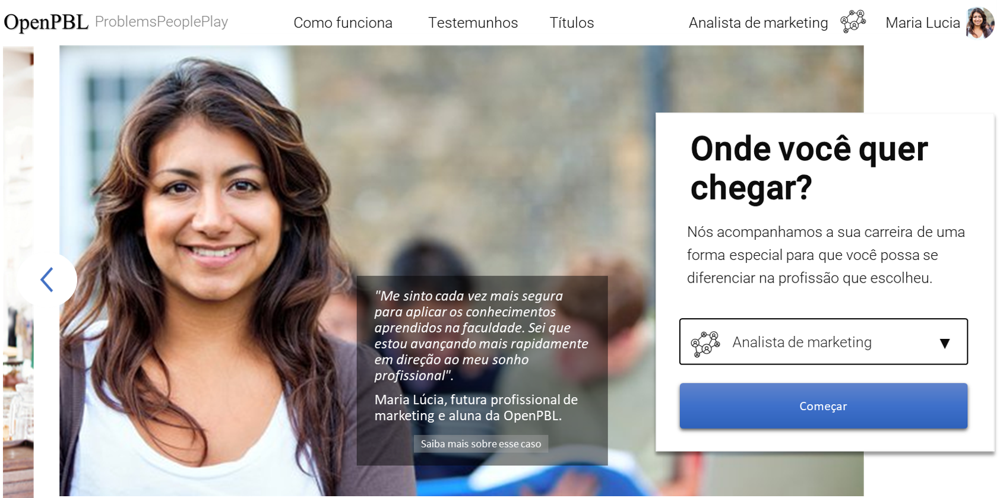
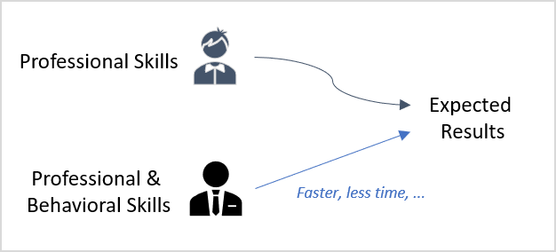
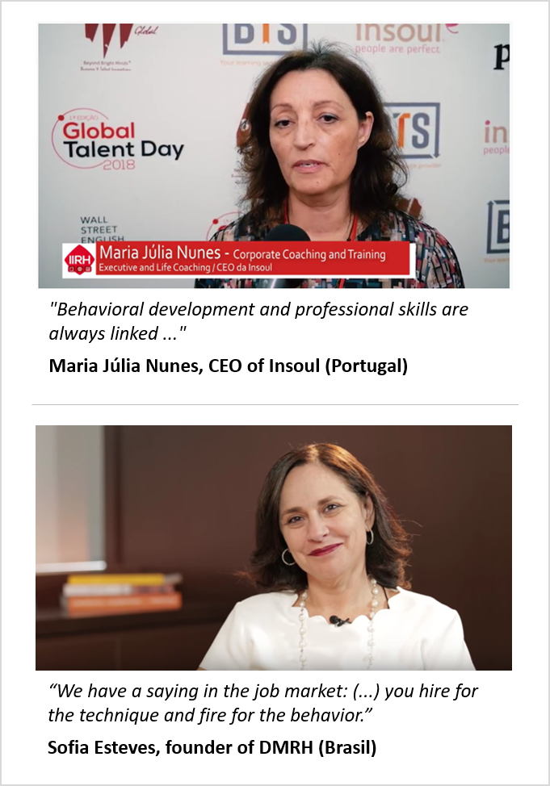
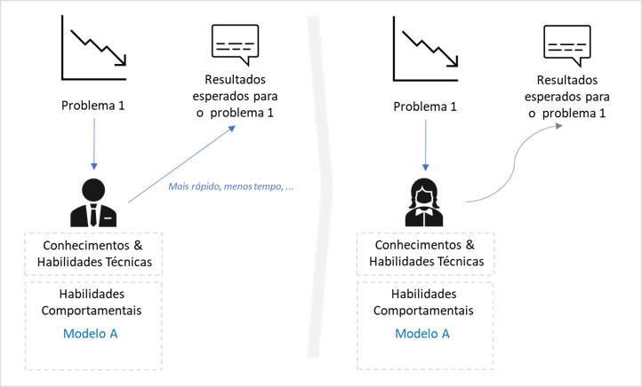

# STARTUP
Plano de negócios proposto no *road show* 2020.1 para captação de recursos.   

 

 

**Índice de assuntos**  

    
    <a href="#problema">O Problema</a>
    ·
    <a href="#proposta">A Proposta</a>
    ·
    <a href="#negocio">O Negócio</a>
    ·
    <a href="#execucao">Execução</a>
    ·
    <a href="#expansao">Expansão</a>
    ·
    <a href="#financiamento">Financiamento</a>

 
 

## O PROBLEMA E A OPORTUNIDADE
Uma pesquisa publicada em 2018 pelo **Fórum Econômico Mundial** elencou as dez competências profissionais mais desejadas para os trabalhadores do futuro na opinião de gestores de RH de todo o mundo. Segundo o <a href="https://www.weforum.org/agenda/2020/01/davos-2020-future-work-jobs-skills-what-to-know/">relatório da pesquisa</a>, o que **diferencia** os profissionais num mundo cada vez mais globalizado, dinâmico e automatizado não são seus conhecimentos e habilidades técnicas, mas o domínio de algumas importantes **competências comportamentais**. 

Para os especialistas consultados na pesquisa, certas virtudes como saber "tomar decisões em ambientes de incerteza", "atuar sob pressão da opinão pública" e "negociar internamente com a equipe" são fundamentais para que colaboradores, não só alcancem os **resultados esperados** por suas empresas, mas que o façam da forma **mais eficiente** possível.   

   

   
  <em><a href="https://youtu.be/9G5mS_OKT0A" target="_blank">Vídeo TED</a> - Competências comportamentais permitem que profissionais  alcançem os resultados esperados com menos recursos.</em>

  

   
  <em><a href="https://youtu.be/1HEymYOkz44" target="_blank">Vídeo 1</a> e <a href="https://youtu.be/WyKZC7nhQZw" target="_blank">vídeo 2</a> com consultores de RH sobre competências comportamentais.</em>

 

**Desenvolvendo competências comportamentais**  

Ao contrário das **habilidades comportamentais**, que resultam das características biológicas, cognitivas e socio-emocionais moldadas **antes** da vida adulta de um indivíduo, as **competências comportamentais** que interessam às empresas só podem ser desenvolvidas ao término da sua formação profissionalizante. Além disso, apesar de ser possível desenvolver competências comportamentais a partir do terço final da formação profissional, na grande maioria das vezes, este desenvolvimento só acontece mesmo ao longo do exercício da profissão. 

Por razões diversas, as escolas de formação profissionalizante se concentram em desenvolver apenas as **competências técnicas** em nível suficiente para garantir a **empregabilidade de entrada** de seus alunos no mercado de trabalho e raramente buscam avaliar o desempenho de seus alunos em questões técnicas que não sejam apresentadas sob **condições ideais** e isentas de fatores inerentes da vida real, tais como **riscos**, **incertezas** e **preferências**. No entanto, o desenvolvimento de competências comportamentais é um processo que se dá justamente quando os profissionais se deparam com estas situações de "imperfeição" da vida real.

O processo pode ser resumido da seguinte forma.

Ao empregar suas competências técnicas nas situações do dia-a-dia da carreira, um profissional se depara com aspectos práticos relevantes, como **assimetrias de informação**, **restrições de recursos** e **pressões de ordem diversa**, que alteram (por vezes, substancialmente) as condições ideais dos problemas para as quais seus conhecimento e habilidades técnicas se aplicam sob medida. 

Sempre que isso ocorre, o profissional precisa buscar e testar novos conhecimentos e **descobrir** os **mais adequados** às suas habilidades comportamentais para atingir os mesmos resultados que atingiria nas condições ideais. Como consequência deste processo contínuo de teste e adequação, cada indivíduo acaba por reunir e **incorporar à sua atuação profissional** um **repertório único** de conhecimentos, modelos empíricos e estratégias com os quais ele irá contar, juntamente com suas competências técnicas, para superar os desafios a que é submetido ao longo da carreira.  

   
  <em>O desenvolvimento das competências técnicas não consideram fatores como riscos, incertezas e preferências.</em>

  

   
  <em>Cada indivíduo incorpora à sua atuação profissional um repertório próprio.</em>

  

   
  <em>Um novo problema pode requerer novas ferramentas comportamentais.</em>

  

**Acelerando o desenvolvimento de competências comportamentais**  

Embora algumas empresas avaliem as **habilidades** de seus colaboradores como forma de contribuir para o seu auto-conhecimento comportamental (modelos DISC, MBTI e Big Five), na grande maioria dos casos, o desenvolvimento das competências comportamentais é um processo **auto patrocinado** e executado de forma **natural** e **inconsciente** ao longo da carreira profissional. Além disso, dependendo dos diferentes estímulos à que são submetidos os profissionais, este processo de desenvolvimento pode durar **muito tempo** ou, até mesmo, não acontecer. 

Para **acelerar** e tornar mais **assertivo** este processo, alguns **programas educacionais** se propõem a **simular** situações reais do dia-a-dia em atividades de aprendizagem para, desta forma, estimular o desenvolvimento personalizado de competências comportamentais. 

É o caso, por exemplo, das escolas que ofertam programas educacionais utilizando predominantemente a *Problem Based Learning* (ou, de forma abreviada, a **PBL**), uma **estratégia de aprendizagem** na qual os alunos aprendem **resolvendo problemas** e **refletindo** sobre suas experiências (<a href="https://en.wikipedia.org/wiki/Problem-based_learning" target="_blank">Ver definição na Wikipedia</a>).  

   
  <em>Harvard, Minerva e a escola de tecnologia #42 são exemplos bem sucedidos de aplicação da PBL.</em>

  

**Desequilíbrio de mercado** 

Se por um lado, empresas demandam cada vez mais profissionais com competências comportamentais, por outro lado, estes mesmos profissionais encontram muitas dificuldades para desenvolvê-las num prazo razoável, uma vez que **a oferta de cursos e programas educacionais** específicos para esse fim **não é suficiente** para atender os requisitos de **preço** e **disponibilidade** do mercado.

Grande parte deste desequilíbrio ocorre porque as escolas que atuam tradicionalmente neste segmento não geram **economias de escala suficientes** para **popularizarem seus cursos**. Nem mesmo a recente introdução de tecnologias digitais nas práticas educacionais foi capaz de estimular a universalização deste tipo de programa.  

Diante deste cenário, de desequilíbrio entre a oferta e a demanda de cursos e programas educacionais para desenvolvimento competências comportamentais, experientes executivos do setor educacional identificaram uma excelente **janela de oportunidades** a ser explorada.  

 
 

## PROPOSTA PARA EXPLORAR A OPORTUNIDADE DE MERCADO

A PBL é comprovadamente **eficaz** no desenvolvimento de competências comportamentais e, portanto, seria **candidata natural** para suprir a atual demanda do mercado educacional. Contudo, a PBL ainda encontra alguns **obstáculos** para **execução em larga escala**.  

   
