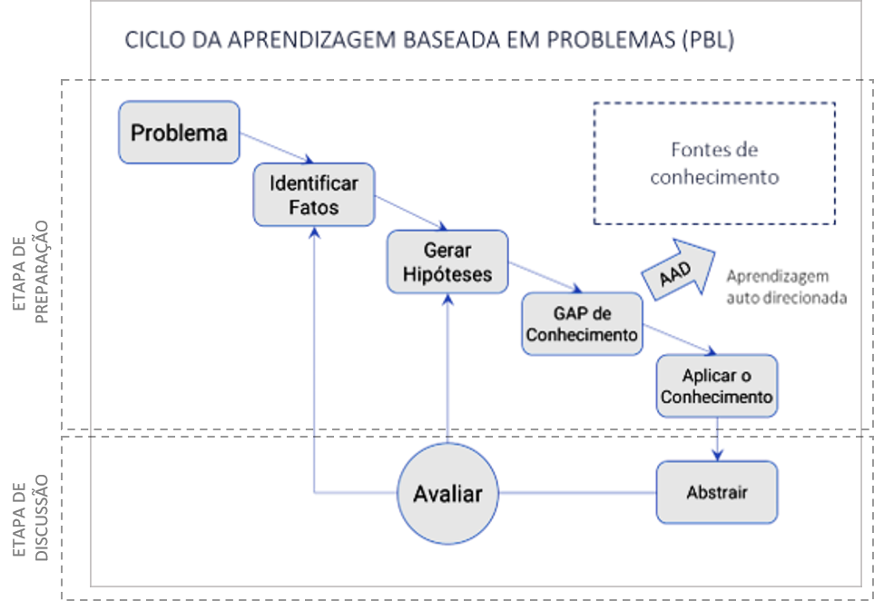

# STARTUP
Plano de negócios proposto no *road show* 2020.1 para captação de recursos.   

 
 

## O PROBLEMA E A OPORTUNIDADE
Uma pesquisa publicada em 2018 pelo **Fórum Econômico Mundial** elencou as dez competências profissionais mais desejadas para os trabalhadores do futuro na opinião de gestores de RH de todo o mundo. Segundo o <a href="https://www.weforum.org/agenda/2020/01/davos-2020-future-work-jobs-skills-what-to-know/">relatório da pesquisa</a>, o que **diferencia** os profissionais num mundo cada vez mais globalizado, dinâmico e automatizado não são seus conhecimentos e habilidades técnicas, mas o domínio de algumas importantes **competências comportamentais**. 

Para os especialistas consultados na pesquisa, certas virtudes como saber "tomar decisões em ambientes de incerteza", "atuar sob pressão da opinão pública" e "negociar internamente com a equipe" são fundamentais para que colaboradores, não só alcancem os **resultados esperados** por suas empresas, mas que o façam da forma **mais eficiente** possível.   

 

**Startup**  

O *startup* da empresa, previsto para o seu **primeiro ano** de operação, tem como objetivos: 
- Abertura formal e pré-operação da empresa na **cidade São Paulo**. 
- Elaborar testes com um “**concierge MVP**” para validar as premissas de **custos de execução** das sessões presenciais (utilização do *capital semente*).
- Estudos de mercado e **escolha das trilhas funcionais** para oferta inicial na cidade São Paulo.
- Produção do estoque inicial de títulos (CAPEX).
- Lançamento das primeiras trilhas, validação das **premissas de mercado** e ajustes na campanha. 
- Desenvolvimento dos componentes de software do **sistema educacional proprietário** da empresa (CAPEX).  

 
 

## PROPOSTA PARA EXPLORAR A OPORTUNIDADE DE MERCADO

A PBL é comprovadamente **eficaz** no desenvolvimento de competências comportamentais e, portanto, seria **candidata natural** para suprir a atual demanda do mercado educacional. Contudo, a PBL ainda encontra alguns **obstáculos** para **execução em larga escala**.  

   
